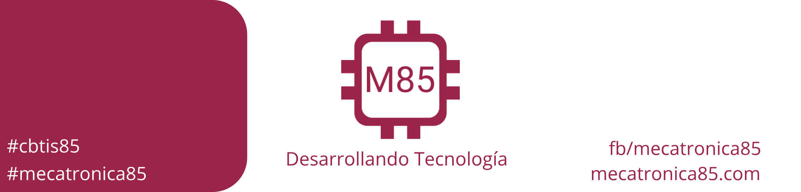

# Introduccion a la electronica digital

# Introducción al diseño digital

En el mundo actual, el término digital se ha convertido en parte de nuestro vocabulario común, debido a la dramática forma en que los circuitos y las técnicas digitales se han vuelto tan utilizados en casi todas las áreas de la vida: computadoras, automatización, robots, ciencia médica y tecnología, transporte, telecomunicaciones, entretenimiento, exploración en el espacio, etcétera.

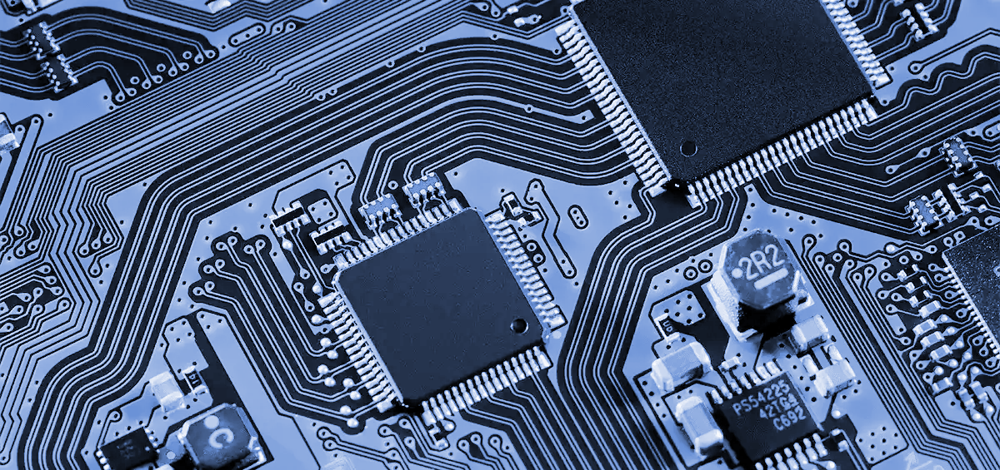

## Representaciones digitales

En la representación digital las cantidades se representan no mediante indicadores que varían en forma continua, sino mediante símbolos llamados  _dígitos_ . Considere como ejemplo el reloj digital, que indica la hora del día en forma de dígitos decimales que representan horas y minutos (y algunas veces segundos). Como es sabido, la hora del día cambia en forma continua, pero la lectura del reloj digital no cambia así, sino que cambia en intervalos de uno por minuto (o por segundo).

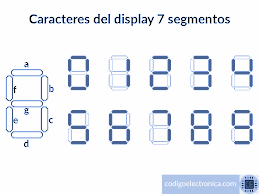

En otras palabras, esta representación digital de la hora del día cambia en incrementos  _discretos_ ,  en comparación con la representación de la hora que proporciona un reloj de pared operado mediante corriente alterna analógica, en donde la lectura de la carátula cambia en forma continua. Así, la principal diferencia entre las cantidades analógicas y digitales puede plantearse de la siguiente manera:

analógica ⬅ continua

digital ⬅ discreta (paso por paso)

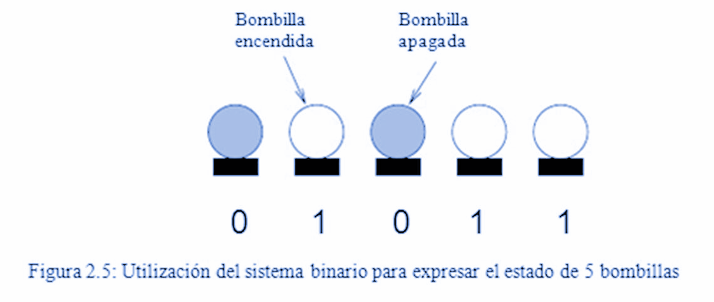

Debido a la naturaleza discreta de las representaciones digitales, no existe ambigüedad cuando se lee el valor de una cantidad digital, mientras que el valor de una cantidad analógica, por lo general, se deja abierto a la interpretación. En la práctica, cuando se mide una cantidad analógica, siempre se “redondea” a un nivel de precisión conveniente.

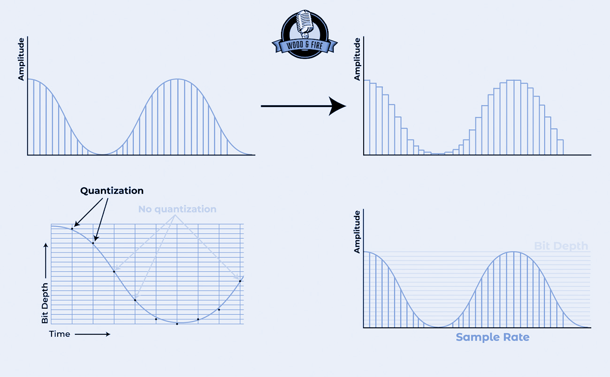

En otras palabras, se __ digitaliza__  la cantidad. La representación digital es el resultado de asignar un número de precisión limitada a una cantidad que varía en forma continua. Por ejemplo, cuando usted toma su temperatura con un termómetro analógico, es común que la columna de mercurio se encuentre entre dos líneas de graduación, pero usted elige la línea más cercana y le asigna un número, por decir, 36.7 °C (98.6 °F).

## Ventajas de las técnicas digitales

Las razones principales del cambio hacia la tecnología digital son:

1. Generalmente, los sistemas digitales son más fáciles de diseñar. Los circuitos que se utilizan en los sistemas digitales son circuitos de conmutación, en donde no importan los valores exactos de voltaje o de corriente, sino solo el intervalo (ALTO o BAJO) en el que se encuentren.

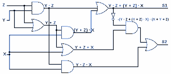

2. Es fácil almacenar información. Esto se logra mediante dispositivos y circuitos especiales que pueden fijar la información digital y almacenarla durante el tiempo que sea necesario, y las técnicas de almacenamiento masivo pueden guardar miles de millones de bits de información en un espacio físico relativamente pequeño. En contraste, la capacidad de almacenamiento de las técnicas analógicas es extremadamente limitada.

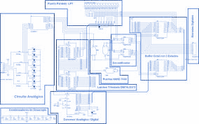

3. Es más fácil mantener la precisión y la exactitud en todo el sistema. Una vez que se digitaliza una señal, la información que contiene no se deteriora a medida que se procesa. En los sistemas analógicos, las señales de voltaje y de corriente tienden a distorsionarse debido a los efectos de temperatura, humedad y por variaciones de tolerancia de los componentes en los circuitos que procesan la señal.

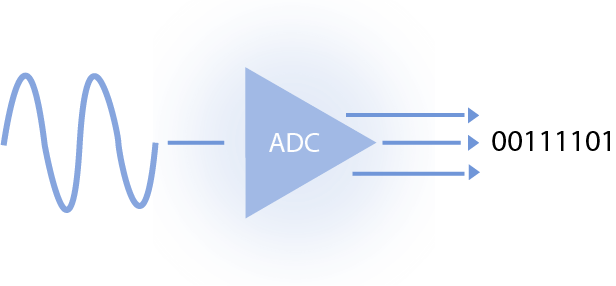

4. La operación puede programarse. Es bastante sencillo diseñar sistemas digitales cuya operación esté controlada por un conjunto de instrucciones almacenadas, a lo cual se le conoce como programa. Los sistemas analógicos también pueden programarse, pero la variedad y la complejidad de las operaciones disponibles son muy limitadas.

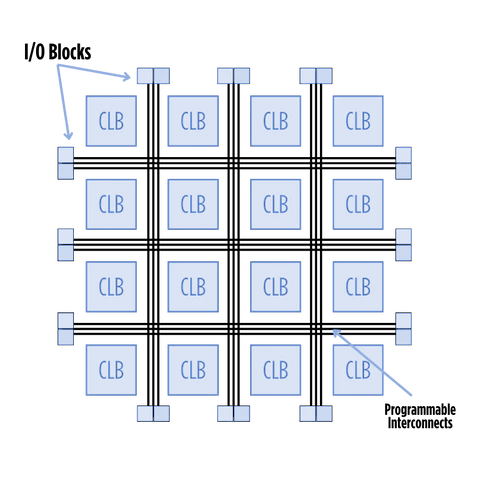

5.  Los circuitos digitales son más resistentes al ruido. Las fluctuaciones espurias en el voltaje (ruido) no son tan críticas en los sistemas digitales, ya que el valor exacto del voltaje no es importante, siempre y cuando el ruido no sea tan fuerte como para evitar que podamos distinguir entre un nivel ALTO y un nivel BAJO.

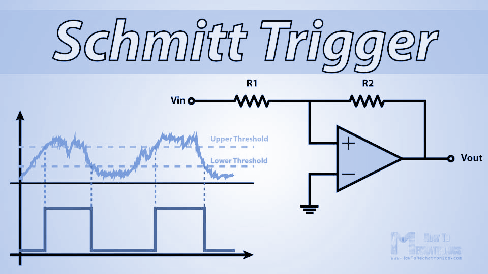

6. Pueden fabricarse más circuitos digitales en los chips IC. Es cierto que los circuitos analógicos también se han beneficiado con el desarrollo de la tecnología de los circuitos integrados, pero su complejidad relativa y uso de dispositivos que no pueden integrarse de manera económicamente conveniente (capacitores de alto valor, resistencias de precisión, inductancias, transformadores) han hecho imposible alcanzar el mismo grado de integración en los sistemas analógicos.

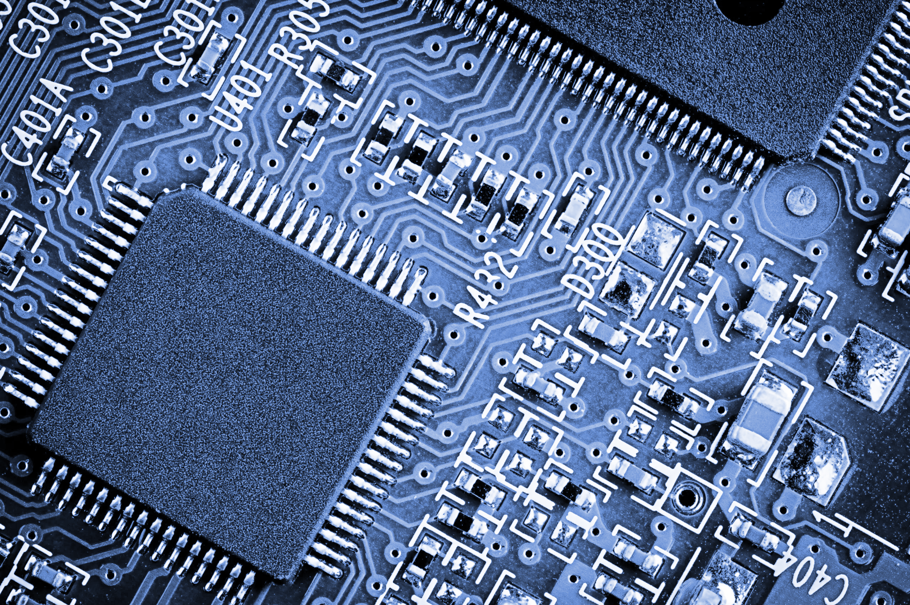

## Limitaciones de las técnicas digitales

En realidad existen muy pocas desventajas al utilizar técnicas digitales.

El mundo real es analógico.

El procesamiento de las señales digitales lleva tiempo.

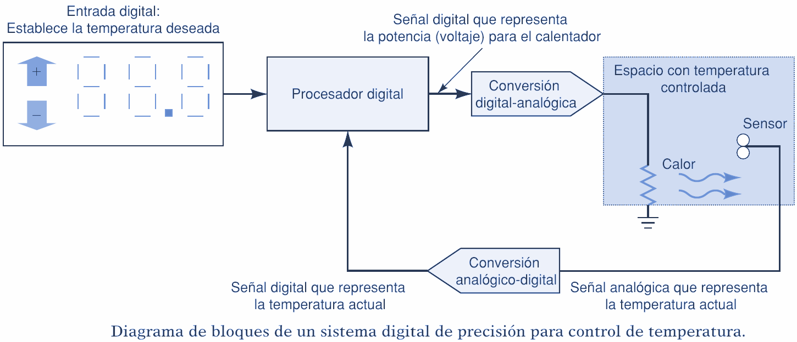
