# Sistemas Numéricos

## Sistema Decimal

El sistema numérico decimal, es un sistema base 10 debido a que tiene  __10 símbolos__  los cuales son los  _números del 0 al 9_ . Para este sistema a cada símbolo se le denomina  _dígito_  y es el más comúnmente usado en la vida cotidiana, ya que por medio de éste podemos representar cualquier cantidad numérica estándar. Cuando se trabaja números que se encuentran en diferentes sistemas, es aconsejable identificar la base del número colocándola como subíndice. Por ejemplo, si se desea representar el número 25 en decimal se coloca: 2510

Al tener 10 dígitos, se pueden formar números de diferentes cantidades. Un número con una sola cifra, tiene 10 posibles cantidades que van de 0 a 9. Si un número tiene dos cifras, entonces se pueden tener hasta 100 posibles cantidades.

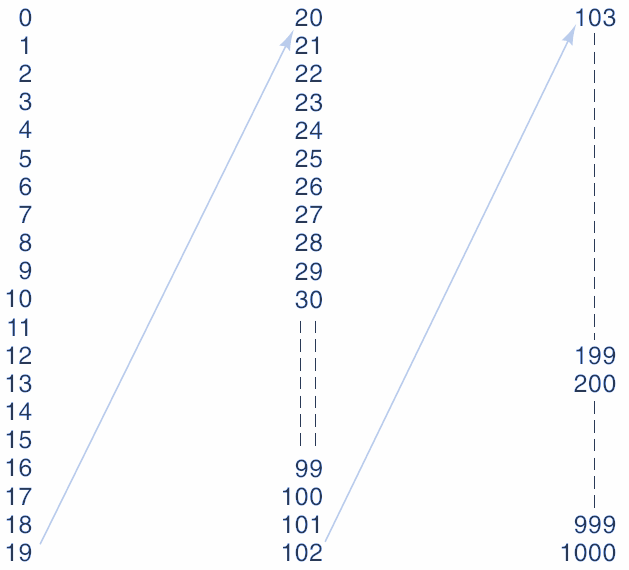

Cada cifra dentro de un número tiene un valor que es comúnmente llamado como peso. La cifra de menor  _peso_ , siempre es la cifra ubicada a la derecha del número. Los pesos de cada cifra incrementan de forma exponencial en donde la base es la cantidad de símbolos del sistema y el exponente es la posición de cada símbolo.

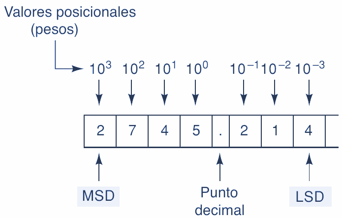

Entonces la cantidad de un número se obtiene de la siguiente forma:

$$348 = 8 * 100 + 4 * 101 + 3 * 102$$

$$348 = 8 * 1 + 4 * 10 + 3 * 100$$

$$348 = 8 + 40 + 300$$

## Sistema Binario

El sistema numérico binario es un sistema base 2 debido a que tiene  _2 símbolos_  los cuales son los números  __0__  y  __1__ . En este sistema a un símbolo se le denomina  _bit_ . Es aconsejable identificar la base del número colocándola como subíndice. Por ejemplo, si se desea representar el número  _100110_  en binario se coloca:  _100110_  _2_ .

|0|1|
|:---:|:---:|
| | |

Para formar cantidades binarias es necesario tener en cuenta que solo hay 2 símbolos en el sistema. Con base en esto, un número con una sola cifra solo puede tener 2 posibles combinaciones. Un número con 2 cifras puede tener 4 posibles combinaciones. Esto es debido a que los pesos para los números binarios se calculan con potencias positivas de base 2 que aumentan de derecha a izquierda comenzando por 20.

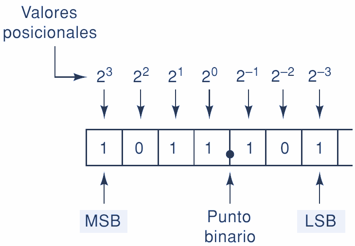

Entonces, se puede observar que la cantidad de combinaciones que se pueden obtener en binario corresponde a 2n donde  _n_  es el número de bits. Con base en lo anterior, con 4 bits se pueden obtener 16 combinaciones, con 5 bits 32 combinaciones y así sucesivamente.

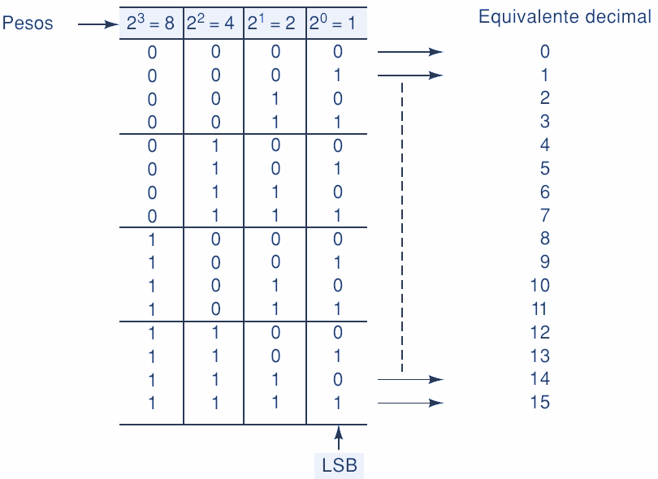

## Sistema Octal

El sistema numérico octal es un sistema base 8 debido a que tiene  _8 símbolos_  los cuales son los números del  _0_  al  _7_ . Es necesario identificar la base del número colocándola como subíndice. Por ejemplo, si se desea representar el número 256 en  _octal_  se coloca: 2568. La cantidad de combinaciones que se pueden obtener en octal corresponde a 8n donde  _n_  es el número de símbolos.

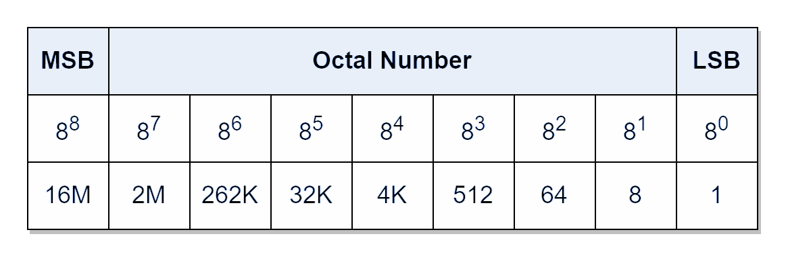

Igual que el sistema decimal, cada símbolo tiene un peso. Los pesos para los números octales son potencias positivas base ocho que aumentan de derecha a izquierda comenzando por 80.

|||
|---|---|
|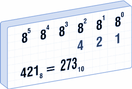 | 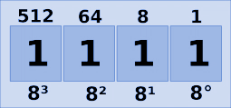|

## Sistema Hexadecimal

El sistema numérico hexadecimal es un sistema base 16 debido a que tiene  _16 símbolos_  los cuales son los números del  __0__  al  __9__  y de la letra  __A__  a la  __F__ . Es necesario identificar la base del número colocándola como subíndice. Por ejemplo, si se desea representar el número 95B en  __hexadecimal__  se coloca: 95B16. La cantidad 16 de combinaciones que se pueden obtener en hexadecimal corresponde a 16n donde n es el número de símbolos.

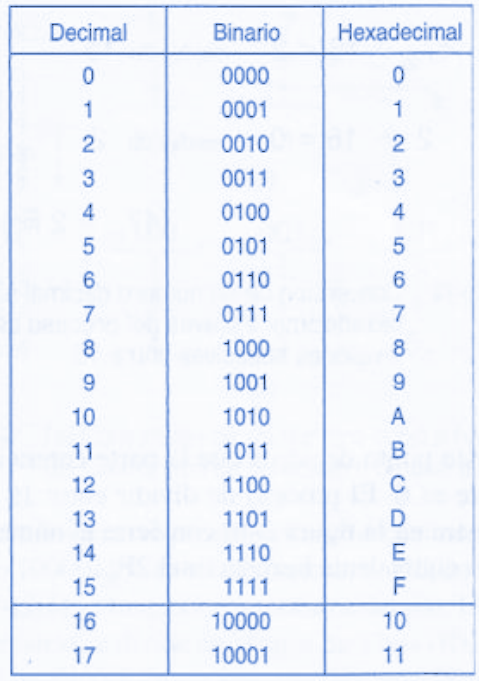

Los pesos para los números hexadecimales son potencias positivas base dieciséis que aumentan de derecha a izquierda comenzando por 160.

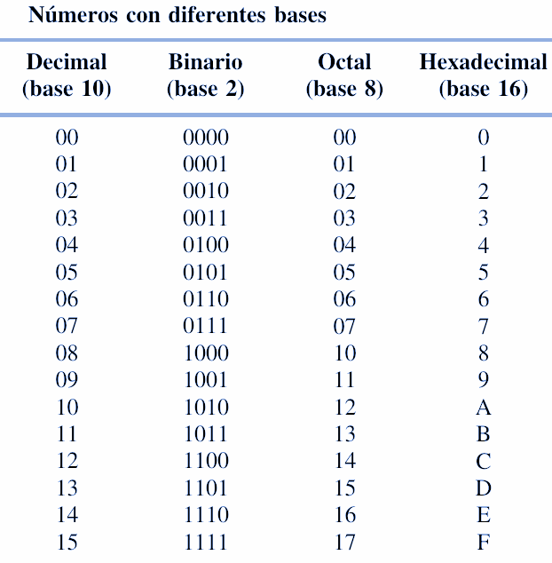

## Código Gray

Es  __un código__  con una característica fundamental.  _La variación entre una combinación y otra es de solo un bit_ . Esta característica es bastante importante en muchas aplicaciones como detección y corrección de errores en sistemas de comunicaciones digitales, de allí la importancia del mismo.

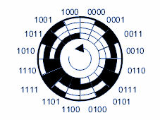

Para construir el código se debe iniciar con los símbolos del código binario en el bit de menor peso, es decir con el 0 y 1. Después se refleja el código resultante, es decir, que se continúa el código colocando el 1 y 0, luego se coloca el bit de siguiente peso con la mitad de posiciones en 0 y la otra mitad en 1.

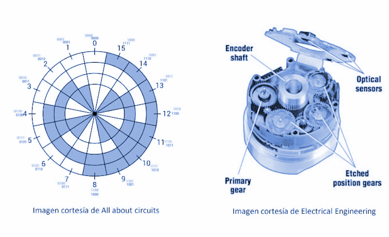

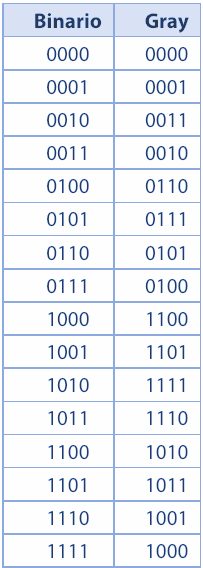

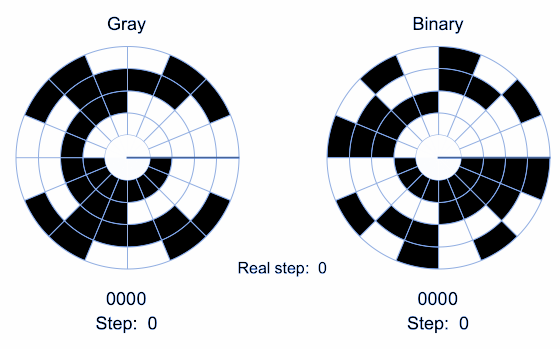

## DECIMAL A BINARIO

### Método de divisiones sucesivas

Este método consiste en tomar el número decimal y dividirlo en 2 \(debido a que la base del sistema binario es 2\). La división se repite hasta que el cociente sea menor que el divisor. Para este caso en particular, debido a que el divisor es 2 entonces se hace divisiones hasta que el cociente sea 1. Al finalizar el número binario se construye tomando el último cociente y se toma los residuos de las divisiones desde el último hasta el primer residuo.

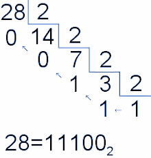

Por ejemplo, si tomamos el número decimal 2410 le aplicamos el método que daría de la siguiente forma:

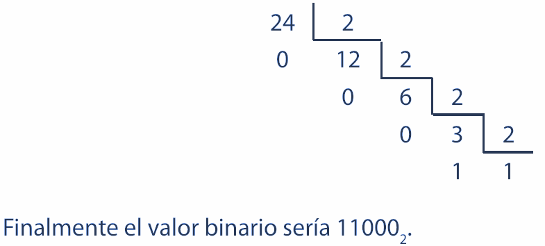

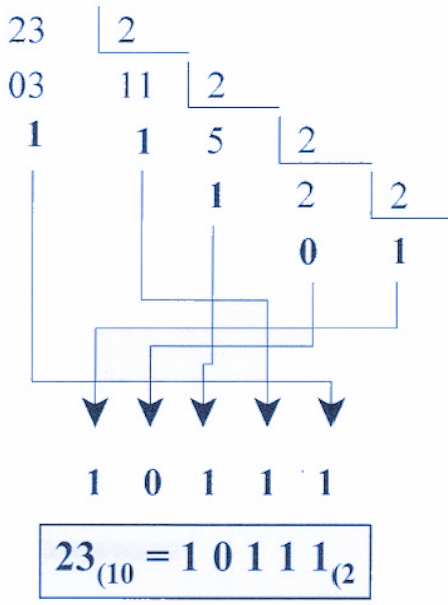

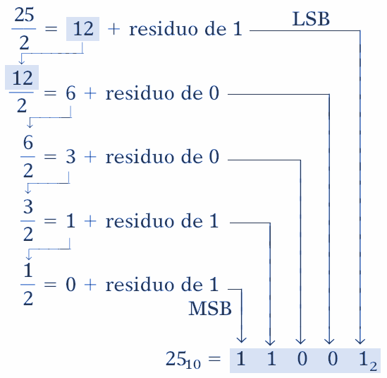

### División repetida

Para convertir enteros decimales a binario es el que utiliza la división entre 2. Para la conversión, que se muestra a continuación para el número 2510, se requiere dividir en forma repetida el número decimal entre 2 y anotar el residuo después de cada división hasta que se obtenga un cociente de 0. El resultado binario se obtiene al escribir el primer residuo como el LSB y el último como el MSB.

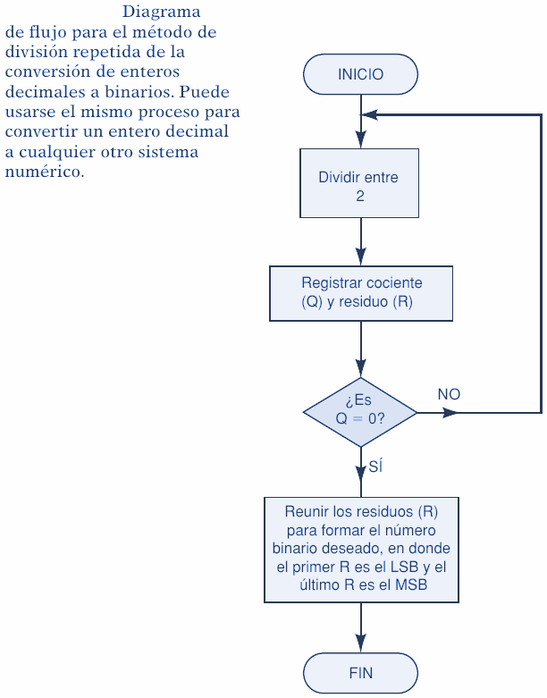

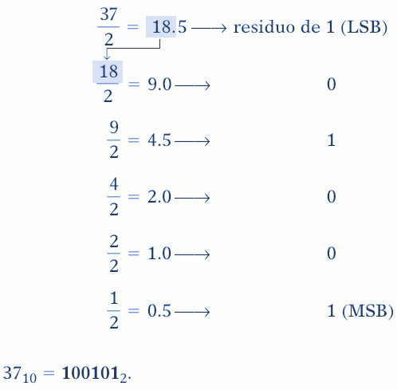

### Método de suma de pesos

Este método consiste en calcular el número binario equivalente al número decimal dado mediante la suma de los pesos binarios que dan como resultado el número decimal. Es necesario tener en cuenta que los pesos binarios van de 20 hasta 2n donde  _n_  es el número de bits. Esto es equivalente a decir que los pesos son: 1, 2, 4, 8, 16, 32, etc.

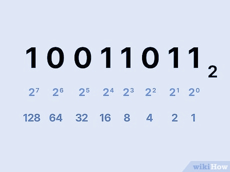

Por ejemplo, si tenemos el número 2510 entonces debemos encontrar un peso que no exceda esa cantidad. Si se escoge el peso 5, 25 = 32 y excede el 25. Entonces el peso adecuado a escoger es el 4.

$$24 = 16$$

$$25 - 16 = 9$$

Aplicamos el mismo algoritmo para el valor resultante que es el 8.

$$23 = 8$$

$$9 - 8 = 1$$

Aplicamos el mismo algoritmo para el valor resultante que es el 1. Nos damos cuenta que 22 = 4 excede el 1, 21 = 2 excede el 1, entonces:

$$20 = 1$$

$$1 - 1 = 0$$

Finalmente, nos damos cuenta de que debe intervenir el peso 4, 3 y 0. Eso significa que para estos pesos el valor es 1. Para los pesos 2 y 1 el valor debe ser 0.

$$\text{24  23  22  21  20}$$

$$\text{1    1    1    1    1}$$

$$16 + 8 + 0 + 0 + 1 = 25$$

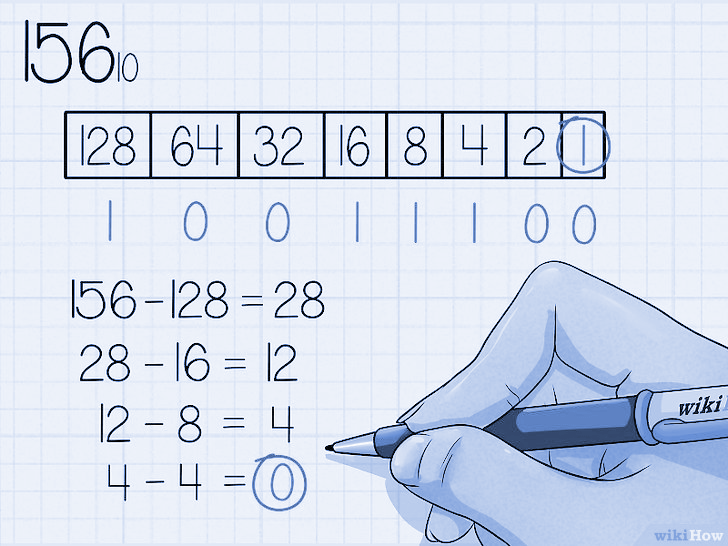

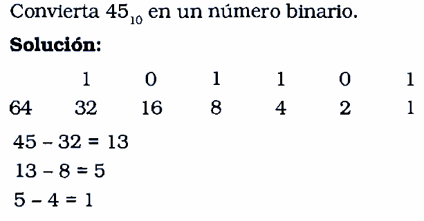

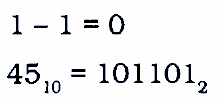

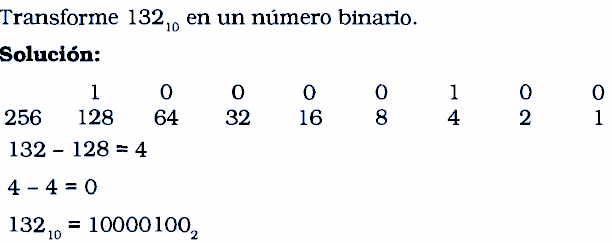

## BINARIO A DECIMAL

### Método de suma de pesos

Este método consiste en calcular el valor de cada peso del número binario y hacer la sumatoria de sus resultados. El resultado de la sumatoria equivaldrá al número decimal.

Por ejemplo, si tenemos el número $11011010_2$ hacemos las siguientes operaciones:

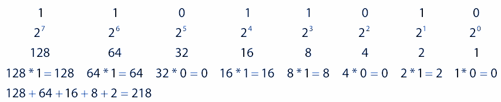

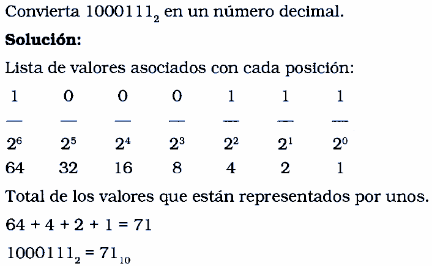

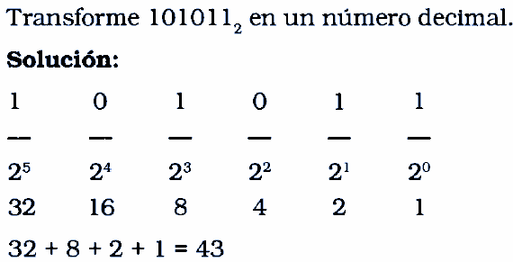

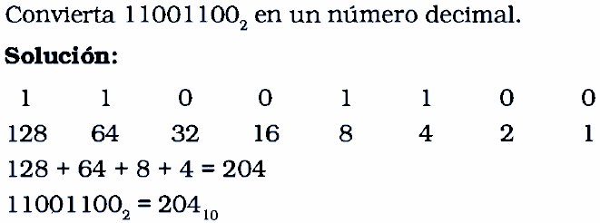

### Binario a Hexadecimal

Nótese que cuatro bits binarios corresponden a un dígito hexadecimal. Esto es, se requieren exactamente cuatro bits para contar desde 0 hasta F. Para representar números binarios como números hexadecimales, se forman grupos de cuatro, comenzando en el punto binario y en dirección a la izquierda.

_Un número binario de ocho bits puede representarse adecuadamente con dos dígitos hexadecimales._

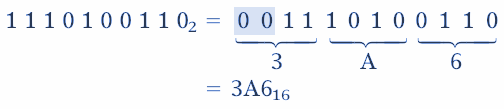

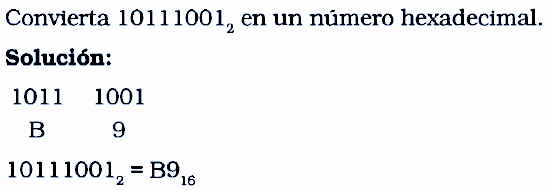

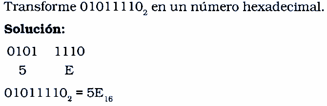

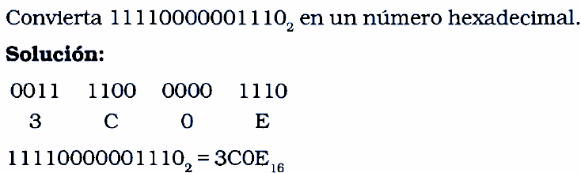

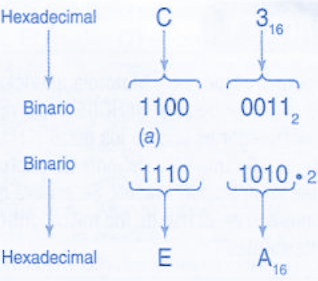

### Hexadecimal a binario

La conversión de hexadecimal a binario es igual de sencilla. Por cada dígito hexadecimal, se escriben los dígitos binarios correspondientes.

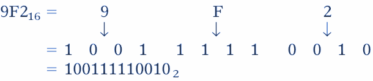

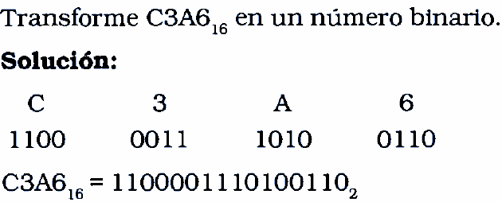

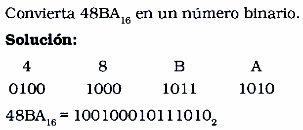

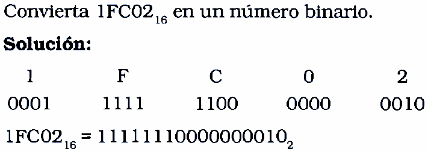

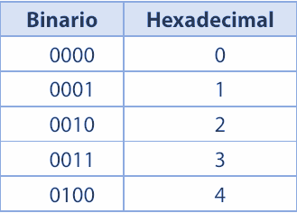

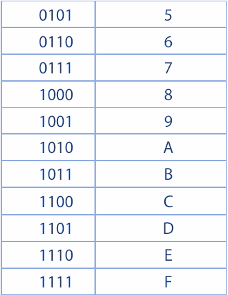

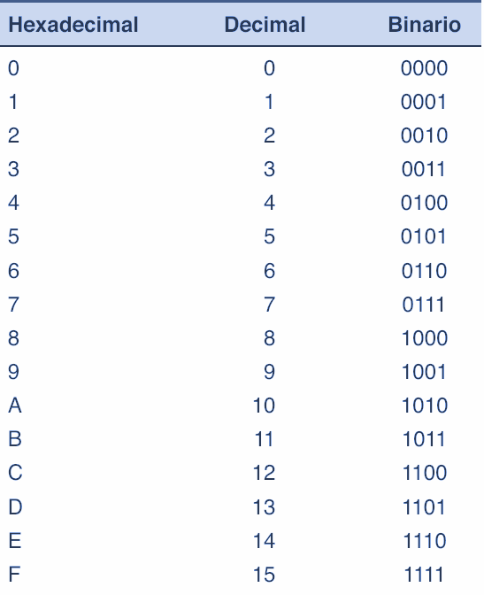

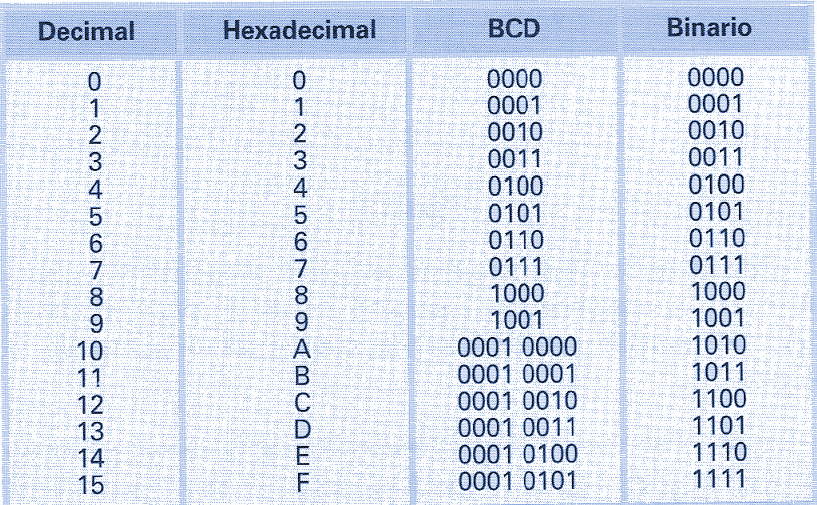
