# Operaciones Binarias

## SUMA BINARIA

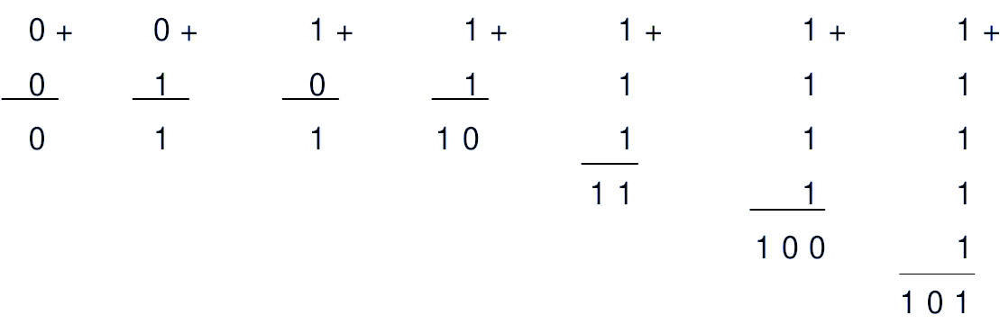

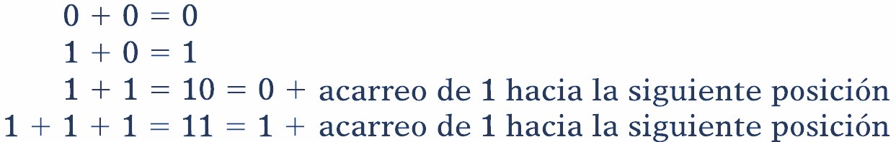

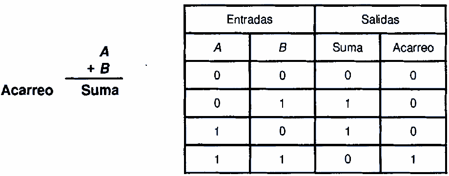

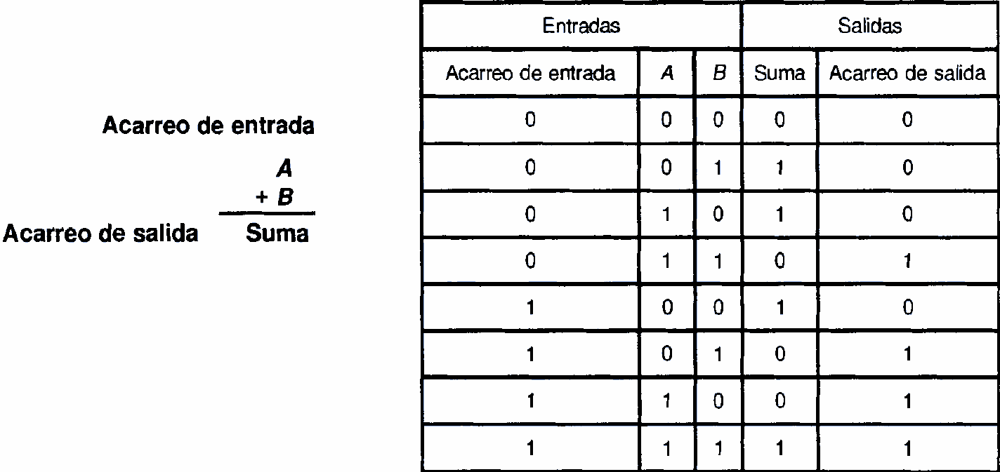

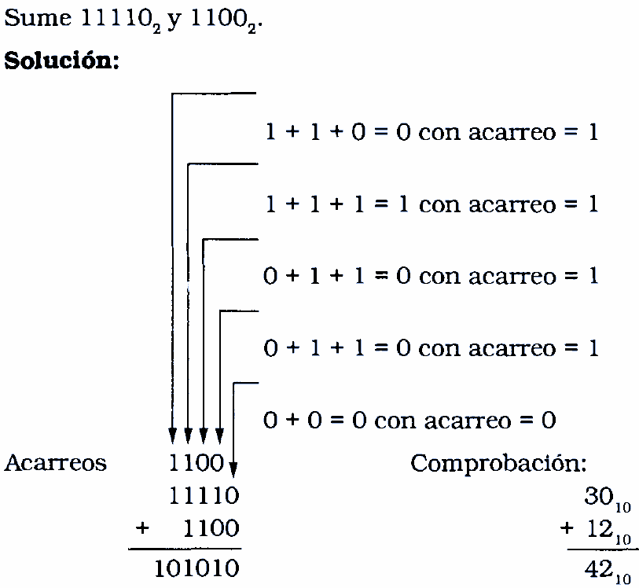

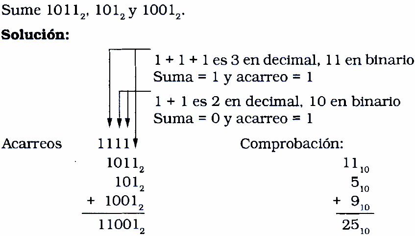

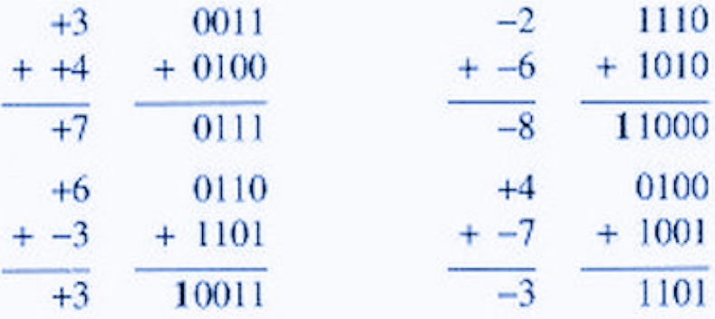

### Suma binaria: Ejercicio

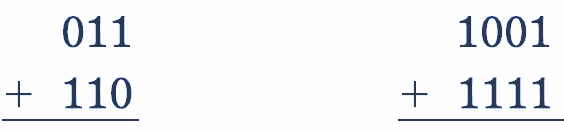

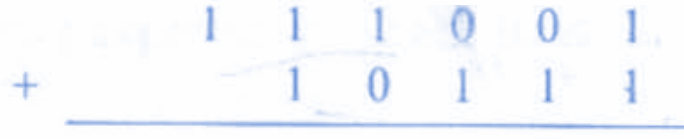

## RESTA BINARIA

### Complemento a 1

Se obtiene invirtiendo los bits.

Por lo tanto, decimos que el complemento a 1 de  _101101_  es  _010010_

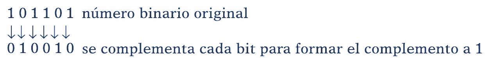

Se toma el resultado del complemento a 1 y se suma 1.

Esto convierte al número en negativo.

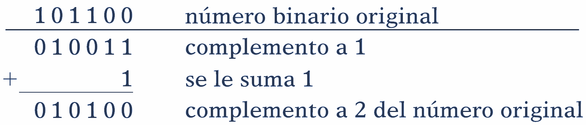

### Números negativo

Una de las maneras de realizar la resta binaria es usando complemento a 2 (no es la única manera).

Una vez obtenido el complemento a 2, se agrega un 1 como  MSB, y con eso indicamos que el número es negativo.

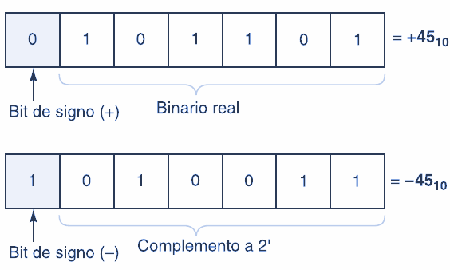

### Complemento a 2

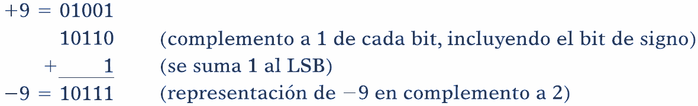

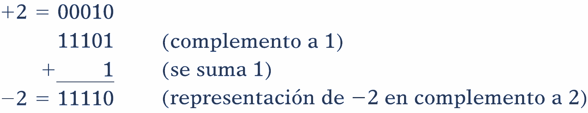

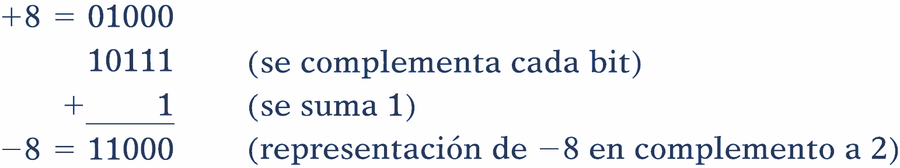

### Resta binaria: Ejemplo

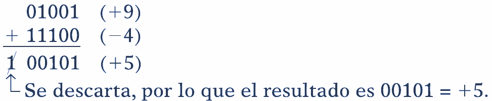

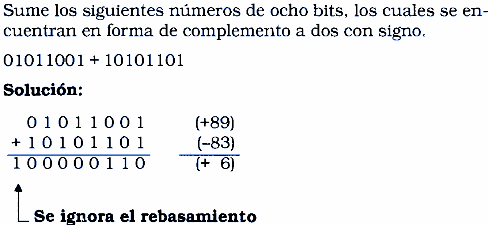

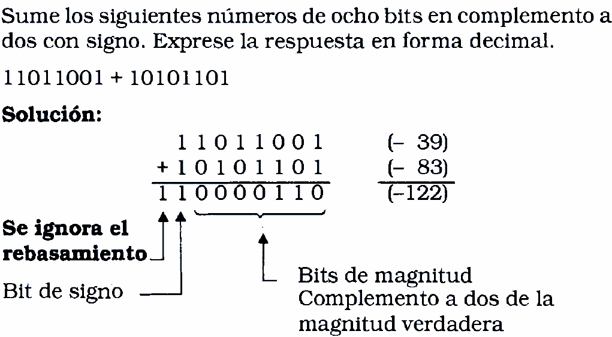
