# Diseño Digital

En los sistemas digitales\, la información que se procesa\, por lo general\, está presente en formato binario. Las cantidades binarias pueden representarse mediante cualquier dispositivo que solo tenga  _dos estados de operación o condiciones posibles_ .

Un interruptor solo tiene dos estados:  _abierto o cerrado_ . De manera arbitraria podemos permitir que un  _interruptor abierto represente el 0 binario_  y que un  _interruptor cerrado represente el 1 binario_.

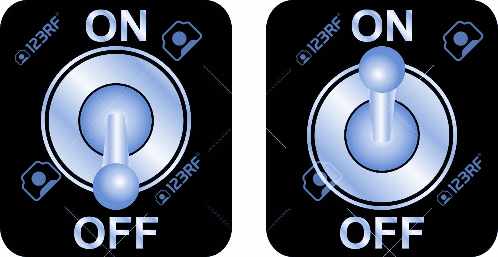

Con esta asignación podemos ahora representar cualquier número binario. Se muestra un número en código binario para un dispositivo de apertura de puertas de garaje. Los pequeños interruptores están ajustados para formar el número binario 1000101010. La puerta se abrirá solo si coinciden los patrones de bits en el receptor y en el transmisor.

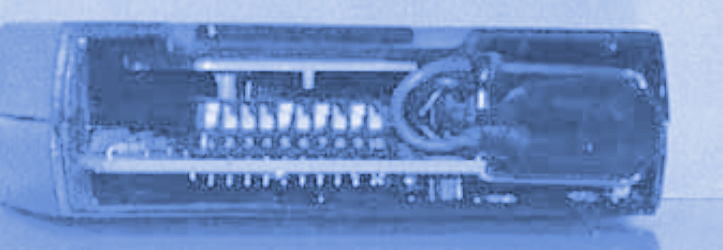

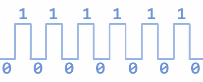

Se almacenan números binarios en un CD. La superficie interior \(debajo de una capa de plástico transparente\) se recubre con una capa de aluminio con alta capacidad de reflexión. Se queman hoyos a través de esta cubierta reflectora para formar “pozos” que no reflejan la luz de la misma manera que las áreas no quemadas. Estas áreas en las que se queman los pozos se consideran como “1s” y las áreas reflectoras son “0s”.

Existen muchos otros dispositivos que sólo tienen dos estados de operación\, o que pueden operarse en dos condiciones extremas. Entre ellos están: la bombilla de luz \(brillante u oscura\)\, el diodo \(conductor o no conductor\)\, el electroimán \(energizado o desenergizado\)\, el transistor \(en corte o saturado\)\, la fotocelda \(iluminada u oscura\)\, el termostato \(abierto o cerrado\)\, el embrague mecánico \(enganchado o desenganchado\)\, y un área en un disco magnético \(magnetizada o desmagnetizada\).

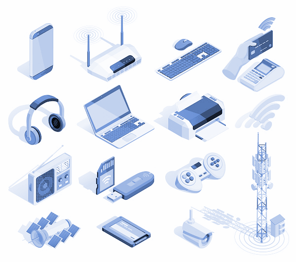

En los sistemas digitales electrónicos la información binaria se representa mediante voltajes \(o corrientes\) que están presentes en las entradas y salidas de los diversos circuitos. Por lo general\, el  _0_  y el  _1 binarios_  se representan mediante dos niveles de voltaje nominal. Por ejemplo\, cero Volts \(0 V\) podrían representar el 0 binario y 5 V podrían representar el 1 binario.

En realidad\, y debido a las variaciones en los circuitos\, el 0 y el 1 se representan mediante intervalos de voltaje. Cualquier voltaje entre 0 y 0.8 V representa un 0 y cualquier voltaje entre 2 y 5 V representa un 1. Por lo general\, todas las señales de entrada y salida se encuentran dentro de alguno de estos intervalos\, excepto durante las transiciones de un nivel a otro.

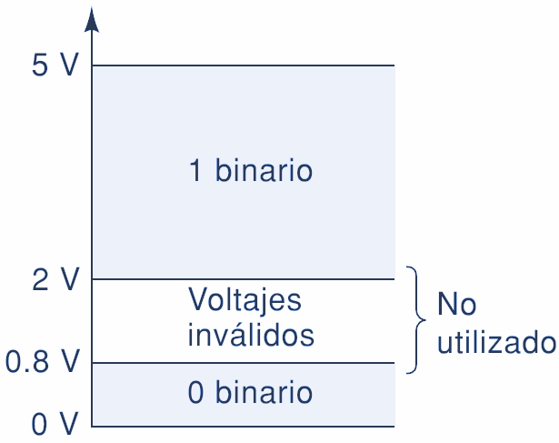

Podemos notar otra diferencia importante entre los sistemas digitales y los analógicos. En los sistemas digitales\, el valor exacto de un voltaje no es importante; por ejemplo\, para las asignaciones de un voltaje de 3.6 V significa lo mismo que un voltaje de 4.3 V. En los sistemas analógicos el valor exacto de un voltaje es importante. Por ejemplo\, si el voltaje analógico es proporcional a la temperatura medida por un transductor\, 3.6 V representaría una temperatura distinta que 4.3 V.

En otras palabras\, la magnitud del voltaje lleva información importante. Dicha característica significa que\, por lo general\, es más difícil diseñar circuitos analógicos precisos que circuitos digitales\, debido a la manera en la que se ven afectados los valores exactos de voltaje por las variaciones en los valores de los componentes\, la temperatura y el ruido \(fluctuaciones aleatorias de voltaje\).

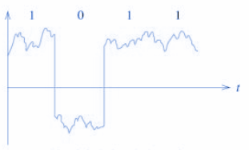

Se muestra una señal digital común y la forma en que esta varía a través del tiempo. En realidad es un gráfico de voltaje contra tiempo  _\(t\)_  y se le conoce como  _diagrama de tiempos_ . La escala de tiempo horizontal está graduada en intervalos regulares que comienzan desde  _t_  _0_  y avanzan hasta  _t_  _1_  _\, t_  _2_  y así sucesivamente.

Para el ejemplo del diagrama de tiempos que se muestra aquí\, la señal empieza en 0 V \(un 0 binario\) en el tiempo  _t_  _0_  y permanece ahí hasta el tiempo  _t_  _1_ . En  _t_  _1_  la señal realiza una transición \(salto\) hasta 4 V \(un 1 binario\). En  _t_  _2_  regresa a 0 V. En  _t_  _3_  _ y t_  _5_  ocurren transiciones similares. Observe que la señal no cambia en  _t_  _4_ \, sino que permanece en 4 V desde  _t_  _3_  hasta  _t_  _5_ .

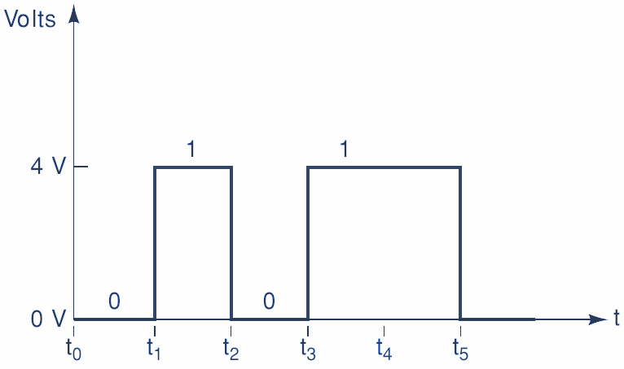

## Circuitos Digitales

Los  __circuitos digitales__  están diseñados para producir voltajes de salida que se encuentran dentro de los intervalos de voltaje prescritos para 0 y 1. De igual forma\, los circuitos digitales están diseñados para responder en forma predecible a los voltajes de entrada que se encuentran dentro de los intervalos definidos de 0 y 1.

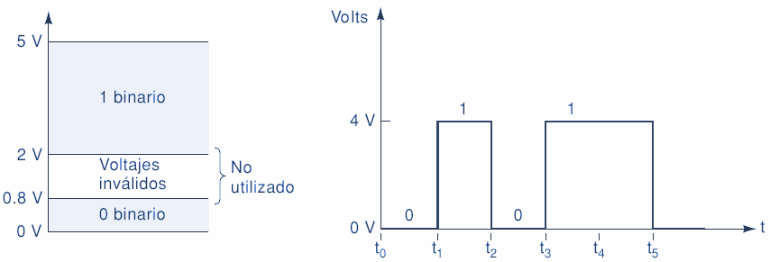

Esto significa que un circuito digital responderá de igual forma a todos los voltajes de entrada que se encuentren dentro de los valores permitidos para 0; de manera similar\, no habrá distinción entre los voltajes de entrada que se encuentren dentro del intervalo permitido para 1.

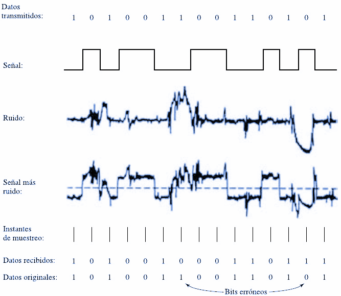

Se representa un circuito digital típico con una entrada  _vi_  y una salida  _vo_ . La salida se muestra para dos formas de onda de señal de entrada distintas. Observe que  _vo_  es igual para ambos casos\, pues aunque las dos formas de onda de entrada difieren en sus niveles exactos de voltaje\, se encuentran en los mismos niveles binarios.

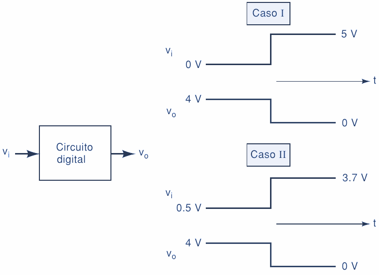

## Dígitos binarios

Cada uno de los dos dígitos del sistema  _binario_ \, 1 y 0\, se denomina  _bit_ \, que es la contracción de las palabras  _binary digit_  \( _dígito binario_ \). En los circuitos digitales se emplean dos niveles de tensión diferentes para representar los dos bits.

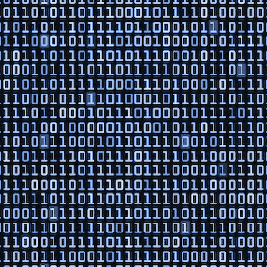

Por lo general\, el  _1_  se representa mediante el  _nivel de tensión_  más elevado\, que se denomina nivel  _ALTO \(HIGH\)_  y  _0_  se representa mediante el  _nivel de tensión más bajo_ \, que se denomina nivel  _BAJO \(LOW\)_ .  _Este convenio recibe el nombre de _  _lógica positiva_ .

__ALTO \(HIGH\) = 1__

__BAJO \(LOW\) = 0__

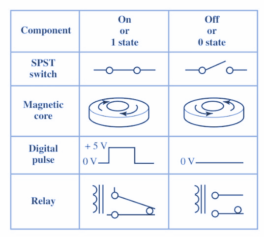

Un sistema en el que un 1 se representa por un nivel BAJO y un 0 mediante un nivel ALTO se dice que emplea  _lógica negativa_ .

Los grupos de bits \(combinaciones de 1s y 0s\)\, llamados códigos\, se utilizan para representar números\, letras\, símbolos\, instrucciones y cualquier otra cosa que se requiera en una determinada aplicación.

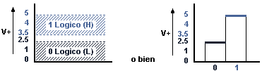

## Niveles lógicos

Las tensiones empleadas para representar un 1 y un 0 se denominan  _niveles lógicos_ . En el caso ideal\, un nivel de tensión representa un nivel ALTO y otro nivel de tensión representa un nivel BAJO.

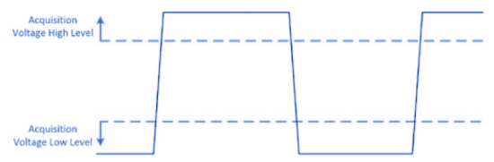

Sin embargo\, en un circuito digital real\, un nivel ALTO puede ser cualquier tensión entre un valor mínimo y un valor máximo especificados. Del mismo modo\, un nivel BAJO puede ser cualquier tensión comprendida entre un mínimo y máximo especificados. No puede existir solapamiento entre el rango aceptado de niveles ALTO y el rango aceptado de niveles BAJO.

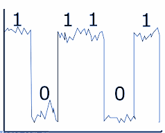

Se ilustra el rango general de los niveles BAJO y ALTO aceptables para un circuito digital. La variable  _V_  _H\(máx\)_  representa el valor máximo de tensión para el nivel ALTO y  _V_  _H\(mín\)_  representa el valor de tensión mínimo para el nivel ALTO. El valor máximo de tensión para el nivel BAJO se representa mediante  _V_  _L\(máx\)_  y el valor mínimo de tensión para el nivel BAJO mediante  _V_  _L\(mín\)_ .

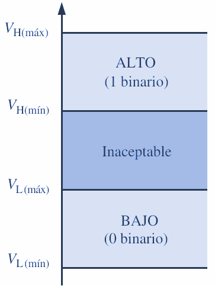

Los valores de tensión comprendidos entre  _V_  _L\(máx\)_  _ y V_  _H\(mín\)_  no son aceptables para un funcionamiento correcto. Una tensión en el rango no permitido puede ser interpretada por un determinado circuito tanto como un nivel ALTO cuanto como un nivel BAJO\, por lo que no puede tomarse como un valor aceptable.

Por ejemplo\, los valores para el nivel ALTO en un determinado tipo de circuito digital denominado CMOS pueden variar en el rango de 2 V a 3\,3 V y los valores para el nivel BAJO en el rango de 0 V a 0\,8 V. De esta manera\, si por ejemplo se aplica una tensión de 2\,5 V\, el circuito lo aceptará como un nivel ALTO\, es decir\, un 1 binario. Si se aplica una tensión de 0\,5 V\, el circuito lo aceptará como un nivel BAJO\, es decir\, un 0 binario. En este tipo de circuito\, las tensiones comprendidas entre 0\,8 V y 2 V no son aceptables.

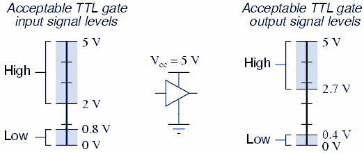

## Circuitos lógicos

_La forma en que un circuito digital responde a una entrada se conoce como lógica del circuito_ . Cada tipo de circuito digital obedece un cierto conjunto de reglas lógicas. Por esta razón a los circuitos digitales se les conoce también como circuitos lógicos.

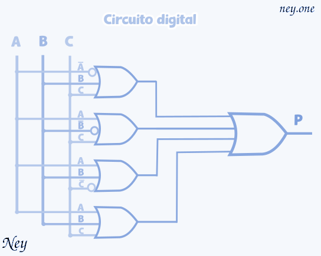

## Circuitos digitales integrados

Casi todos los circuitos digitales que se utilizan en los sistemas digitales modernos son circuitos integrados \(CI\). La amplia variedad de circuitos integrados lógicos disponibles\, ha hecho posible la construcción de sistemas digitales complejos que son más pequeños y confiables que sus contrapartes fabricados con componentes discretos.

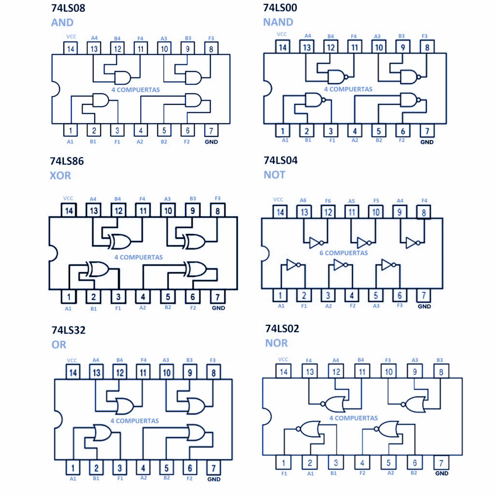

Existen varias tecnologías de fabricación de circuitos integrados utilizadas para producir circuitos integrados digitales\, de las cuales las más comunes son CMOS\, TTL\, NMOS y ECL. Cada una difiere en cuanto al tipo de circuito utilizado para proporcionar la operación lógica deseada.

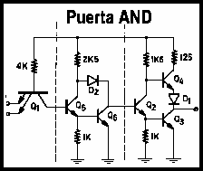

Por ejemplo\, TTL \(lógica de transistor\-transistor\) utiliza el transistor bipolar como el elemento principal en el circuito\, mientras que CMOS \(semiconductor de metal óxido complementario\) utiliza el MOSFET en modo mejorado como el elemento principal del circuito. Veremos sus características\, ventajas y desventajas a medida que vayamos dominando los tipos básicos de circuitos lógicos.

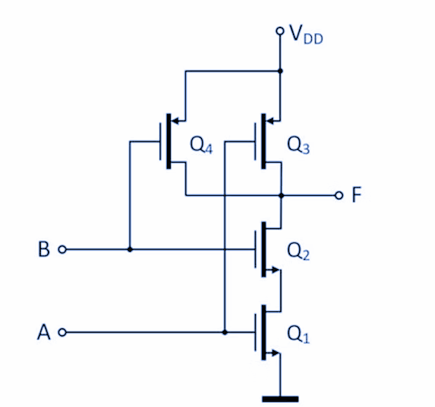

## Formas de onda digitales

Las formas de onda digitales consisten en niveles de tensión que varían entre los estados o niveles ALTO y BAJO. Se muestra que un  _impulso_  positivo se genera cuando la tensión \(o la intensidad\) pasa de su nivel normalmente BAJO hasta su nivel ALTO y luego vuelve otra vez a su nivel BAJO.

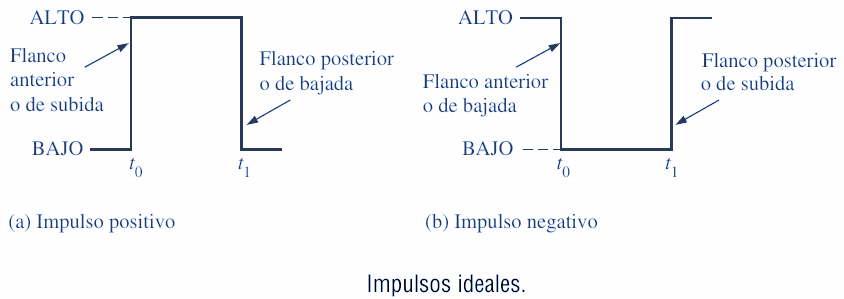

El impulso negativo se genera cuando la tensión pasa de su nivel normalmente ALTO a su nivel BAJO y vuelve a su nivel ALTO. Una señal digital está formada por una serie de impulsos.

__El impulso__ . Un impulso tiene dos flancos: un  __flanco anterior \(__  _flanco de subida_  __\)__  que se produce en el instante  _t_  _0_  y un  _flanco posterior \(flanco de bajada\)_  que se produce en el instante posterior  _t_  _1_ .

Para un impulso positivo\, el flanco anterior es un flanco de subida y el flanco posterior es de bajada. Los impulsos mostrados son ideales porque se supone que los flancos de subida y de bajada ocurren en un tiempo cero \(instantáneamente\). En la práctica\, estas transiciones no suceden de forma instantánea\, aunque para la mayoría de las situaciones digitales podemos suponer que son impulsos ideales.

Se muestra un impulso real \(no ideal\). En la práctica\, todos los impulsos presentan alguna o todas de las características siguientes. En ocasiones\, se producen picos de tensión y rizado debidos a los efectos capacitivos e inductivos parásitos. La caída puede ser provocada por las capacidades parásitas y la resistencia del circuito que forman un circuito RC con una constante de tiempo baja.

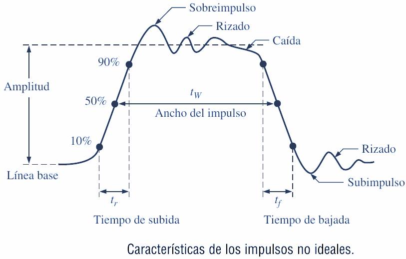

El tiempo requerido para que un impulso pase desde su nivel BAJO hasta su nivel ALTO se denomina tiempo de subida \( _t_  _r_ \)\, y el tiempo requerido para la transición del nivel ALTO al nivel BAJO se denomina tiempo de bajada \( _t_  _f_ \).

En la práctica\, el tiempo de subida se mide como el tiempo que tarda en pasar del 10% \(altura respecto de la línea\) al 90% de la amplitud del impulso y el tiempo de bajada se mide como el tiempo que tarda en pasar del 90% al 10% de la amplitud del impulso.

La razón de que el 10% inferior y el 10% superior no se incluyan en los tiempos de subida y de bajada se debe a la no linealidad de la señal en esas áreas. El ancho del impulso \( _t_  _W_ \) es una medida de la duración del impulso y\, a menudo\, se define como el intervalo de tiempo que transcurre entre los puntos en que la amplitud es del 50% en los flancos de subida y de bajada\, como se indica.

## Características de la forma de onda

La mayoría de las formas de onda que se pueden encontrar en los sistemas digitales están formadas por series de impulsos\, algunas veces denominados también trenes de impulsos\, y pueden clasificarse en periódicas y no periódicas.

Un tren de impulsos  _periódico_  es aquel que se repite a intervalos de tiempo fijos; este intervalo de tiempo fijo se denomina  _período \(T\)_ . La  _frecuencia \(f\)_  es la velocidad a la que se repite y se mide en hercios \(Hz\).

Por supuesto\, un tren de impulsos no periódico no se repite a intervalos de tiempo fijos y puede estar formado por impulsos de distintos anchos y/o impulsos que tienen intervalos distintos de tiempo entre los pulsos.

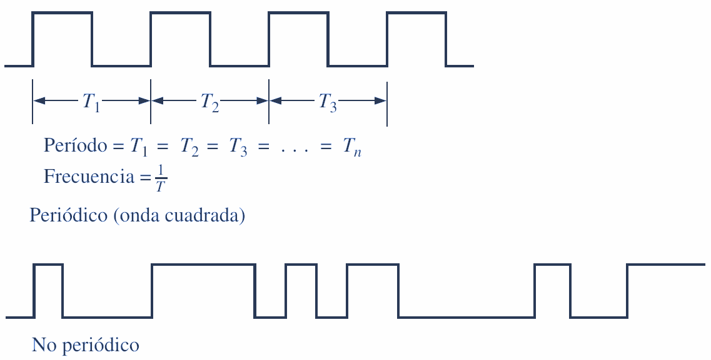

La frecuencia  _\(f\)_  de un tren de pulsos \(digital\) es el inverso del período. La relación entre la frecuencia y el período se expresa como sigue:

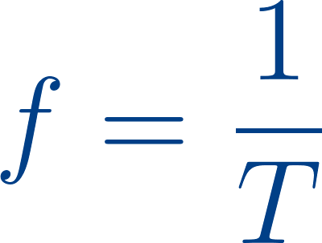

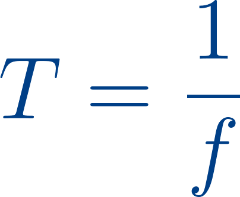

Una característica importante de una señal digital periódica es su  _ciclo de trabajo_ \, que es el cociente entre el ancho del impulso \( _t_  _W_ \) y el período \( _T_ \) y puede expresarse como un porcentaje.

## Diagramas de tiempos

Un diagrama de tiempos o cronograma es una gráfica de señales digitales que muestra la relación temporal real entre dos o más señales y cómo varía cada señal respecto a las demás.

Al examinar un diagrama de tiempos\, es posible determinar los estados \(ALTO o BAJO\) de todas las formas de onda en cualquier punto de tiempo especificado y el instante exacto en el que una forma de onda cambia de estado respecto a las restantes.

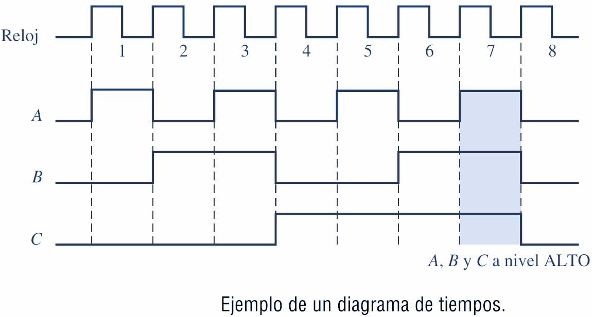

A partir de este diagrama de tiempos podemos ver\, por ejemplo\, que las tres formas de onda A\, B y C están a nivel ALTO solo durante el séptimo ciclo de reloj y las tres cambian de nuevo a nivel BAJO cuando termina dicho ciclo \(área sombreada\).

## BYTE, NIBBLE Y PALABRA

### Bytes

La mayoría de las microcomputadoras maneja y almacena datos binarios e información en grupos de ocho bits\, por lo que una cadena de ocho bits tiene un nombre especial: byte. Un byte consiste de ocho bits y puede representar cualquier tipo de datos o de información. Los siguientes ejemplos ilustrarán este punto.

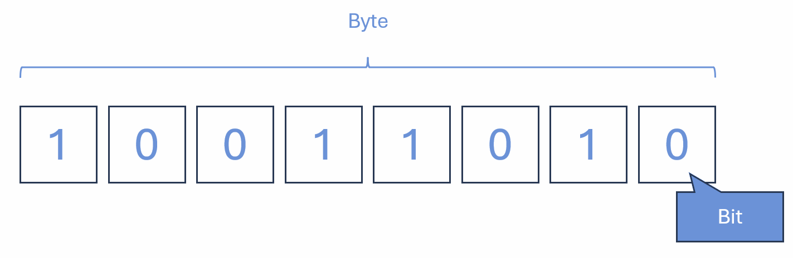

### Nibbles

A menudo los números binarios se descomponen en grupos de cuatro bits\, como con códigos BCD y las conversiones a números hexadecimales. En los primeros días de los sistemas digitales surgió un término para describir un grupo de cuatro bits. Como abarca la  _mitad de un byte_ \, se le denominó nibble. Los siguientes ejemplos ilustran el uso de este término.

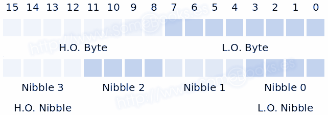

### Palabras

Los términos bit\, nibble y byte representan un número fijo de dígitos binarios. A medida que los sistemas han ido creciendo a lo largo de los años\, también ha crecido su capacidad \(¿apetito?\) de manejar datos binarios. Una palabra es un grupo de bits que representa una cierta unidad de información.

El tamaño de la palabra depende del tamaño de la ruta de datos en el sistema que utiliza la información. El tamaño de palabra puede definirse como el número de bits en la palabra binaria con el que opera un sistema digital.

Por ejemplo\, tal vez la computadora en su horno de microondas solo pueda manejar un byte a la vez. Tiene un tamaño de palabra de ocho bits. Por otro lado\, la computadora personal en su escritorio puede manejar ocho bytes a la vez\, por lo que tiene un tamaño de palabra de 64 bits.

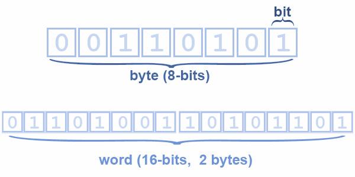

## Código ASCII

El código alfanumérico más utilizado es el  _Código estándar estadounidense para el intercambio de información \(ASCII\)._  Este código es de siete bits\, por lo cual tiene 27 = 128 códigos posibles. Más que suficiente para representar todos los caracteres estándar del teclado\, así como las funciones de control tales como retorno de carro \(RETURN\) y avance de línea \(LINEFEED\).

Se muestra un listado del código ASCII estándar de siete bits. La tabla proporciona los equivalentes en hexadecimal y decimal. Para obtener el código binario de siete bits para cada carácter hay que convertir el valor hexadecimal en binario.

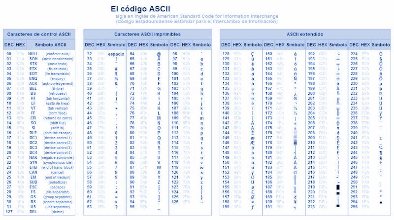

La tabla proporciona los equivalentes en hexadecimal y decimal. Para obtener el código binario de siete bits para cada carácter hay que convertir el valor hexadecimal en binario.

