# Compuertas logicas

## Constantes y Variables Booleanas

El álgebra booleana difiere en gran medida del álgebra ordinaria, ya que a las constantes y variables booleanas solo se les permite tener dos valores posibles: 0 y 1. Una variable booleana es una cantidad que puede ser (en distintas ocasiones) igual a 0 o a 1.

Las variables booleanas se utilizan a menudo para representar el nivel de voltaje presente en un alambre o en las terminales de entrada/salida de un circuito.

Por ejemplo, en cierto sistema digital, el valor booleano 0 podría asignarse a cualquier voltaje en el intervalo de 0 a 0.8 V, mientras que el valor booleano 1 podría asignarse a cualquier voltaje entre 2 y 5 V\*

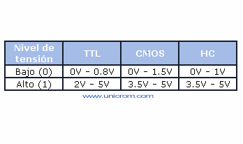

Por lo tanto, el 0 y el 1 booleanos no representan números reales, sino el estado de una variable de voltaje, o lo que se conoce como su  _nivel lógico_ . Se dice que un voltaje en un circuito digital está en el nivel 0 lógico o en el nivel 1 lógico, dependiendo de su valor numérico actual.

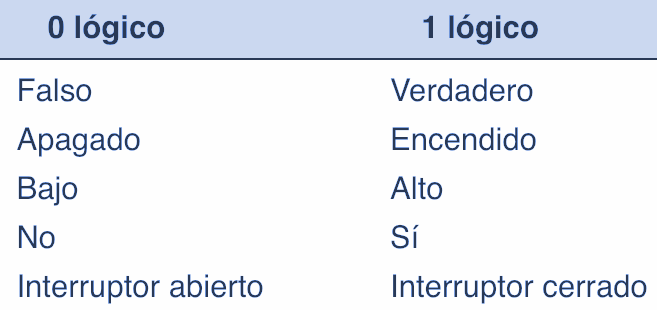

En la lógica digital se utilizan otros términos más como sinónimos de 0 y 1. La tabla muestra algunos de los más comunes. La mayor parte del tiempo utilizaremos las designaciones 0/1 y BAJO/ALTO.

El álgebra booleana es el medio para expresar la relación entre las entradas y las salidas de un circuito lógico. Las entradas se consideran variables lógicas cuyos niveles lógicos en cualquier momento determinan los niveles de salida. En todo el trabajo que veremos utilizaremos símbolos de letras para representar variables lógicas. Por ejemplo, la letra A podría representar una cierta entrada o salida de un circuito digital, y en un determinado momento debemos tener  _A = 0_  o  _A = 1_ ; alguno de los dos estados.

Como solo dos valores son posibles, en realidad es muy sencillo trabajar con el álgebra booleana en comparación con el álgebra ordinaria. En el álgebra booleana no hay fracciones, decimales, números negativos, raíces cuadradas, raíces cúbicas, logaritmos, números imaginarios, etc. De hecho, en el álgebra booleana solo hay tres operaciones básicas: _ _  _OR, AND y NOT_  _._

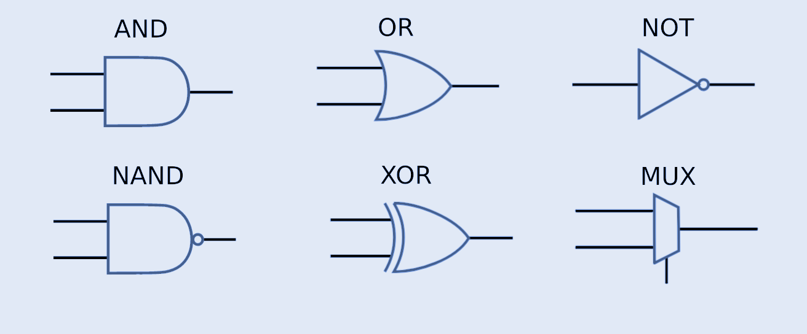

A estas operaciones básicas se les conoce como  _operaciones lógicas_ . Los circuitos digitales, llamados compuertas lógicas, pueden construirse a partir de diodos, transistores y resistencias conectados de manera que la salida del circuito sea el resultado de una operación lógica básica  _(OR, AND, NOT_ ) que se lleva a cabo con las entradas. Utilizaremos primero el álgebra booleana para describir y analizar las compuertas lógicas básicas, y después para analizar y diseñar combinaciones de compuertas lógicas conectadas para formar circuitos lógicos.

## Tablas de Verdad

Una  _tabla de verdad_  es una herramienta para describir la forma en que la salida de un circuito lógico depende de los niveles lógicos presentes en las entradas del circuito. Se muestra una tabla de verdad para un tipo de circuito lógico de dos entradas. La tabla lista todas las posibles combinaciones de niveles lógicos presentes en las entradas A y B, junto con el correspondiente nivel en la salida  _x_ .

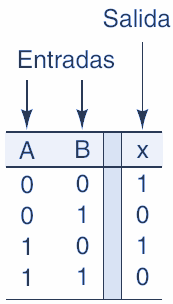

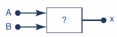

La primera entrada en la tabla muestra que cuando  _A y B_  se encuentran en el nivel 0, la salida  _x_  se encuentra en el nivel 1 o, de manera equivalente, en el estado 1. La segunda entrada muestra que cuando la entrada B se cambia al estado 1, de manera que A = 0 y B = 1, la salida x se vuelve un 0. De manera similar, la tabla muestra qué ocurre con el estado de salida para cualquier conjunto de condiciones de entrada.

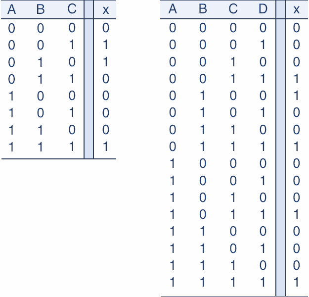

Se muestran ejemplos de tablas de verdad para circuitos lógicos de tres y cuatro entradas. De nuevo, cada tabla enlista todas las posibles combinaciones de niveles lógicos de las entradas a la izquierda, con el nivel lógico resultante para la salida  _x_  a la derecha. Desde luego que los valores reales para  _x_  dependerán del tipo de circuito lógico.

Hay 4 combinaciones para la tabla de verdad de dos entradas, 8 combinaciones para una tabla de verdad de tres entradas y 16 combinaciones para la tabla de verdad de cuatro entradas. El número de combinaciones de entrada será igual a 2N para una tabla de verdad con  _N_  entradas. También la lista de todas las posibles combinaciones de entrada va de acuerdo con la secuencia de conteo binario, por lo que es fácil anotar todas las combinaciones sin que falte una.

## COMPUERTA OR

### Operación OR con Compuertas OR

La operación OR (O) es la primera de las tres operaciones booleanas básicas. El horno de cocina es un buen ejemplo. La luz dentro del horno debe encenderse si el interruptor de la luz del horno está encendido  _“O”_  si la puerta está abierta.

La letra  _A_  podría usarse para representar la condición interruptor de la luz del horno encendido y  _B_  podría representar la condición puerta abierta. La letra  _x_  podría representar la condición luz encendida.

Se muestra lo que ocurre cuando se combinan dos entradas lógicas (A y B) mediante el uso de la operación OR para producir la salida x. La tabla muestras que x es un 1 lógico para cada una de las combinaciones de niveles de entrada en donde una o más entradas sea 1. El único caso en el que x es un 0 es cuando ambas entradas son 0.

La expresión booleana para la operación OR es

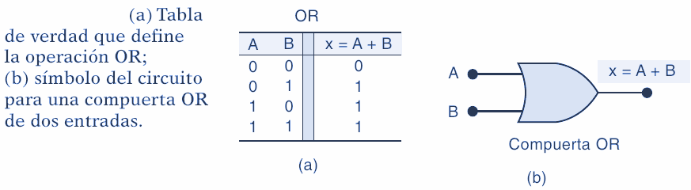

En esta expresión,  _el signo _  _+_  _ no indica la suma ordinaria_ ;  __indica la operación OR__ . Esta operación es similar a la suma ordinaria, excepto para el caso en el que tanto A como B son 1; la operación OR produce  _1 + 1 = 1, _  __no__  _ 1 + 1  = 2_ .

En el álgebra booleana 1 es el valor más alto, por lo que nunca tendremos un resultado mayor que 1. Lo mismo aplica cuando se combinan tres entradas mediante el uso de la operación OR. Aquí tenemos que  _x = A + B + C_ . Si consideramos el caso en el que las tres entradas son 1, tenemos

La expresión  _x = A + B_  se lee como “ _x es igual a A OR B_ ”, lo cual significa que  _x_  será  _1_  cuando  _A o B o ambas sean 1_ . De igual forma, la expresión x = A + B + C se lee como “ _x es igual a A OR B OR C_ ”, lo cual significa que  _x_  será  _1_  cuando  _A o B o C o cualquier combinación de ellas sean 1_ . Para describir este circuito en el idioma español podríamos decir que  _x es verdadera (1) _  _CUANDO_  _ A es verdadera (1) _  _OR_  _ B es verdadera (1) _  _OR_  _ C es verdadera (1)_

### Compuerta OR

En los circuitos digitales, una  __compuerta OR__  es un circuito que tiene dos o más entradas y cuya salida es igual a la combinación  __OR__  de las entradas. Se muestra el símbolo lógico para una compuerta  __OR__  de dos entradas.

Las entradas A y B son niveles lógicos de voltaje y la salida x es un nivel lógico de voltaje cuyo valor es el resultado de la operación  __OR__  sobre _ A y B_ ; es decir, x = A + B. En otras palabras, la compuerta OR opera de manera que su salida esté en ALTO, 1 lógico, si cualquiera de las entradas A o B o ambas se encuentran en el nivel 1 lógico. La salida de la  _compuerta OR_  estará en BAJO, 0 lógico, solo si todas sus entradas están en 0 lógico.

Esta misma idea puede extenderse a más de dos entradas.  Se muestra una compuerta  __OR__  de tres entradas y su tabla de verdad. Si examinamos esta tabla de verdad podremos ver de nuevo que la salida será 1 para cada caso en el que una o más entradas sean 1. Este principio general es el mismo para las compuertas OR con cualquier número de entradas.

Si utilizamos el lenguaje del álgebra booleana, la salida  _x_  podemos expresarla como x = A + B + C, en donde hay que enfatizar otra vez que el símbolo  representa la operación OR. Así, la salida de cualquier compuerta OR puede expresarse como la combinación OR de sus diversas entradas.

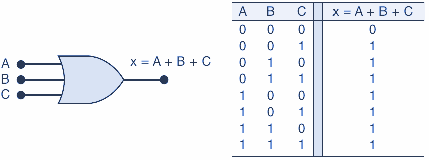

El funcionamiento de la compuerta se puede observar:

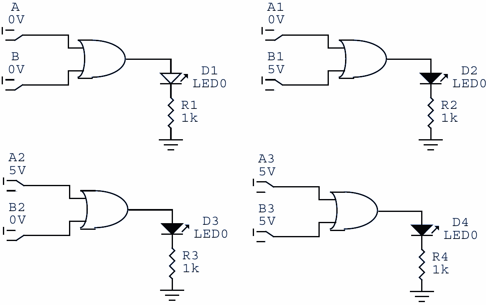

Se puede apreciar que en la parte superior izquierda hay en las entradas ceros lógicos, por consiguiente a la salida se apaga el LED indicando un cero lógico. En el resto de las figuras la salida es uno lógico, lo cual describe la tabla de verdad de esta operación lógica.

La referencia de la compuerta OR de dos entradas es el número 74LS32, el cual tiene la siguiente estructura interna.

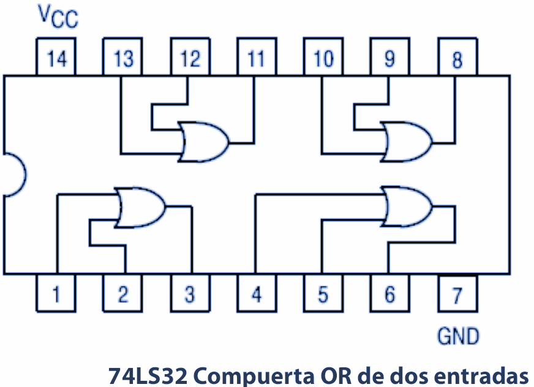

El circuito  __74LS32__ , tiene internamente 4 compuertas OR de dos entradas, además de un pin que se debe conectar a tierra denominado GND y un pin que se debe conectar a 5 volts denominado Vcc.

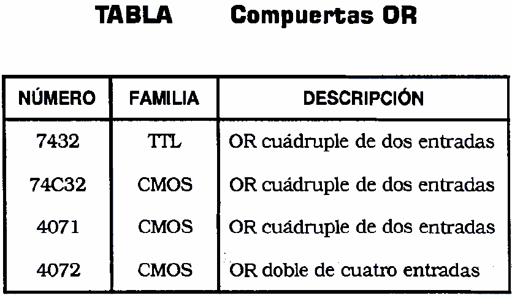

Además del símbolo lógico convencional, la IEC (International Electrotechnical Commission) y el IEEE (Institute of Electrical and Electronics Engineers) han desarrollado un sistema de símbolos lógicos que muestran la relación entre cada entrada y salida, sin presentar la circuitería interna.

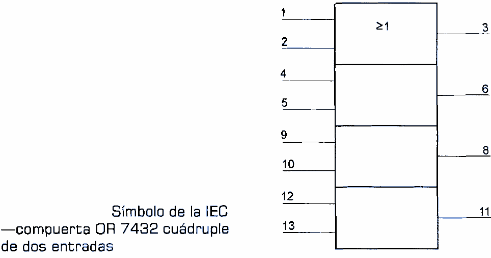

### Ejemplo: Compuerta OR

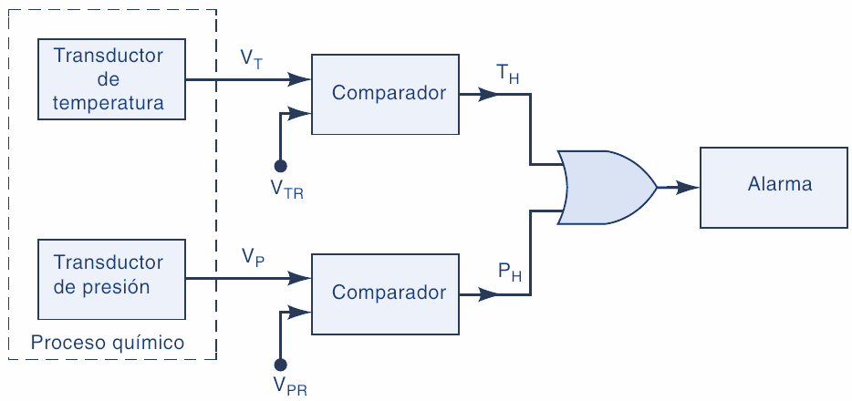

# COMPUERTA AND

## Operación AND Con Compuertas AND

La  __operación AND__  es la segunda operación booleana básica. Como ejemplo del uso de la lógica AND, considere una secadora de ropa ordinaria: seca ropa ( _calienta y gira_ ) solo si el temporizador está por encima de cero  _“Y”_  la puerta está cerrada. Vamos a asignar A para representar cuando el temporizador está activado,  _B_  para representar cuando la puerta está cerrada y  _x_  puede representar cuando el calentador y el motor están encendidos.

La tabla de verdad se muestra lo que ocurre cuando dos entradas lógicas  _A y B_  se combinan mediante el uso de la operación AND para producir la salida  _x_ . La tabla muestra que x es un 1 lógico sólo cuando A y B están en el nivel 1 lógico. Para cualquier caso en el que una de las entradas sea 0, la salida será 0.

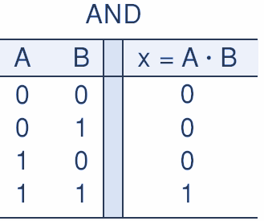

La expresión booleana para la operación AND es

En esta expresión,  _el signo _  __࢈__  indica la operación AND booleana y  _no la operación de multiplicación_ . No obstante, la operación AND sobre variables booleanas opera de la misma forma que la multiplicación ordinaria, según nos muestra el análisis de la tabla de verdad, por lo que podemos considerarlas como iguales. Esta característica puede ser útil al evaluar expresiones lógicas que contengan operaciones AND.

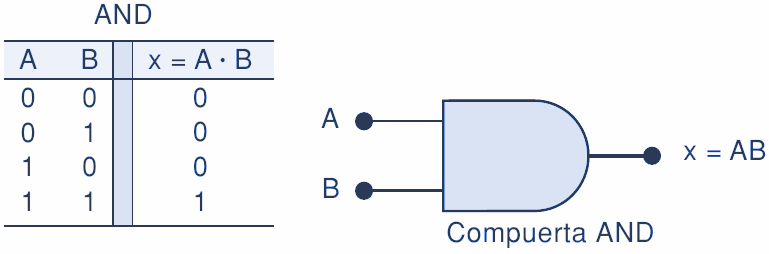

La expresión x = A · B se lee como “ _x es igual a A AND B_ ”, lo cual significa que  _x_   _será 1 sólo cuando A y B sean 1_ . Por lo general, se omite el signo  de manera que la expresión se vuelve x = AB. Para el caso en el que se aplica la operación AND con tres entradas, tenemos que x = A · B · C = ABC. Esto se lee como “ _x es igual a A AND B AND C”_ , lo cual significa que x será 1 solo cuando  _A y B y C_  sean todas 1.

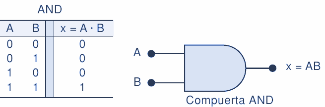

## Compuerta AND

Se muestra el símbolo lógico para una compuerta  _AND_  de dos entradas. La salida de la compuerta AND es igual al producto AND de las entradas lógicas; es decir, _ x  = AB_ . En otras palabras, la compuerta AND es un circuito que opera de manera que su salida esté en ALTO solo cuando todas sus entradas se encuentren en ALTO. Para todos los demás casos, la salida de la compuerta AND estará en BAJO.

Esta misma operación es característica de compuertas AND con más de dos entradas. Por ejemplo, la figura muestra una compuerta AND de tres entradas y su tabla de verdad correspondiente. Una vez más, observe que la salida de la compuerta es 1 sólo para el caso en el que  _A = B = C = 1_ . La expresión para la salida es  _x = ABC_ . Para una compuerta AND de cuatro entradas, la salida es  _x = ABCD_ .

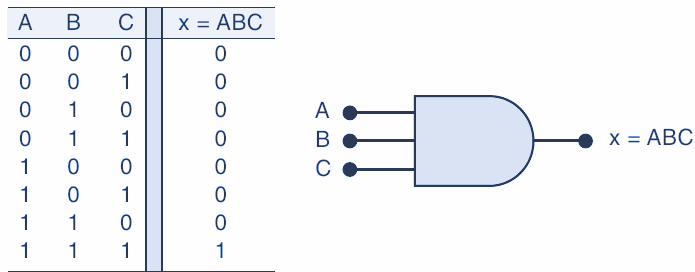

El funcionamiento de la compuerta se puede observar:

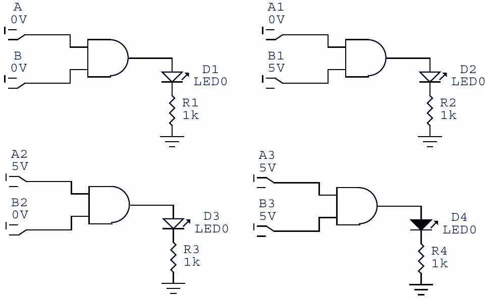

Se puede apreciar que en la parte inferior derecha hay en las entradas un uno lógico, por consiguiente a la salida se enciende el LED indicando un uno lógico. En el resto de las imágenes la salida es cero lógico, lo cual describe la tabla de verdad de esta operación lógica.

La referencia de la compuerta AND de dos entradas es el número 74LS08, el cual tiene la siguiente estructura interna.

El circuito 74LS08, tiene internamente 4 compuertas AND de dos entradas, además de un pin que se debe conectar a tierra denominado GND y un pin que se debe conectar a 5 voltios denominado Vcc.

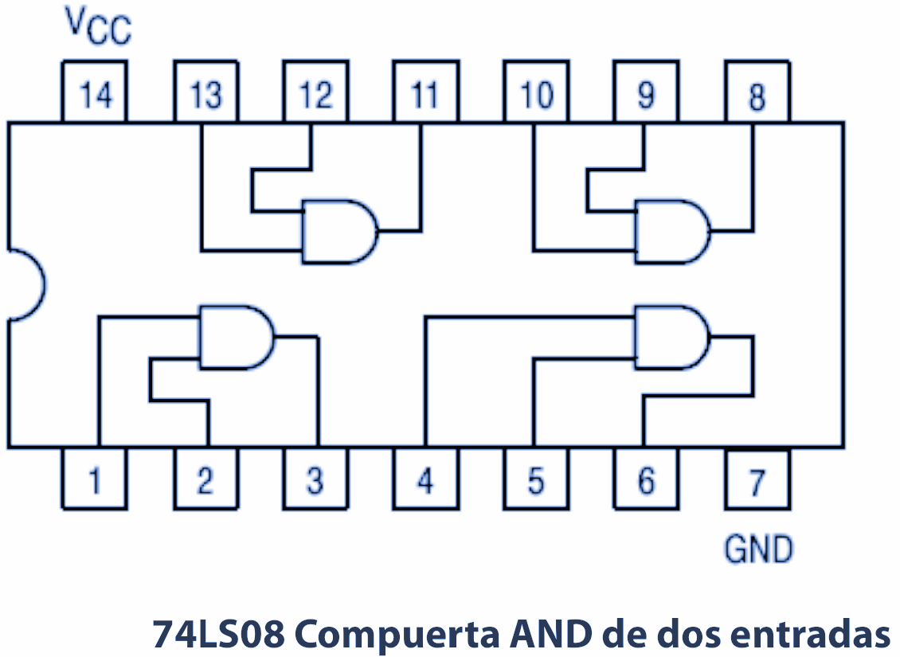

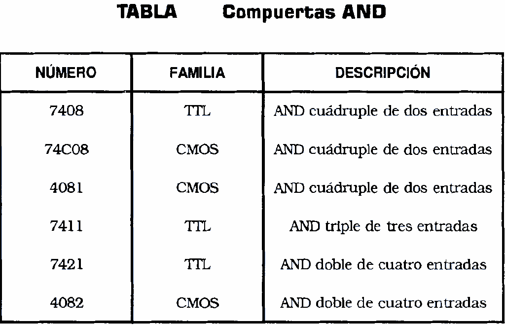

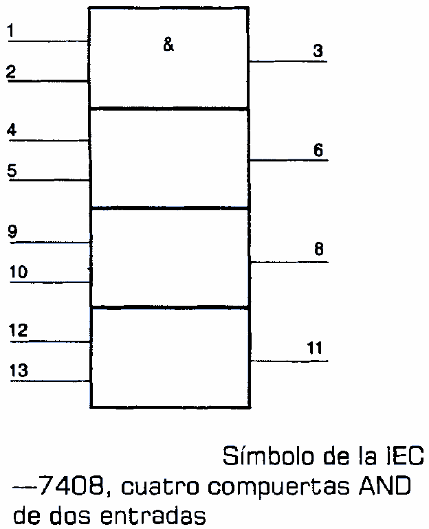

La IEC eligió el símbolo  __&__  para  _representar la función AND_ . Se muestra el símbolo de la IEC para una compuerta AND cuádruple con dos entradas 7408.

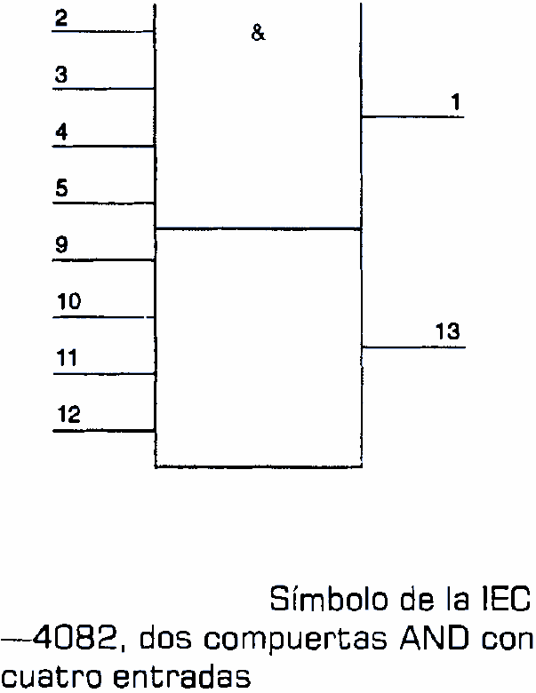

Aparece el símbolo para el CI 4082 con compuerta AND doble de cuatro entradas.

## Aplicación: Compuerta AND

Determine la forma de onda de salida para la compuerta AND que se muestra

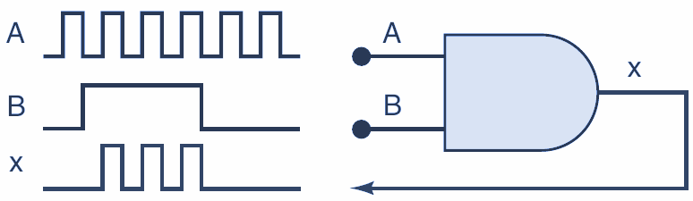

# Compuerta AND vs OR

Notemos la diferencia entre los símbolos para la compuerta AND y la compuerta OR. Cada vez que vea el símbolo AND en el diagrama de un circuito lógico, le indicará que la salida estará en ALTO sólo cuando todas las entradas estén en ALTO. Cada vez que vea el símbolo OR, le indicará que la salida estará en ALTO cuando cualquiera de sus entradas esté en ALTO.

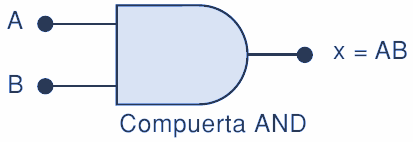

# COMPUERTA NOT (INVERSORA)

## Operación NOT

La  _operación NOT_  es distinta de las operaciones OR y AND, ya que puede realizarse sobre una sola variable de entrada. Por ejemplo, si la variable A está sujeta a la operación NOT, el resultado x puede expresarse así:

En donde la barra superior representa la operación NOT. Esta expresión se lee como “ _x es igual a NOT A_ ” o “ _x es igual al inverso de A_ ” o “ _x es igual al complemento de A_ ”.

Cada una de estas expresiones es de uso común y todas indican que el valor lógico de x = ‘A es el opuesto del valor lógico de  _A_ .

La tabla de verdad aclara esto para los dos casos en que  _A = 0 y A = 1_ . Esto es,

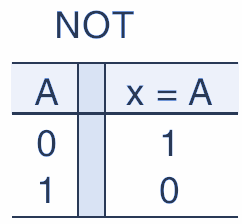

La operación NOT también se conoce como  _inversión_  o  _complementación_ , términos que utilizamos de manera indistinta. Siempre utilizaremos el indicador de barra superior para representar la inversión, es importante mencionar que el símbolo primo (‘) es otro indicador para la inversión. Esto es,

Ambos deben reconocerse como símbolos que indican la operación de inversión.

## Circuito NOT (INVERSOR)

Se muestra el símbolo para un  __circuito NOT__ , al cual se le conoce más comúnmente como  __INVERSOR__ . Este circuito siempre tiene una sola entrada y su nivel lógico de salida siempre es opuesto al nivel lógico de esta entrada.

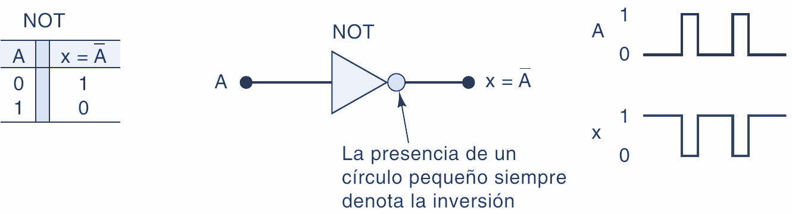

El círculo que aparece en la salida del símbolo, se conoce como círculo de inversión.

Se muestra la forma en que el INVERSOR afecta a una señal de entrada. Invierte (complementa) la señal de entrada en todos los puntos de la forma de onda, por lo que siempre que la entrada = 0, la salida = 1, y viceversa.

El funcionamiento de la compuerta se puede observar:

Se puede apreciar que en la figura de la izquierda hay a la entrada un cero lógico, por consiguiente a la salida se enciende el LED indicando un uno lógico. En la figura de la derecha hay a la entrada un uno lógico, por consiguiente a la salida se apaga el LED indicando un cero lógico.

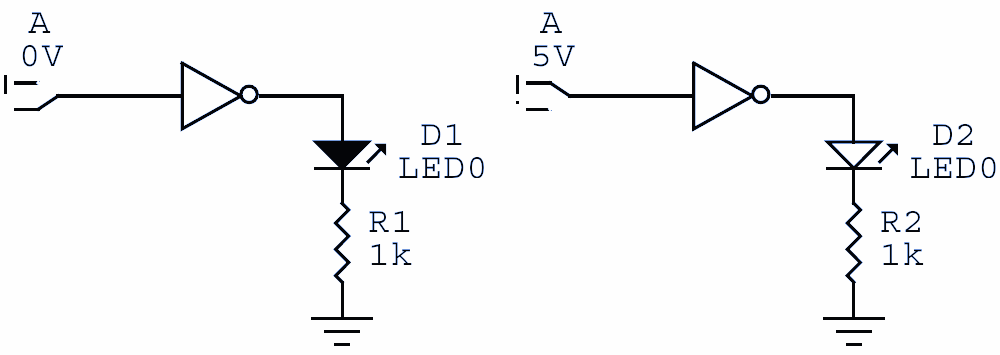

La referencia de esta compuerta es el número 74LS04, el cual tiene la estructura interna

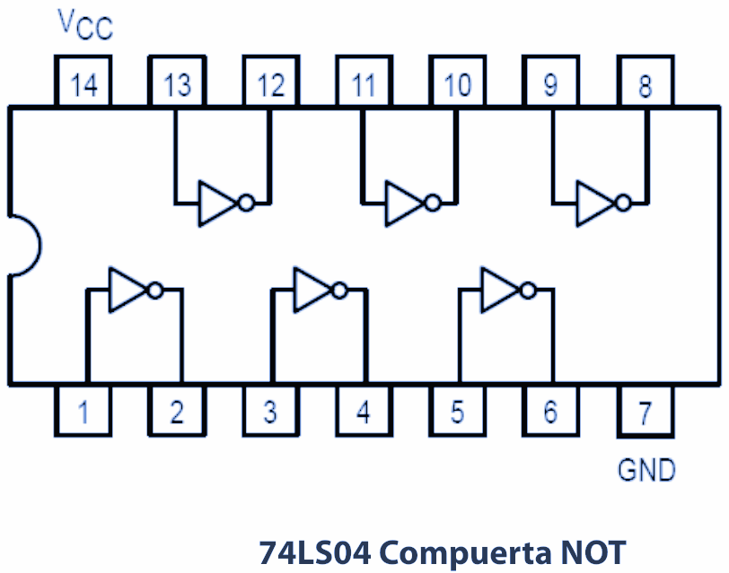

El circuito 74LS04, tiene internamente  _6 compuertas NOT_ , además de un pin que se debe conectar a tierra denominado GND y un pin que se debe conectar a 5 Volts denominado Vcc.

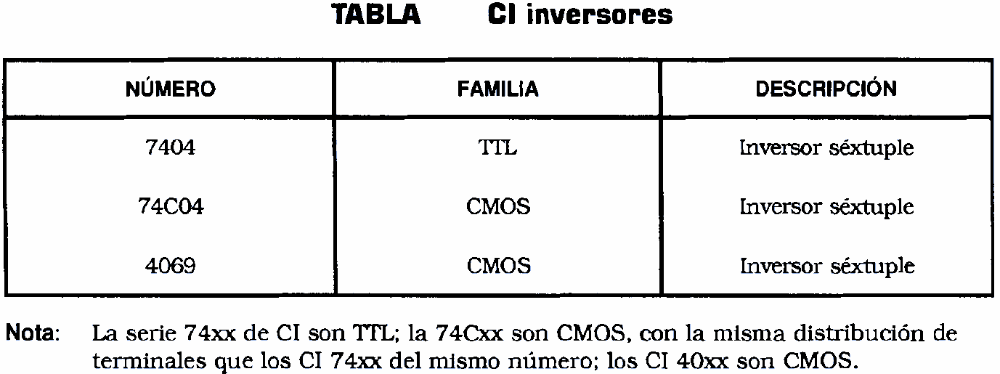

Además del símbolo lógico convencional, la IEC (International Electrotechnical Commission) y el IEEE (Institute of Electrical and Electronics Engineers) han desarrollado un sistema de símbolos lógicos que muestran la relación entre cada entrada y salida, sin presentar la circuitería interna.

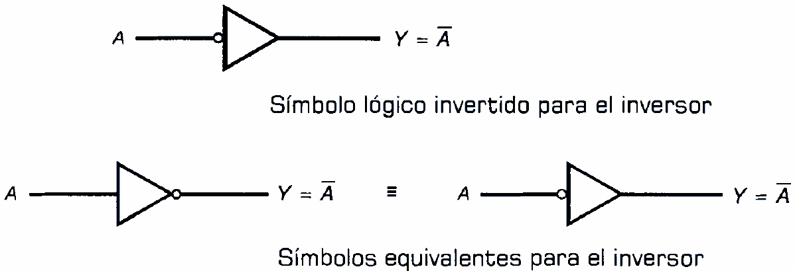

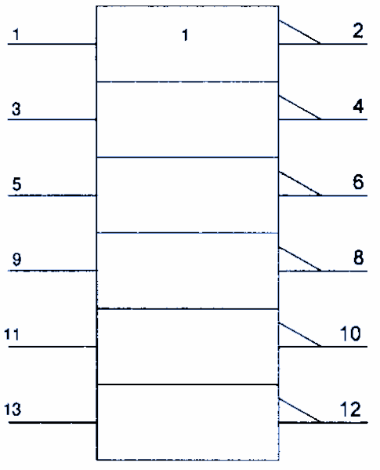

Se muestra el símbolo de la IEC para el inversor séxtuple 7406. Puesto que cada inversor funciona de manera independiente de los demás, cada uno se dibuja con su propio rectángulo. El  _"1"_  del rectángulo de la parte superior indica que una entrada debe estar activa para producir la salida. El triángulo de la derecha es equivalente al círculo de inversión del símbolo convencional. Una entrada activa en el nivel alto, produce una salida activa en el nivel bajo.

## Aplicación: Circuito NOT (INVERSOR)

Se muestra una aplicación ordinaria de la compuerta NOT. El botón está cableado para producir un 1 lógico (verdadero) cuando se oprime. Algunas veces es conveniente saber si el botón no está oprimido, por lo que este circuito proporciona una expresión que es verdadera cuando el botón no está oprimido.

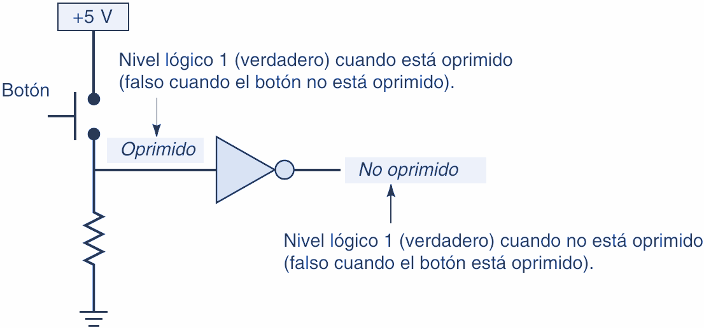

# Compuertas

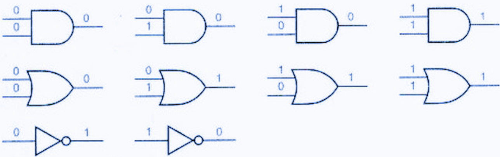

# Símbolos Lógicos del Estándar IEEE/ANSI

En 1984 se desarrolló un estándar más reciente para los símbolos lógicos; a este se le conoce como Estándar IEEE/ANSI 91\-1984 para símbolos lógicos. El estándar IEEE/ANSI utiliza símbolos rectangulares para representar todas las compuertas y circuitos lógicos.

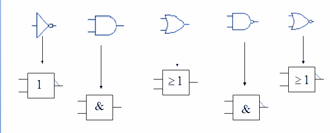

Una notación de dependencia especial dentro del símbolo rectangular indica cómo dependen las salidas del dispositivo de sus entradas. Se muestra los símbolos IEEE/ANSI a un lado de los símbolos tradicionales para las compuertas lógicas básicas.

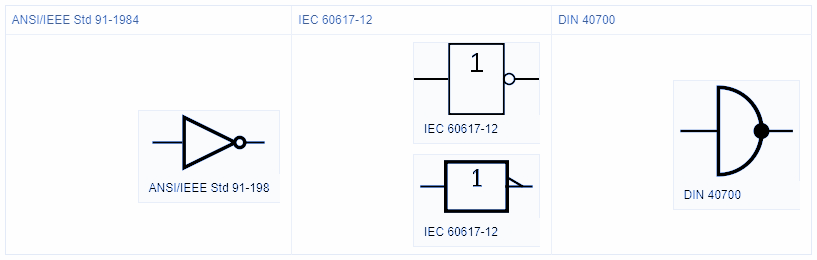

Los símbolos rectangulares utilizan un pequeño triángulo rectángulo ( ◺ ) en lugar de la pequeña burbuja de los símbolos tradicionales para indicar la inversión del nivel lógico. La presencia o ausencia del triángulo también indica si una entrada o salida es activa en nivel BAJO o ALTO.

Una notación especial dentro de cada símbolo rectangular describe la relación lógica entra las entradas y la salida. El “1” dentro del símbolo INVERSOR denota un dispositivo con solo una entrada; el triángulo en la salida indica que esta cambiará al estado activo en BAJO cuando la entrada se encuentre en su estado activo en ALTO.

El “&” dentro del símbolo AND significa que la salida cambiará a su estado activo en ALTO cuando todas las entradas se encuentren en el estado activo en ALTO. El “≥” dentro de la compuerta OR indica que la salida cambiará a su estado activo (ALTO) siempre que cualquiera de las entradas se encuentre en su estado activo (ALTO).

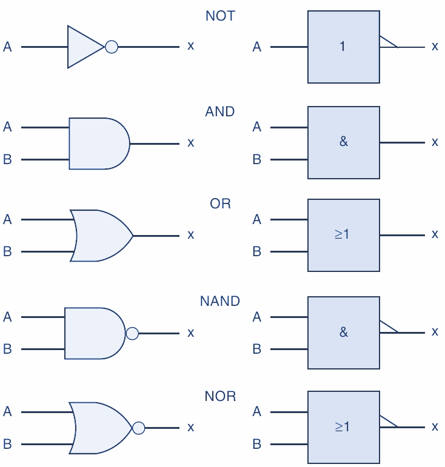

Los símbolos rectangulares para las compuertas NAND y NOR son los mismos que para las compuertas AND y OR, respectivamente, con la adición del pequeño triángulo inversor en la salida.

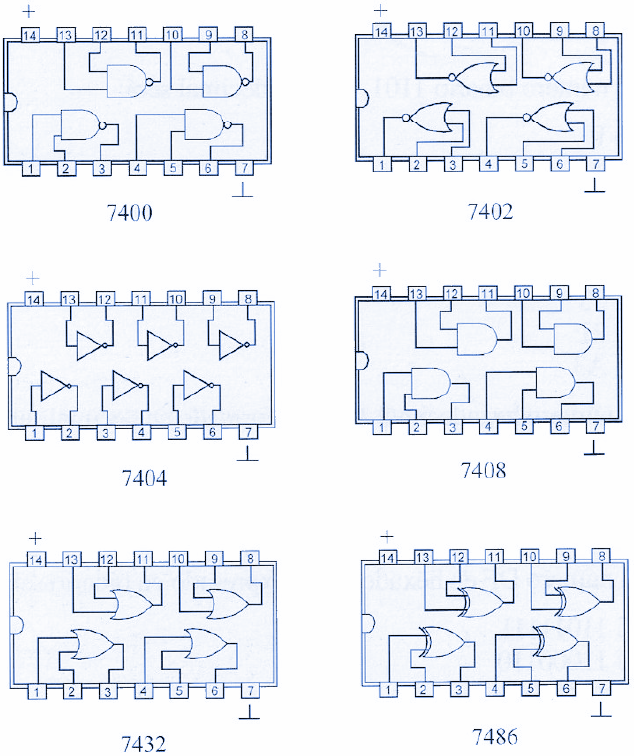

