# Compuertas Combinadas NOR Y NAND

En los circuitos digitales se utilizan mucho otros dos tipos de compuertas lógicas: _NOR y NAND_ .  _Estas compuertas combinan las operaciones básicas AND, OR y NOT_ , por lo que es muy sencillo escribir sus expresiones booleanas.

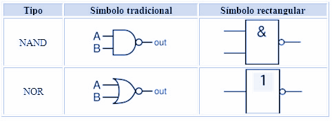

## Compuerta NOR (NO-O)

Se muestra el símbolo para una compuerta NOR de dos entradas. Es igual que el símbolo de la compuerta OR, slo que tiene un pequeño círculo en la salida. El pequeño círculo representa la operación de inversión.

Por ello, la compuerta NOR opera de manera similar a una compuerta OR seguida de un INVERSOR, de manera que los circuitos son equivalentes, y la expresión de salida para la compuerta NOR es

La tabla de verdad muestra que la salida de la compuerta NOR es el inverso exacto de la salida de la compuerta OR para todas las posibles condiciones de entrada. La salida de una compuerta OR cambia a ALTO cuando cualquiera de sus entradas se encuentra en ALTO; la salida de la compuerta NOR cambia a BAJO cuando cualquiera de sus entradas se encuentra en ALTO. Esta misma operación puede aplicarse a las compuertas NOR con más de dos entradas.

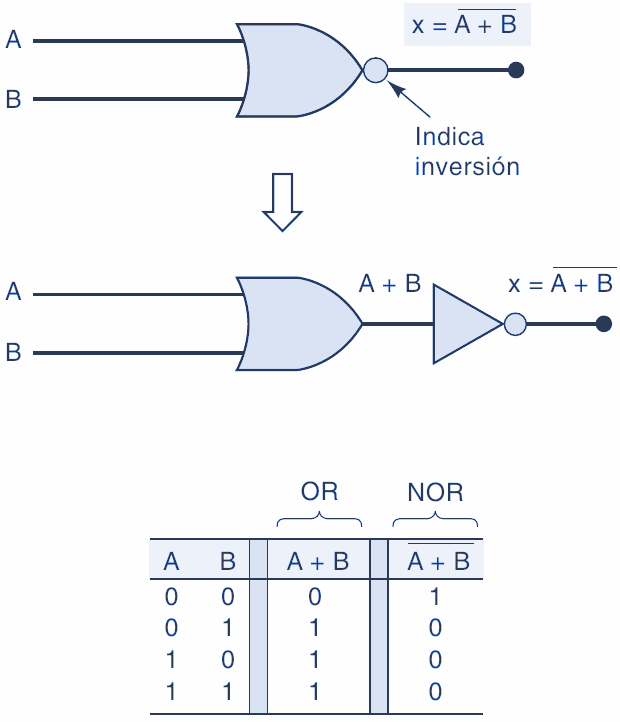

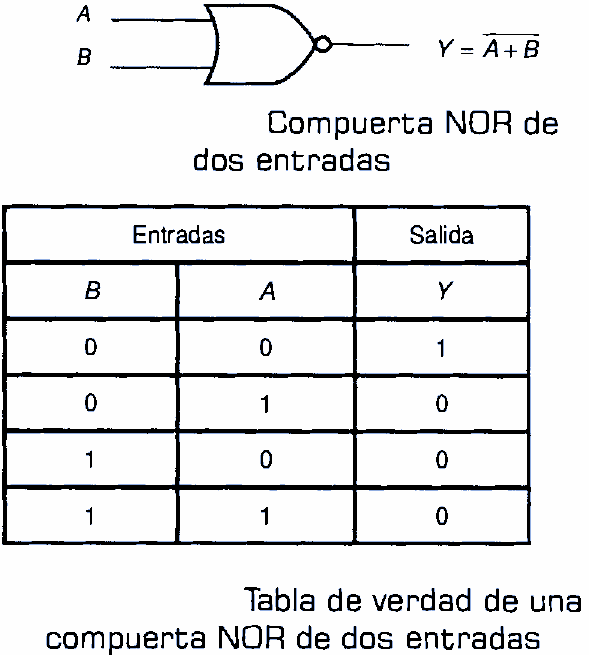

El símbolo describe la operación de la compuerta. Puesto que las entradas no tienen círculo de inversión, pero la salida si, la lectura del símbolo es " _entra 1 OR 1, sale 0_ ". Lo anterior está descrito por las tres últimas líneas de la tabla de verdad

_La puerta NOR_  genera una salida a nivel BAJO cuando cualquiera de sus entradas está a nivel ALTO. Solo cuando todas sus entradas estén a nivel BAJO, la salida se pondrá a nivel ALTO.

Para el caso concreto de la puerta NOR de dos entradas, con la designación A y B para las entradas y X para la salida.

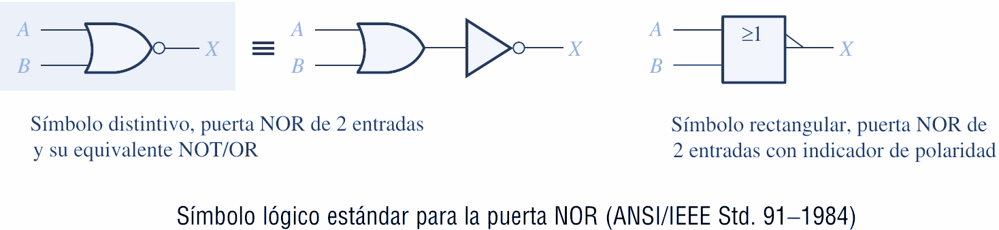

> En una puerta NOR de dos entradas: la salida X es un nivel BAJO si cualquiera de sus entradas A o B está a nivel ALTO, o si ambas entradas A y B están a nivel ALTO; X es un nivel ALTO si A y B están a nivel BAJO.

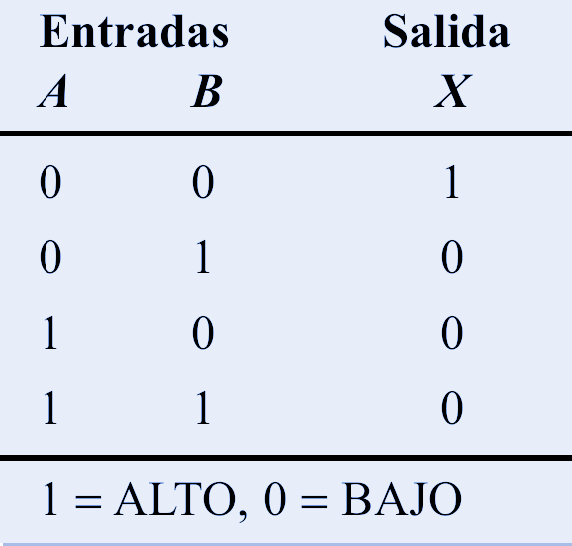

Esta operación genera un nivel de salida opuesto al que genera la puerta OR. En una puerta NOR, el nivel BAJO es el nivel activo o verdadero de salida, como indica el círculo de la salida.

Se ilustra el funcionamiento de una puerta NOR de dos entradas, para las cuatro posibles combinaciones de entrada.

Esta operación genera un nivel de salida opuesto al que genera la puerta OR. En una puerta NOR, el nivel BAJO es el nivel activo o verdadero de salida, como indica el círculo de la salida.

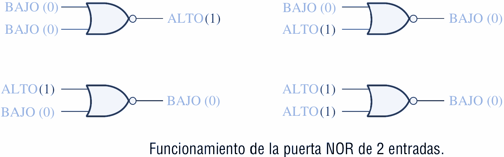

La figura ilustra el funcionamiento de una puerta NOR de dos entradas, para las cuatro posibles combinaciones de entrada, y la Tabla es la tabla de verdad para la puerta NOR de dos entradas.

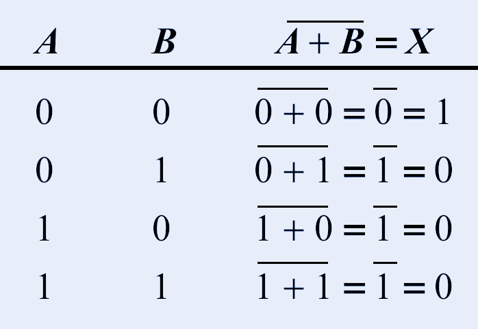

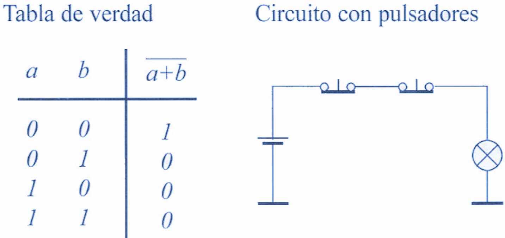

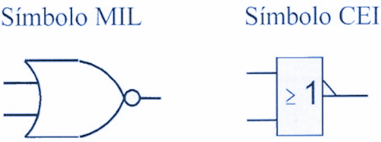

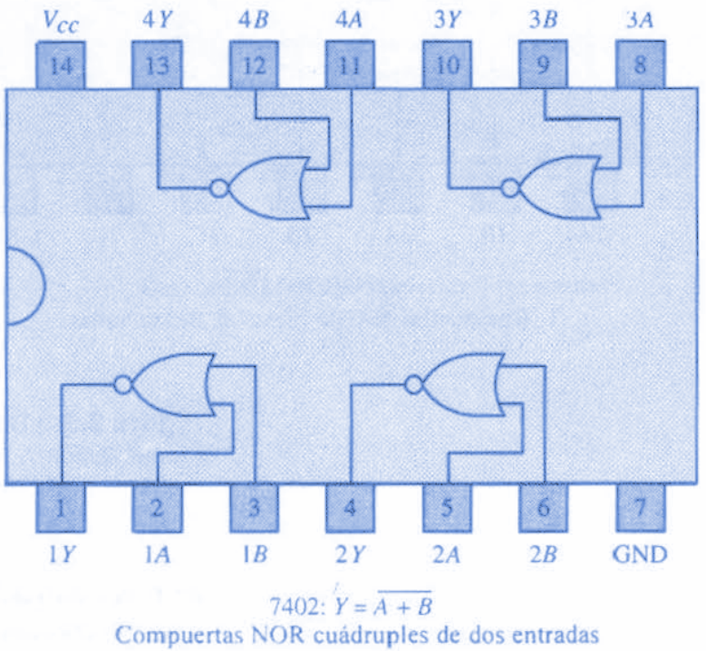

El funcionamiento de la compuerta se puede observar en la siguiente:

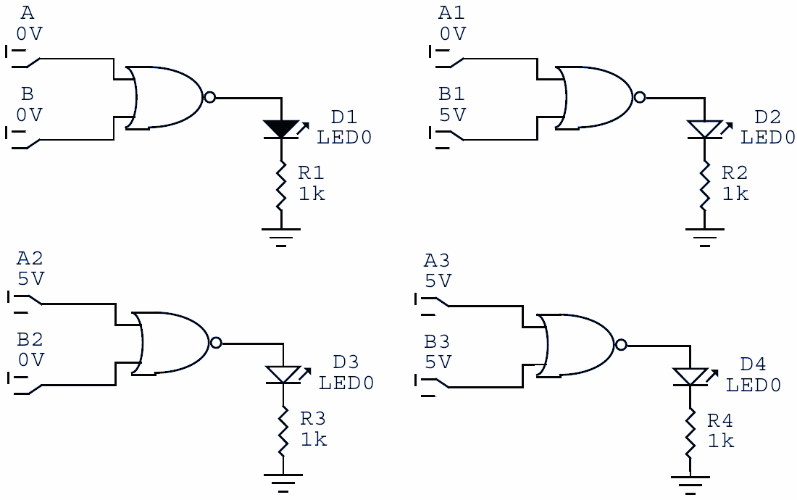

### Aplicación: Compuerta NOR (NO-O)

Si se aplican a la puerta NOR las dos señales mostradas, ¿cómo es la señal de salida que se obtiene?

Cuando cualquier entrada de la puerta NOR está a nivel ALTO, la salida es un nivel BAJO, como se ve en la forma de onda de salida X del diagrama de tiempos.

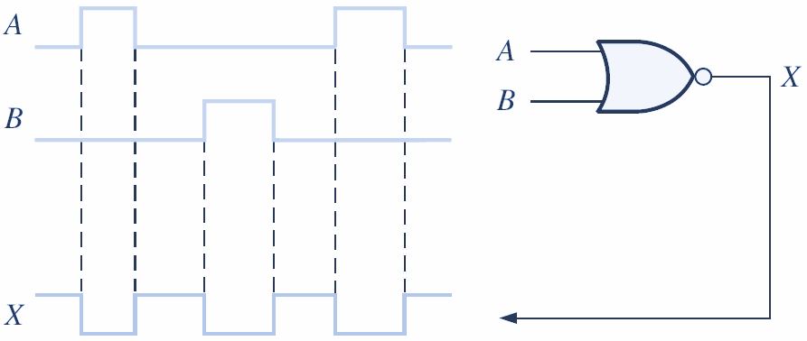

## Compuerta NAND (NO-Y)

Se muestra el símbolo para una compuerta NAND de dos entradas. Es el mismo que el de la compuerta AND más un pequeño círculo en la salida.

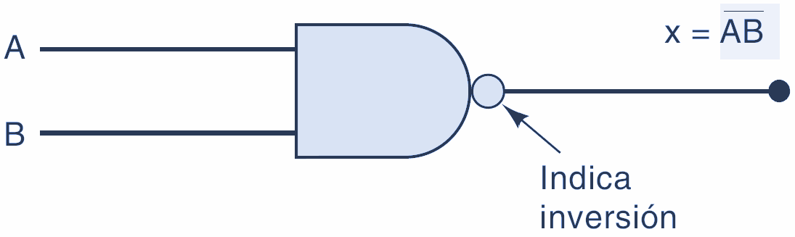

Este pequeño círculo denota la operación de inversión. Así, la compuerta NAND opera igual que una compuerta AND seguida de un INVERSOR, de manera que los circuitos son equivalentes y la expresión de salida para la compuerta NAND es x = (AB)’.

La tabla de verdad se muestra que la salida de la compuerta NAND es el inverso exacto de la compuerta AND para todas las posibles condiciones de entrada.

_La salida AND cambia a nivel ALTO sólo cuando todas las entradas se encuentran en ALTO_ , mientras que la salida _ NAND cambia a BAJO sólo cuando todas las entradas se encuentran en ALTO_ . Esta misma característica puede aplicarse a las compuertas NAND que tienen más de dos entradas.

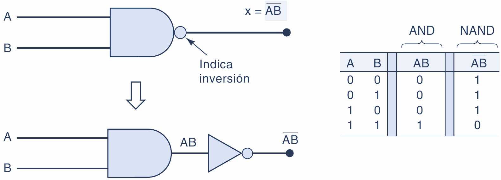

El término  _NAND_  es una contracción de  _NOT−AND_ , e implica una función AND con la salida complementada (negada).

Se muestra el símbolo lógico estándar para la puerta NAND de 2 entradas y su equivalente empleando los símbolos de la puerta AND seguida de un inversor, donde el símbolo  __≡__  significa “ _equivalente a_ ”.

La  _puerta NAND_  genera una salida a nivel BAJO solo cuando todas las entradas están a nivel ALTO. Cuando cualquiera de las entradas está a nivel BAJO, la salida se pondrá a nivel ALTO. Para el caso concreto de la puerta NAND de dos entradas, con la designación A y B para las entradas y X para la salida.

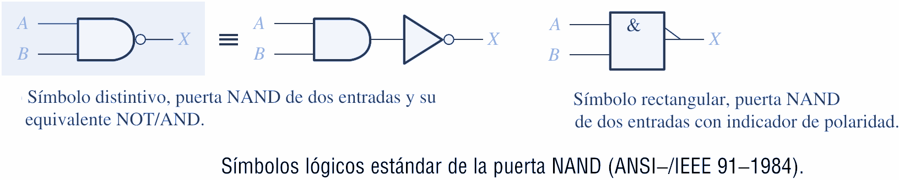

> En una puerta NAND de dos entradas, la salida X es un nivel BAJO si las entradas A y B están a nivel ALTO; X es un nivel ALTO si A o B están a nivel BAJO o si ambas, A y B, están a nivel BAJO.

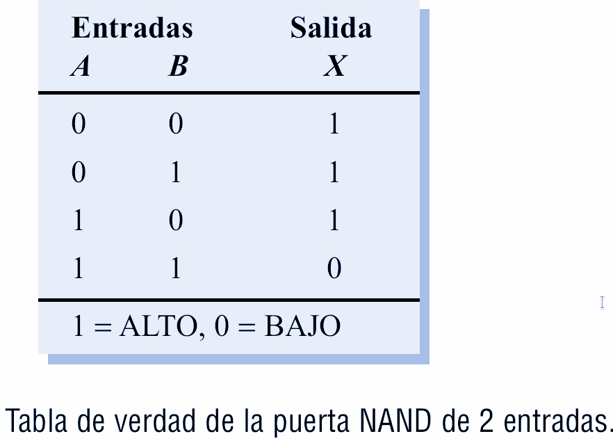

Observe que esta operación, en términos de nivel de salida, es la opuesta a la operación lógica AND. En una puerta NAND, el nivel BAJO (0) es el nivel activo o verdadero de salida, como indica el círculo de la salida. Se ilustra la operación lógica de una puerta NAND de dos entradas, para las cuatro posibles combinaciones.

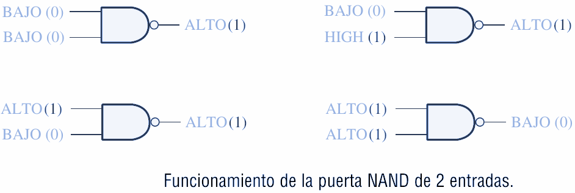

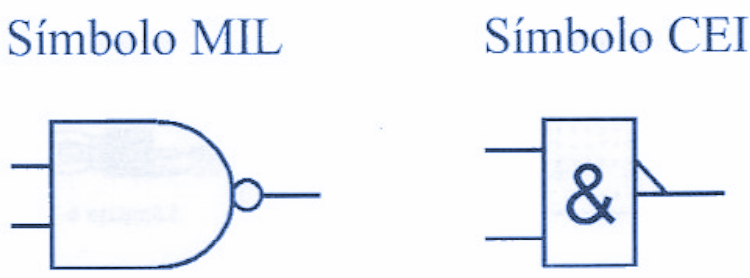

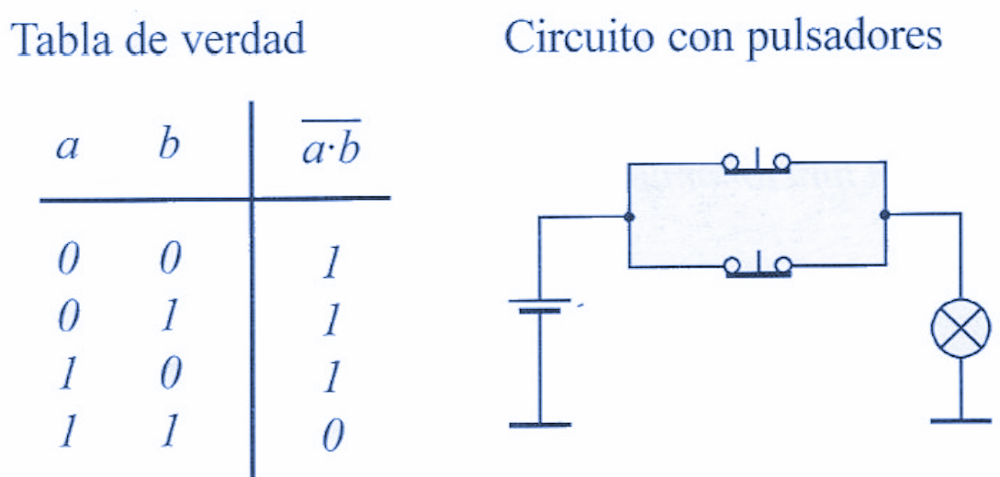

Determine la forma de onda de salida de una compuerta NAND que tiene las entradas que se muestran

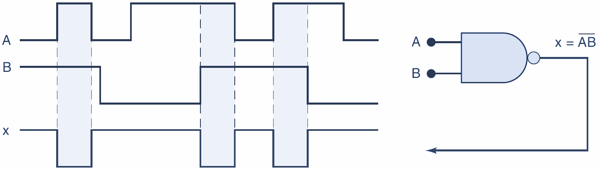

## Compuerta OR EXCLUSIVA (XOR)

Se muestran los símbolos estándar para la puerta OR−exclusiva (XOR). La puerta XOR tiene solo dos entradas. La salida de una puerta OR−exclusiva se pone a nivel ALTO solo cuando las dos entradas están a niveles lógicos opuestos. Esta operación se puede expresar, en función de dos entradas A y B y una salida X.

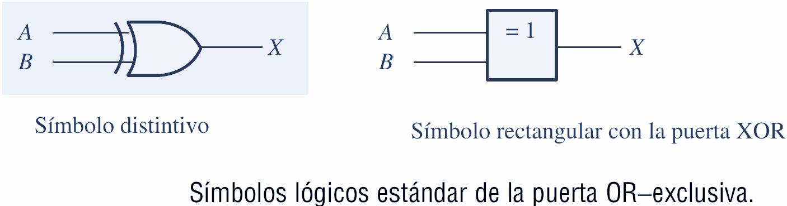

_En una puerta OR−exclusiva, la salida X es un nivel ALTO si la entrada A está a nivel BAJO y la entrada B está a nivel ALTO; o si la entrada A está a nivel ALTO y la entrada B está a nivel BAJO; X es un nivel BAJO si tanto A como B están a nivel ALTO o BAJO._

Se ilustran las cuatro posibles combinaciones de entrada y las salidas resultantes para la puerta XOR. El nivel ALTO es el nivel activo o verdadero de salida y solo se produce cuando las entradas están a niveles opuestos.

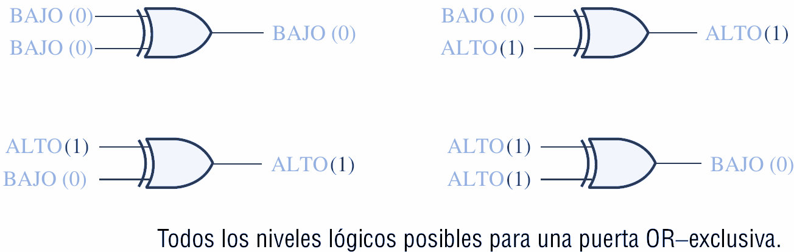

La operación lógica de la puerta XOR se resume en la tabla de verdad mostrada en la Tabla.

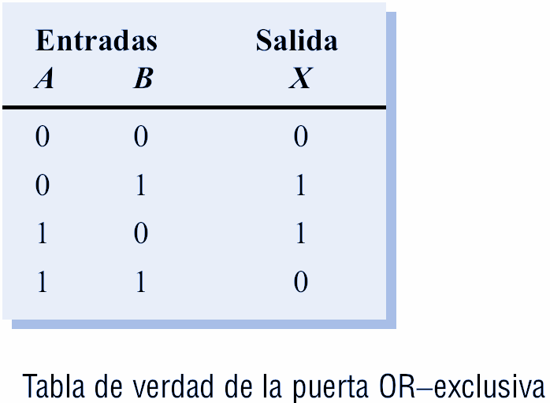

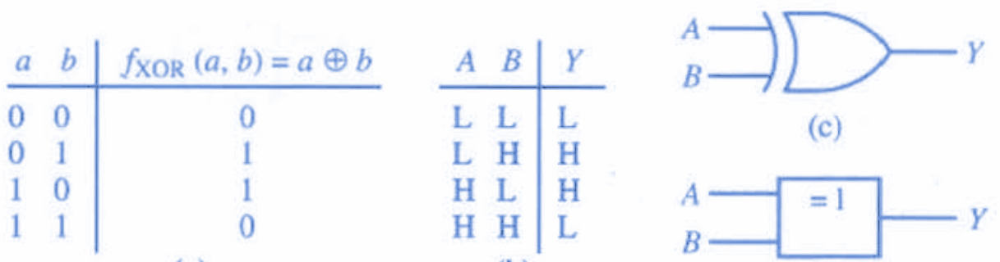

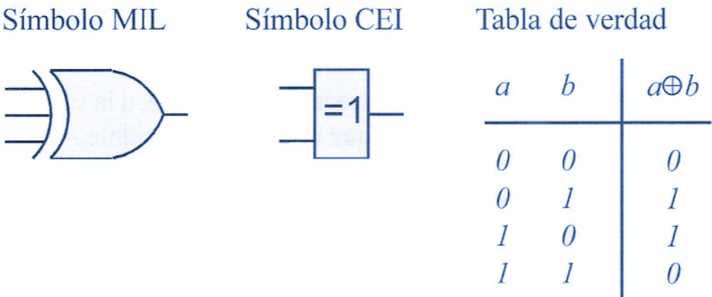

Considere el circuito lógico. La expresión de salida de este circuito es:

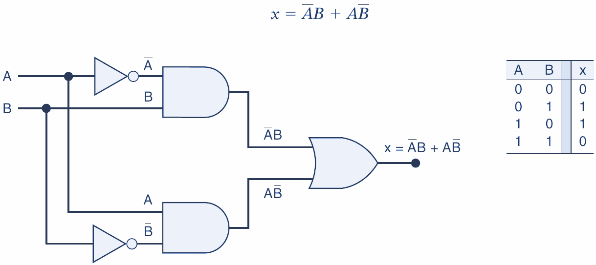

La ecuación que representa una XOR es:

mejor conocida como:

La tabla de verdad que acompaña a este circuito muestra que x = 1 para dos casos: A = 0, B = 1 (el término A’B) y A = 1, B = 0 (el término AB’). En otras palabras:

_Este circuito produce una salida en ALTO siempre que las dos entradas se encuentran en los niveles opuestos._

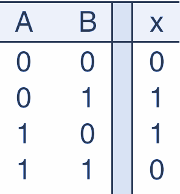

Este es el circuito  _OR exclusivo_ , que de aquí en adelante se escribe como  _XOR._

Esta combinación específica de compuertas lógicas se produce con mucha frecuencia y es muy útil en ciertas aplicaciones. De hecho, al circuito XOR se le ha otorgado su propio símbolo, el cual se muestra.

Se asume que este símbolo contiene toda la lógica dentro del circuito  _XOR_  y, por lo tanto, tiene la misma expresión lógica y la misma tabla de verdad. Por lo general, al  _circuito XOR_   _se le conoce como _  _compuerta XOR_ , y lo consideramos como otro tipo de compuerta lógica.

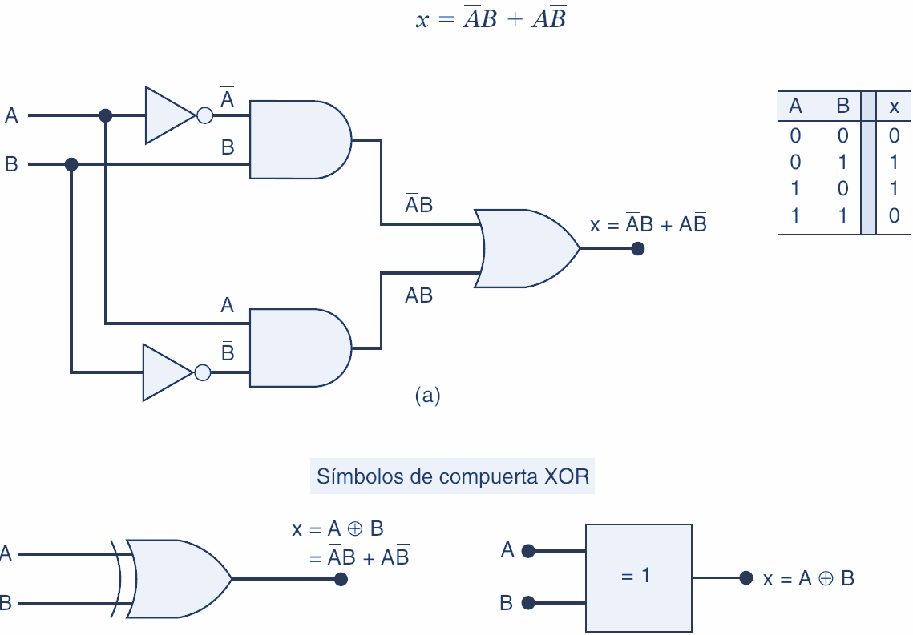

En la figura se muestra el símbolo IEEE/ANSI para una compuerta  _XOR_ . El símbolo de notación de dependencia (= 1) dentro del bloque indica que la salida será activa en ALTO sólo cuando una de las entradas esté en ALTO.

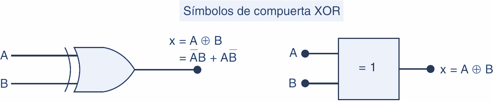

Una compuerta XOR sólo tiene  _dos_  entradas;  _no hay compuertas XOR de tres ni de cuatro entradas_ . Las dos entradas se combinan de manera que x = A’B + AB’.

Una forma abreviada que se utiliza algunas veces para indicar la expresión de salida XOR es:

en donde el  __símbolo ⊕__  representa la operación de la c _ompuerta XOR_

Se sintetizan las características de una  _compuerta XOR_ :

1. Sólo tiene dos entradas y su salida es

2. Su salida está en  _ALTO_  solo cuando las dos entradas se encuentran en niveles  _distintos_ .

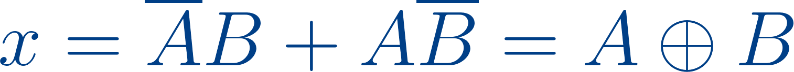

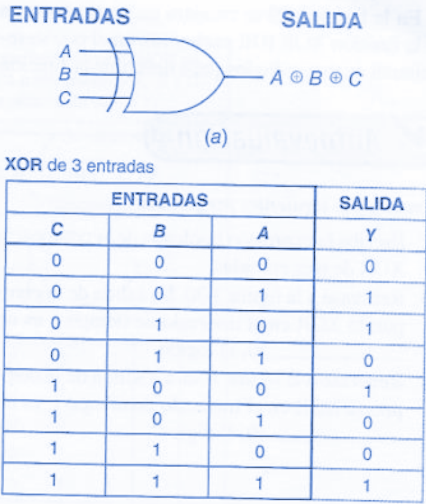

El funcionamiento de la compuerta se puede observar en la siguiente figura:

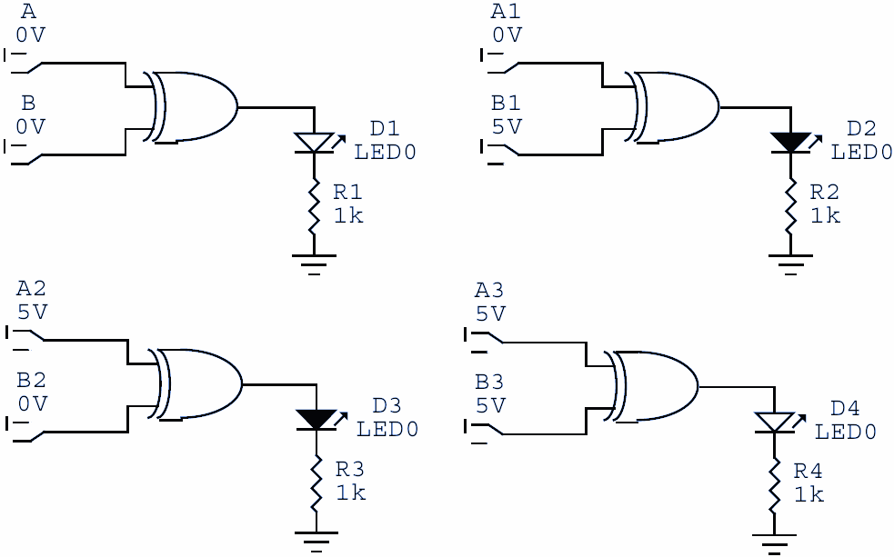

En la gráfica se puede apreciar que en la primera y última figura hay en las entradas número par de unos lógicos, por consiguiente a la salida se apaga el LED indicando un cero lógico. En el resto de las figuras la salida es uno lógico, lo cual describe la tabla de verdad de esta operación lógica.

La referencia de la compuerta XOR de dos entradas es el número 74LS86, el cual tiene la siguiente estructura interna.

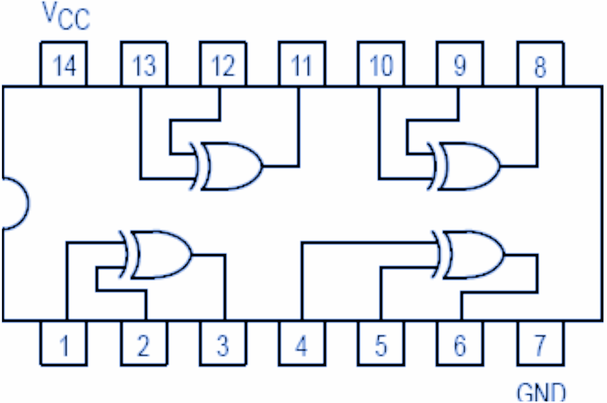

### Aplicación: Compuerta OR EXCLUSIVA (XOR)

Un cierto sistema está formado por dos circuitos idénticos que funcionan en paralelo. Mientras que ambos funcionan correctamente, las salidas de los dos circuitos son iguales. Si uno de los circuitos falla, las salidas serán niveles opuestos en ese instante. Establecer un método para detectar que se ha producido un fallo en uno de los circuitos.

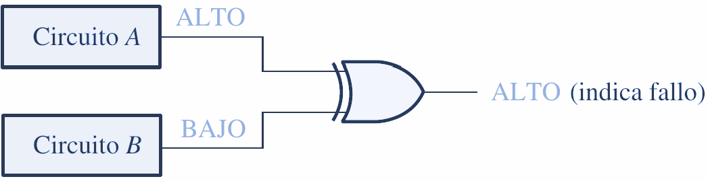

__Solucion__ : Las salidas de los circuitos se conectan a las entradas de una puerta XOR, como muestra. Un fallo en cualquiera de los circuitos hace que las entradas de la puerta XOR tengan niveles opuestos. Esta condición da lugar a nivel ALTO en la salida de la puerta XOR, que indica que uno de los circuitos ha fallado.

## Compuerta NOR EXCLUSIVA (XNOR)

El  _NOR exclusivo_ , también conocido en ocasiones como  _OR no exclusivo_ , tiene la tabla de verdad y el símbolo que se muestran.  _La salida, Y, tiene el nivel ALTO cuando las entradas son iguales, y BAJO si son distintas_ .

El circuito NOR exclusivo (que se abrevia como  _XNOR_ ) opera en forma completamente opuesta al circuito XOR. Se muestra un circuito XNOR y su tabla de verdad correspondiente.

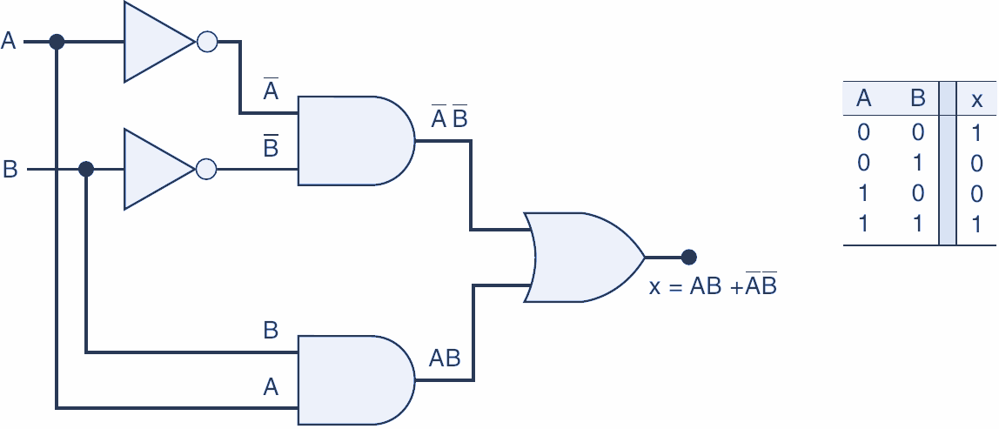

La expresión de salida es

_lo cual indica junto con la tabla de verdad que x será 1 para dos casos: A = B = 1 (el término AB) y A = B = 0 (el término A’ B’). _

_El circuito XNOR produce una salida en ALTO siempre que las dos entradas se encuentran en el mismo nivel._

De todo esto podemos deducir que la salida del circuito XNOR es el inverso exacto de la salida del circuito XOR. El símbolo tradicional para una compuerta XNOR se obtiene con sólo agregar un pequeño círculo en la salida del símbolo XOR.

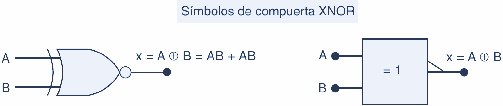

El símbolo IEEE/ANSI agrega el pequeño triángulo en la salida del símbolo XOR. Ambos símbolos indican una salida que cambia a su estado de activo en BAJO cuando sólo una de las entradas está en ALTO.

La compuerta XNOR también tiene sólo dos entradas, y las combina de manera que su salida sea

Una forma abreviada de indicar la expresión de salida de la compuerta XNOR es

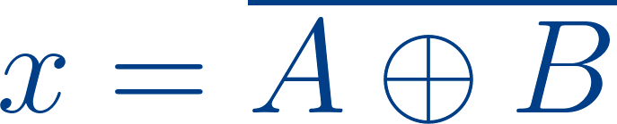

la cual es el inverso de la operación XOR. La compuerta XNOR se puede sintetizar de la siguiente manera:

1. Sólo tiene dos entradas y su salida es:

2. Su salida está en ALTO sólo cando las dos entradas se encuentran en el mismo nivel.

Se presentan los símbolos estándar de la puerta NOR−exclusiva (XNOR). Al igual que la puerta XOR, la puerta XNOR solo tiene dos entradas. El círculo en la salida del símbolo de la puerta XNOR indica que su salida es la opuesta a la de la puerta XOR.

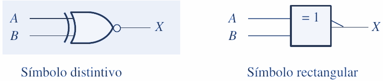

Cuando dos niveles lógicos de entrada son opuestos, la salida de la puerta NOR−exclusiva es un nivel BAJO. La operación se puede expresar del siguiente modo (A y B son las entradas, y X es la salida).

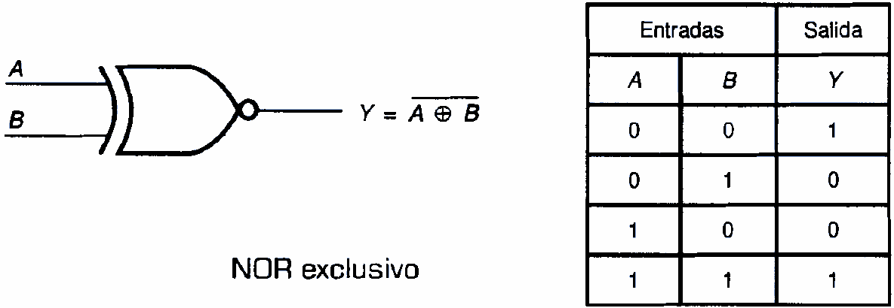

Se muestran las cuatro posibles combinaciones de entrada y las salidas resultantes para la puerta XNOR.

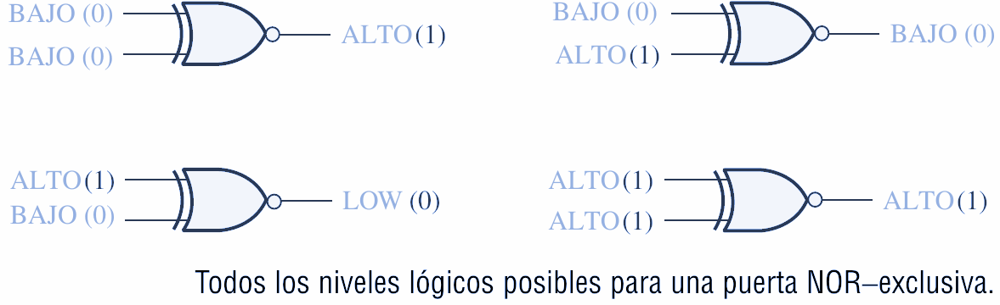

La operación lógica se resume en la Tabla de verdad. Observe que la salida es un nivel ALTO cuando las dos entradas están al mismo nivel.

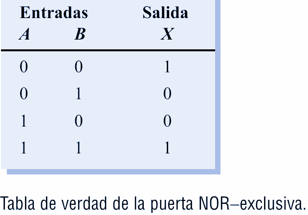

### Aplicacion: Compuerta NOR EXCLUSIVA (XNOR)

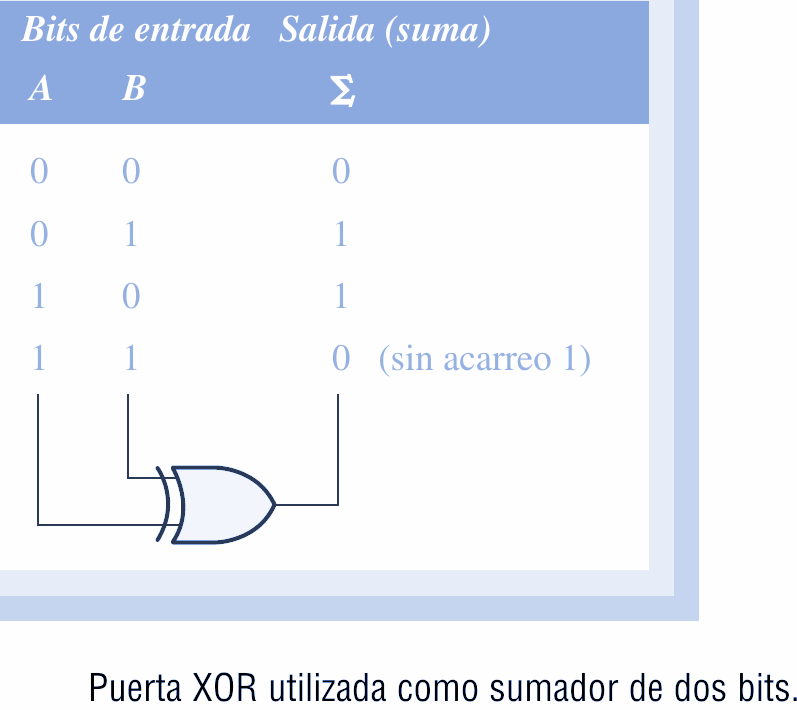

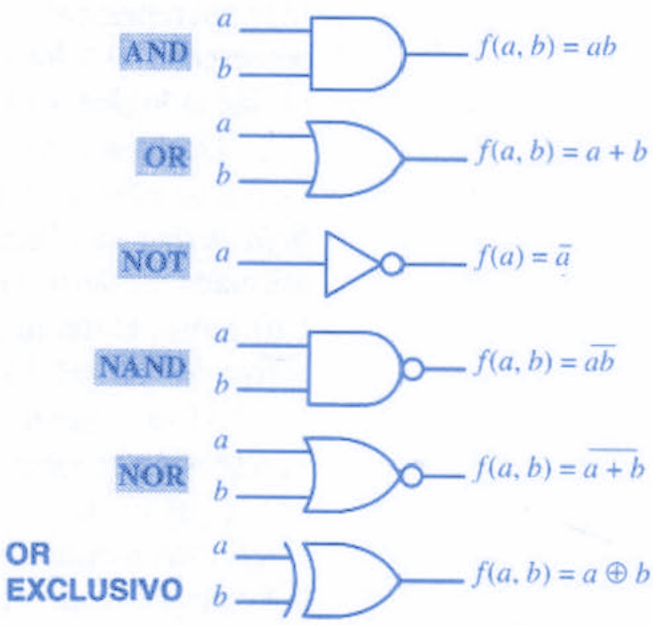

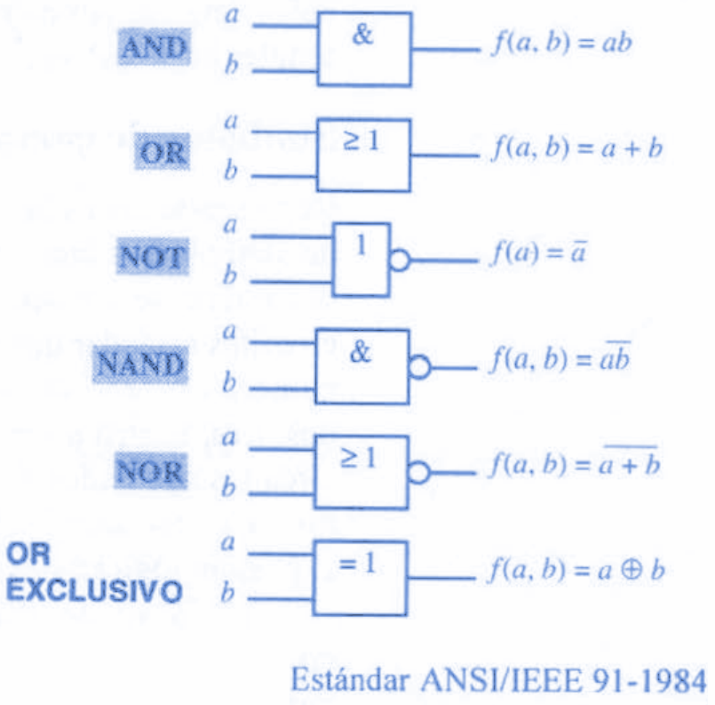

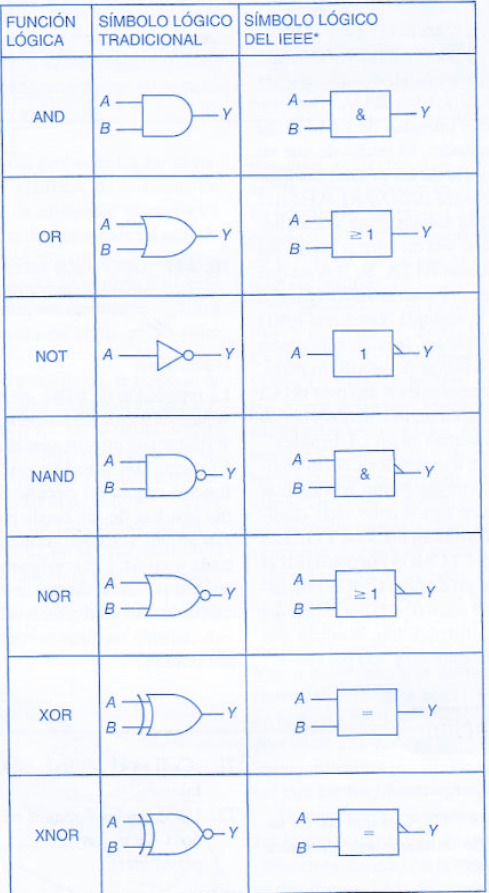

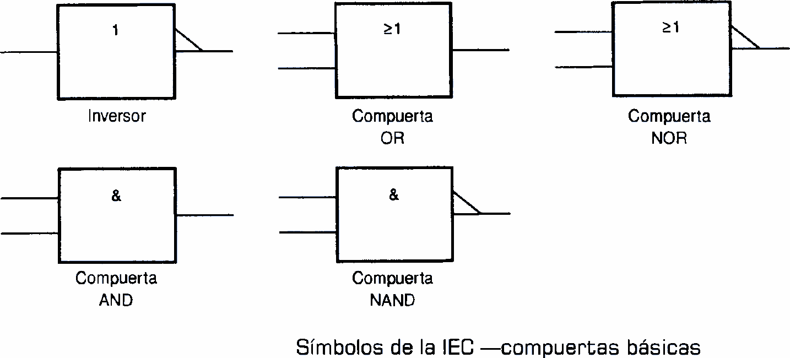

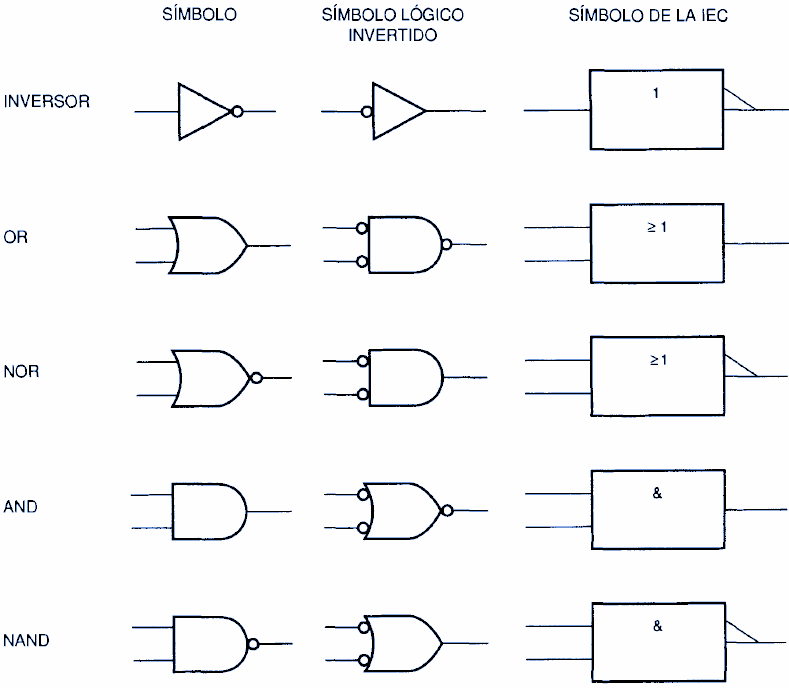

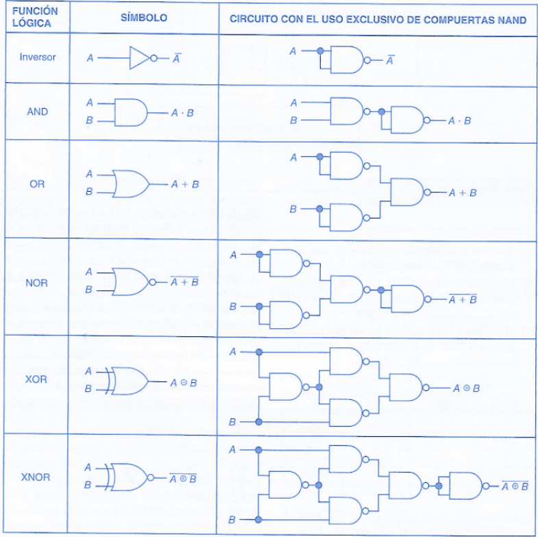

## Compuerta NAND como compuerta universal

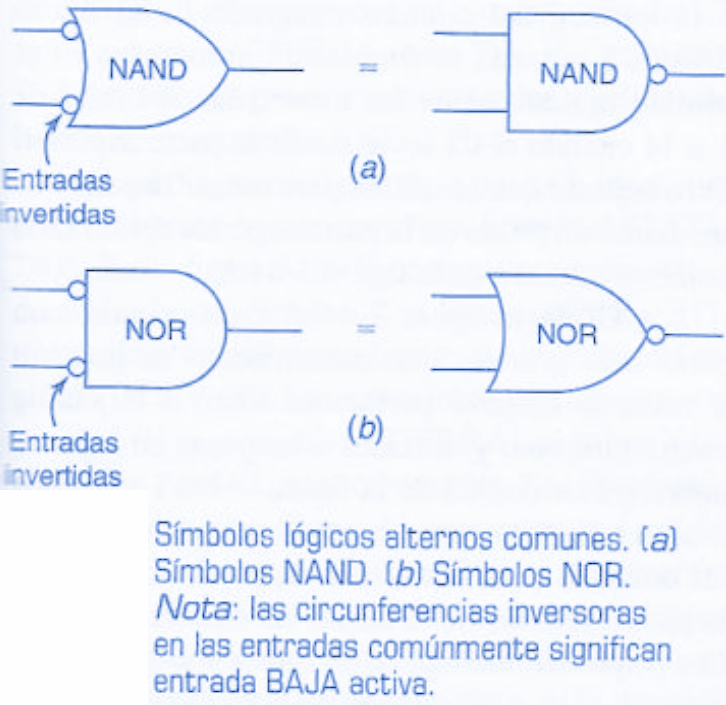

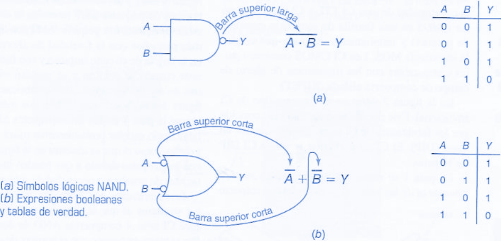
