# Lógica combinacional

Para producir una forma de onda de salida deseada, a menudo es necesario utilizar una combinación de compuertas. Por ejemplo, supóngase que se necesita generar una señal de control formada por los pulsos 2' y 5' a partir de las formas de onda del reloj con retardo y del contador de corrimiento.

Se requiere una compuerta AND de tres entradas para aislar el pulso 2' y otra AND con el mismo número de entradas para aislar el pulso 5'. Para producir la señal deseada, debe hacerse el OR de la salida de ambas compuertas. La salida estará en el nivel ALTO ya sea durante el pulso 2' O (OR) el 5'. La combinación de compuertas para producir la salida requerida recibe el nombre de  _lógica combinacional o combinatoria_ .

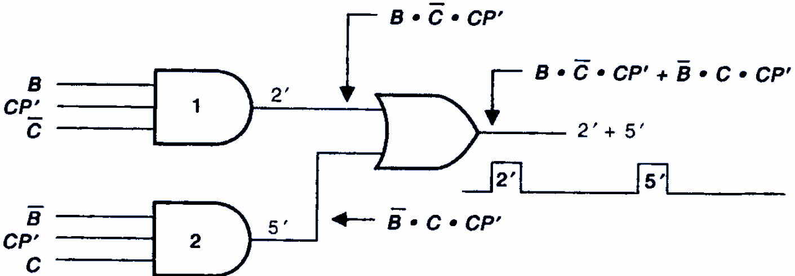

La operación de todas las compuertas lógicas básicas, y el álgebra booleana para describir y analizar circuitos formados de combinaciones de compuertas lógicas.  _Estos circuitos pueden clasificarse como circuitos lógicos combinacionales_ , ya que, en cualquier momento, el nivel lógico de la salida depende de la combinación de los niveles lógicos presentes en las entradas. Un circuito combinacional no tiene característica de memoria, por lo que su salida depende solo del valor actual de sus entradas.

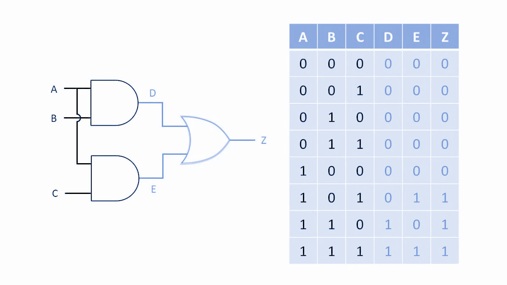

## Construcción de circuitos a partir de su expresión booleana

Construir el diagrama de la siguiente expresión:

$$A + B + C = Y$$

Construir el diagrama de la siguiente expresión:

$$(A + B + C) (A’ + B’)= Y$$

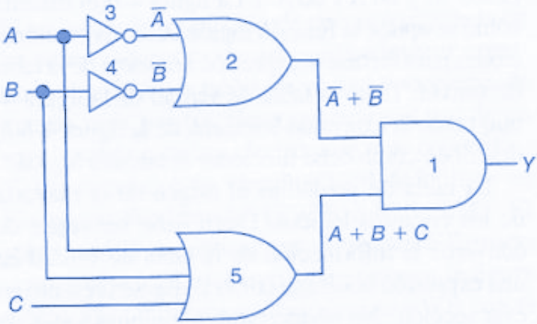

Construir el diagrama de la siguiente expresión:

$$A B C + A’ B’ C = Y$$

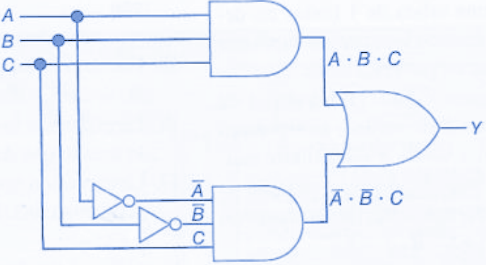

Construir el diagrama de la siguiente expresión:

$$x = BC + AC + AB$$

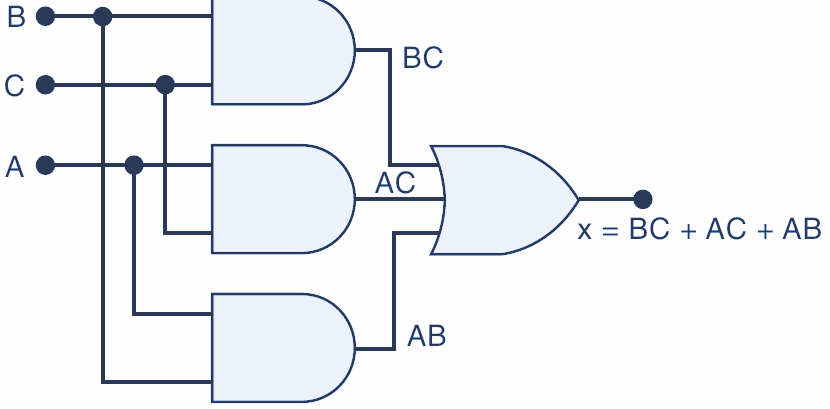

Construir el diagrama de la siguiente expresión:

$$A’ B = Y$$

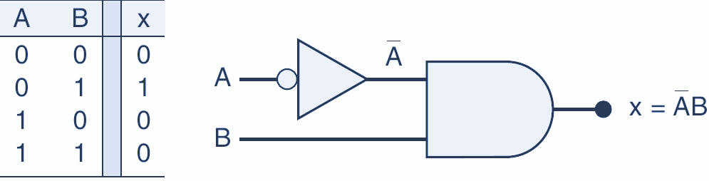

Construir el diagrama de la siguiente expresión:

$$A B’ + A’ B = Y$$

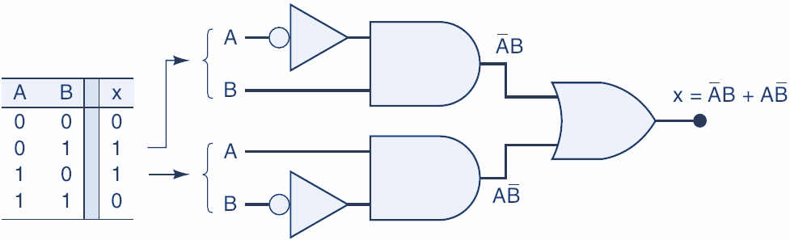

## Diseño digital

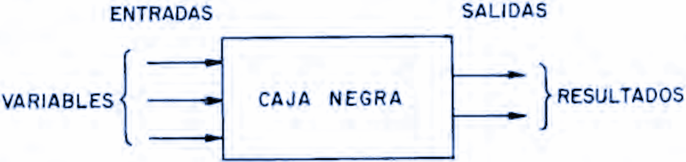

# Álgebra booleana

El álgebra de Boole es un sistema matemático que nos permite manejar ecuaciones, las cuales pueden ser simplificadas y convertidas en o desde un sistema físico de puertas lógicas, las cuales realizan esa misma función. Es decir, podemos, mediante matemáticas, hacer que un sistema de control muy complejo se pueda simplificar.

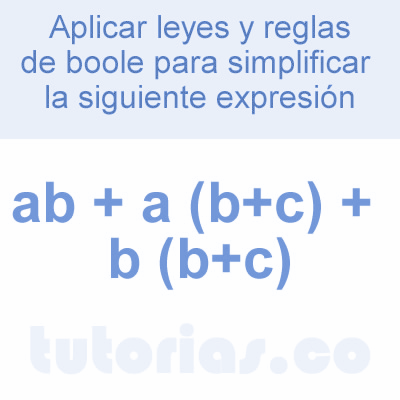

Las operaciones fundamentales son:

__Suma__ . Es la operación que realiza la compuerta OR, esta se expresa como:  _f = a + b_

__Producto__ . Es la operación de la compuerta AND, la cual se expresa como:  _f = ab_

__Inversión__ . Es la operación que realiza la compuerta NOT. Se expresa como: _ f = a’_

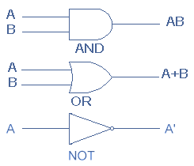

El álgebra de Boole son las matemáticas de los sistemas digitales. Es indispensable tener unos conocimientos básicos del álgebra booleana para estudiar y analizar los circuitos lógicos. Se han presentado las operaciones y expresiones booleanas para las puertas NOT, AND, OR, NAND y NOR.

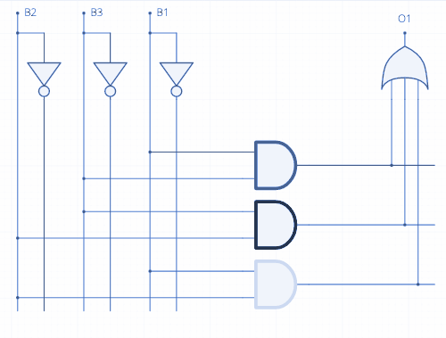

Los términos  _variable_ ,  _complemento_  y  _literal_  son términos utilizados en el álgebra booleana. Una  _variable_  es un símbolo que se utiliza para representar magnitudes lógicas. Cualquier variable puede tener un valor de 0 o de 1. El  _complemento_  es el inverso de la variable y se indica mediante una barra encima de la misma. Por ejemplo, el complemento de la variable  _A es A’_ . Si A = 1, entonces A = 0. Si A = 0, entonces A = 1.

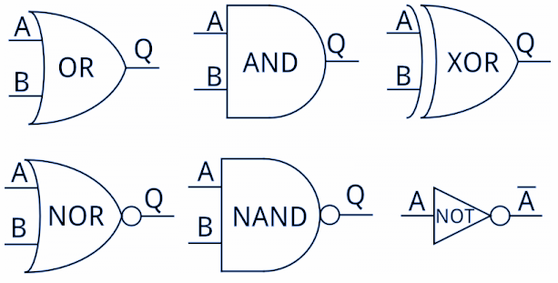

El  _complemento_  de la variable A se lee “no A” o “A barra”. En ocasiones, se emplea un apóstrofe en lugar de la barra para indicar el complemento de una variable; por ejemplo B’ indica el complemento de B. Un  _literal_  es una variable o el complemento de una variable.

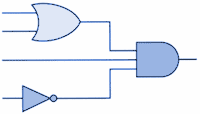

## Suma booleana

La suma booleana es equivalente a la operación OR y a continuación se muestran sus reglas básicas junto con su relación con la puerta OR:

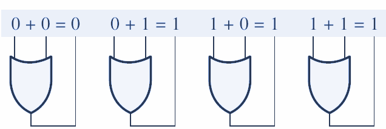

En el álgebra de Boole, un  _término suma_  es una suma de literales. En los circuitos lógicos, un término suma se obtiene mediante una operación OR, sin que exista ninguna operación AND en la expresión.

_Un término suma es igual a 1 cuando uno o más de los literales del término es 1. Un término suma es igual a 0 sólo si cada uno de los literales son iguales a 0._

# Multiplicación booleana

La multiplicación booleana es equivalente a la operación AND y sus reglas básicas junto con sus relaciones con la puerta AND se ilustran a continuación:

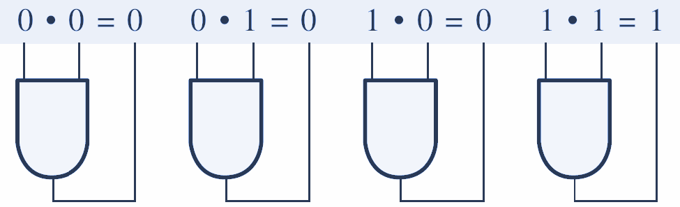

En el álgebra de Boole, un  _término producto_  es un producto de literales. En los circuitos lógicos, un término suma se obtiene mediante una operación AND, sin que existe ninguna operación OR en la expresión.

_Un _  _término producto_  _ es igual a 1 sólo si cada uno de los literales del término es 1. Un término producto es igual a 0 cuando uno o más de los literales son iguales a 0_ .

# Precedencia de operadores

La expresión A · B + C puede interpretarse de dos maneras:

(1) Se aplica un OR entre A · B y el término C; o

(2) Se aplica un AND entre A y el término B + C.

Para evitar esta confusión debe quedar claro que si una expresión contiene las operaciones AND y OR,  __la operación AND se realiza primero__ ,  _a menos que haya paréntesis_  en la expresión, en cuyo caso la operación encerrada entre paréntesis es la que se debe realizar primero. Esta regla es la misma que se utiliza en el álgebra ordinaria para determinar el orden de las operaciones.

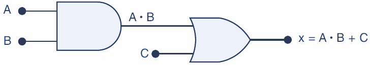

La expresión para la salida de la compuerta OR es A + B. Esta salida sirve como entrada para la compuerta AND junto con otra entrada C. Por ende, expresamos la salida de la compuerta AND como  _x = (A + B) · C_ .

El uso de los paréntesis aquí para indicar que primero se aplica la operación OR entre A y B, antes de que a su suma OR se le aplique un AND con C. Sin los paréntesis se interpretaría de manera incorrecta, ya que A + B · C significa que a la entrada A se le aplica un OR con el producto  _B · C_ .

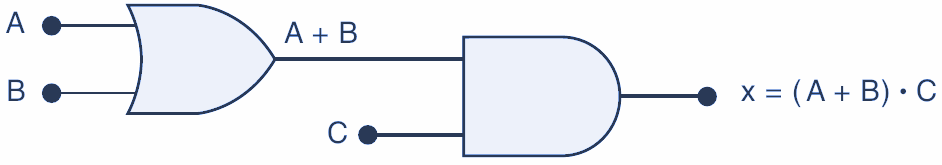

# Circuitos que contienen INVERSORES

Siempre que haya un INVERSOR presente en el diagrama de un circuito lógico, la expresión de su salida es en sí igual a la expresión de la entrada con una barra sobre ella.

Se muestra dos ejemplos que utilizan INVERSORES. La entrada A se alimenta a través de un INVERSOR, cuya salida es, por lo tanto, A. La salida del INVERSOR se alimenta a una compuerta OR junto con B, de manera que la salida OR es igual a A + B. Observe que la barra solo está sobre A, lo cual indica que A primero se invierte y después se alimenta a la compuerta OR junto con B.

La salida de la compuerta OR es igual a A + B y se alimenta a través de un INVERSOR. Por lo tanto, la salida del INVERSOR es igual a (A + B)’, ya que invierte toda la expresión de entrada. Observe que la barra cubre toda la expresión (A + B). Esto es importante, las expresiones (A + B)’ y (A’ + B’)  _no son equivalentes_ .

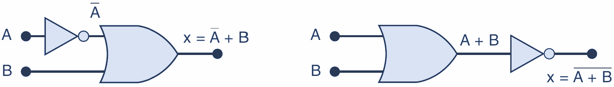

La expresión (A + B)’ indica que primero se aplica un OR entre A y B, y después su suma OR se invierte, mientras que la expresión (A’ + B’) indica que primero se invierten A y B, y después se aplica un OR a los resultados de las dos inversiones.

Note el uso de dos conjuntos separados de paréntesis en la figura. Observe además en la figura que la variable de entrada A está conectada como entrada para dos compuertas distintas.

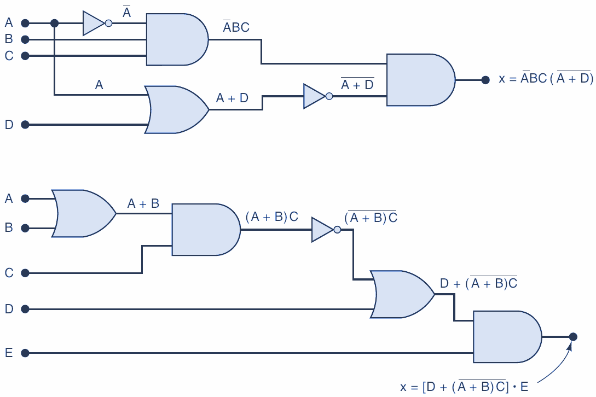

# Análisis mediante el uso de una tabla

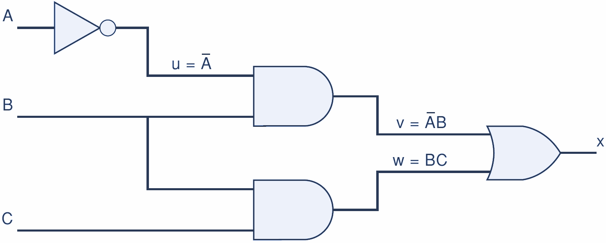

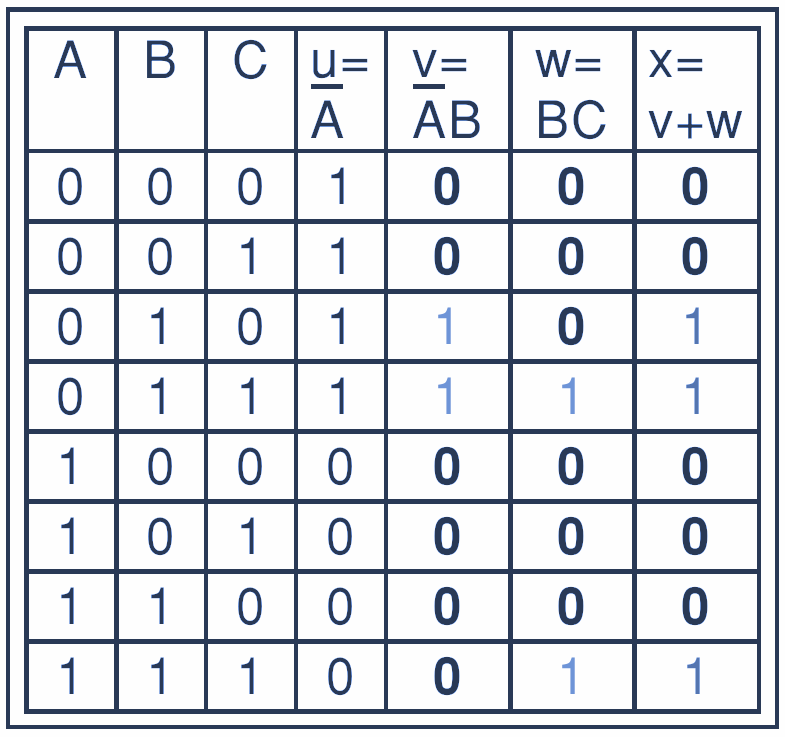

# Teoremas Booleanos

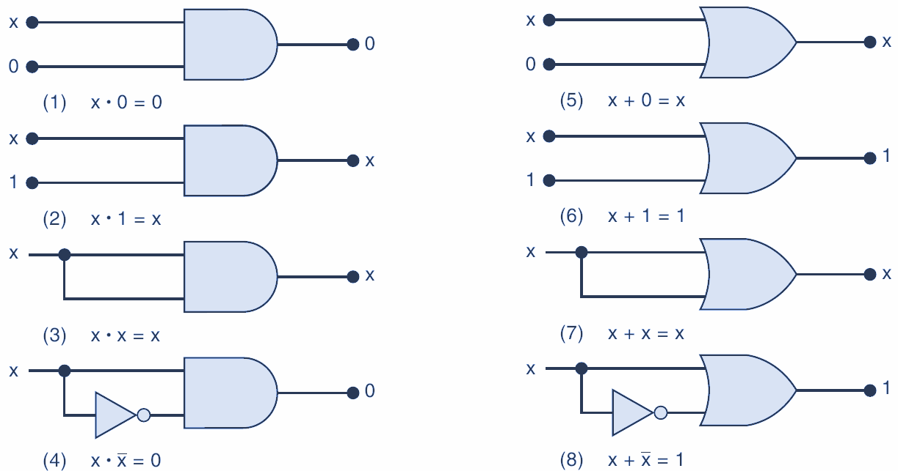

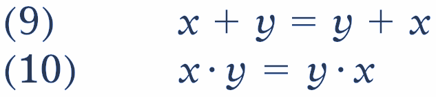

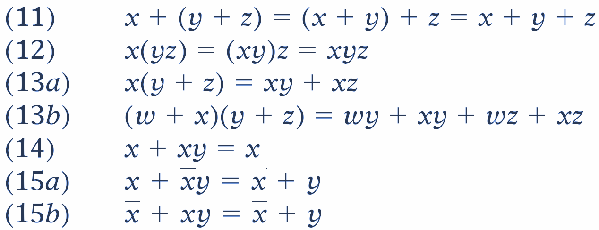

Los teoremas (9) y (10) se conocen como  _leyes conmutativas_ , ya que indican que el orden en el que se aplican las operaciones OR y AND a dos variables no importa; el resultado es el mismo.

Los teoremas (11) y (12) son las  _leyes asociativas_ , las cuales establecen que podemos agrupar las variables en una expresión AND o en una expresión OR de cualquier forma que necesitemos.

El teorema (13) es la  _ley distributiva_ , la cual establece que para expandir una expresión se multiplica término por término, de igual forma que en el álgebra ordinaria.

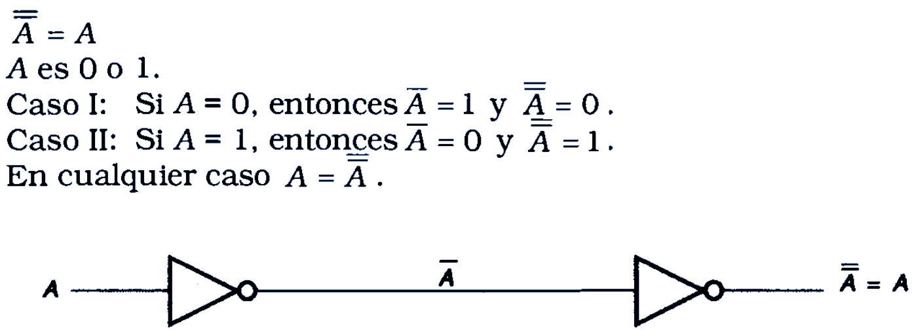

# Identidades del álgebra de Boole

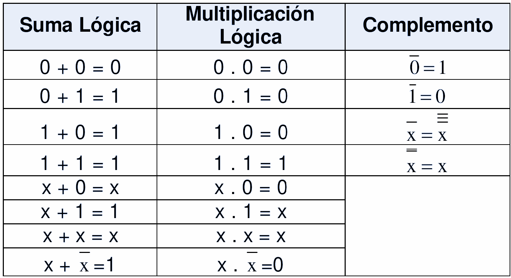

# Leyes del álgebra de Boole

La  _ley conmutativa_  de la  __suma__  para dos variables se escribe como sigue:

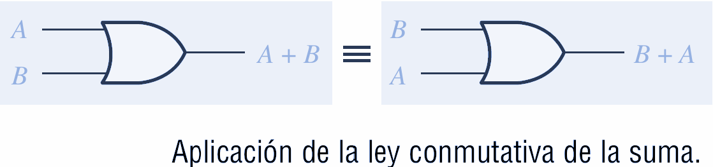

La  _ley conmutativa de la multiplicación_  para dos variables es

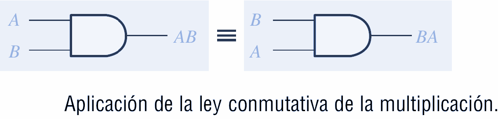

La  _ley asociativa de la suma_  para tres variables se escribe como sigue:

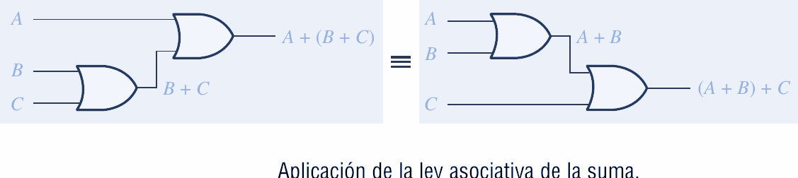

La  _ley asociativa de la multiplicación_  para tres variables se escribe del siguiente modo:

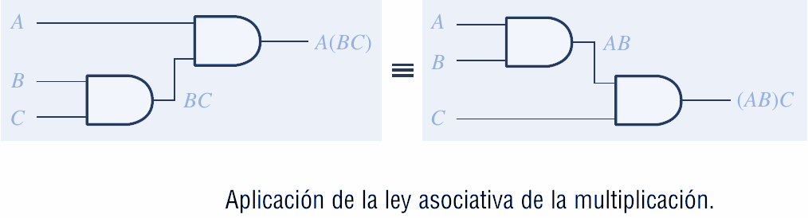

La  _ley distributiva para tres variables_  se escribe como sigue:

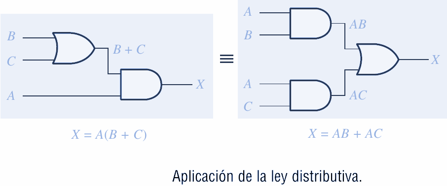

# Teorema de Morgan

Los  __teoremas de DeMorgan__  proporcionan una verificación matemática de la equivalencia entre las puertas  _NAND_  y  _negativa\-OR, y las puertas NOR y negativa\-AND._

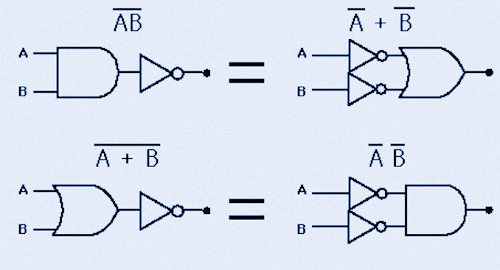

El primer teorema de DeMorgan se enuncia de la siguiente forma:

_El complemento de un producto de variables es igual a la suma de los complementos de las variables._

O dicho de otra manera

_El complemento de dos o más variables a las que se aplica la operación AND es equivalente a aplicar la operación OR a los complementos de cada variable._

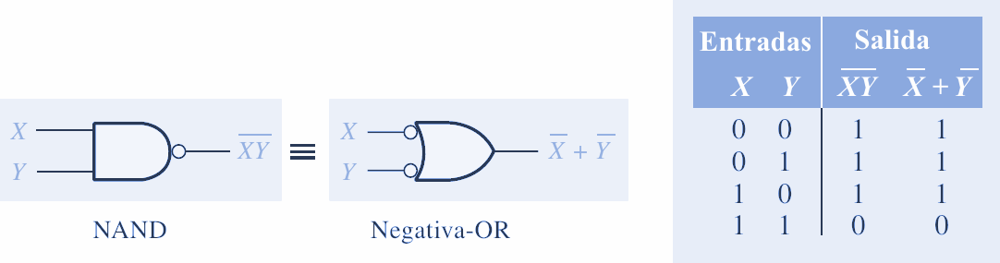

El segundo teorema de DeMorgan se enuncia como sigue:

_El complemento de una suma de variables es igual al producto de los complementos de las variables._

O dicho de otra manera,

_El complemento de dos o más variables a las que se aplica la operación OR es equivalente a aplicar la operación AND a los complementos de cada variable._

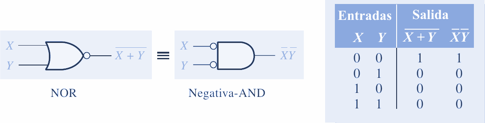

# Teoremas Booleanos

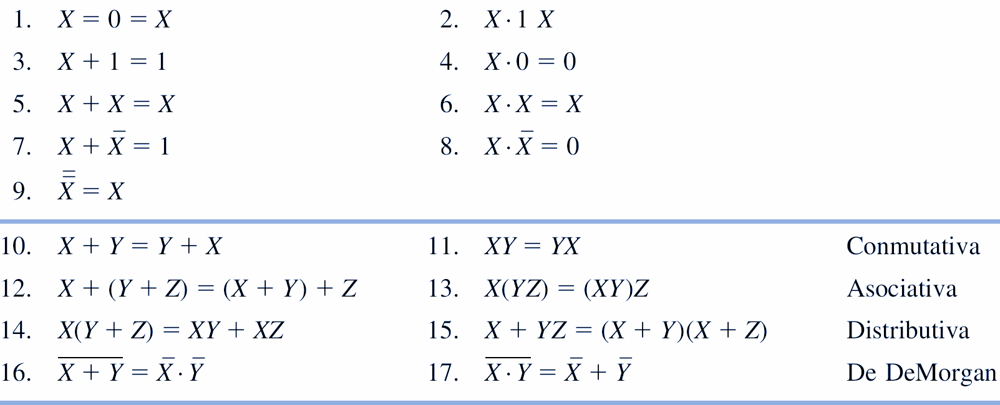
