# Aplicando Álgebra Booleana

Simplifique la expresión, comprobar tabla de verdad y crear su circuito digital

Simplificando la expresión, la ecuación es:

Factorizamos las variables comunes  _AB_ ’

Nos queda para reducir la D con su complemento D’, y aplicamos la fórmula:

Nos da como resultado:

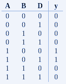

Crear el circuito de la ecuación reducida:

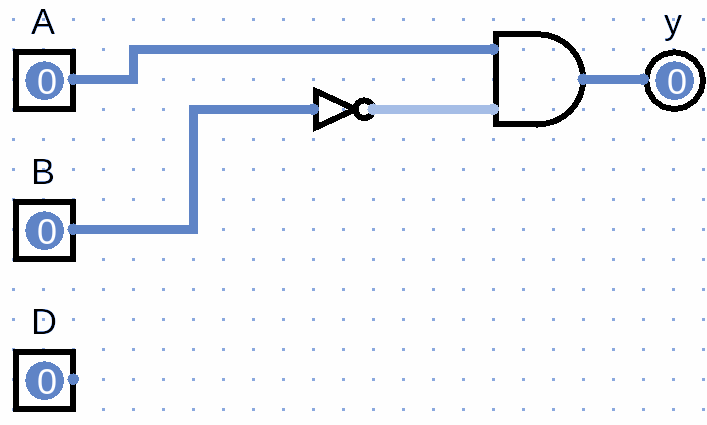

Simplifique la expresión, comprobar tabla de verdad y crear su circuito digital

Simplificando la expresión, la ecuación es:

Realizamos la multiplicación:

Ahora podemos aplicar los teoremas siguientes:

Sustituimos en la ecuación:

Reducimos y nos queda:

Factorizamos a B

Nos da como resultado:

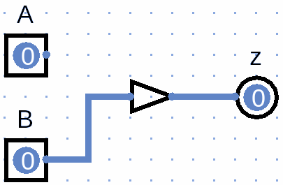

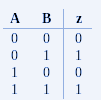

Simplifique la expresión, comprobar tabla de verdad y crear su circuito digital:

Simplificando la expresión, la ecuación es:

Si factorizamos las variables comunes CD, tenemos que

Utilizando el  _teorema_  podemos sustituir

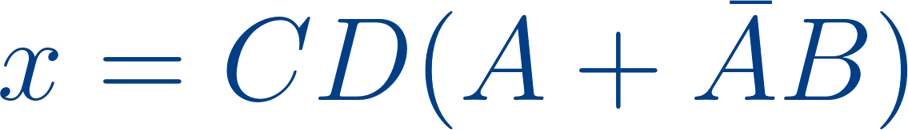

Quedándonos:

Volvemos a multiplicar todo, para el resultado final

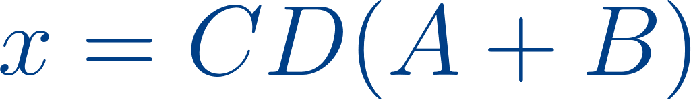

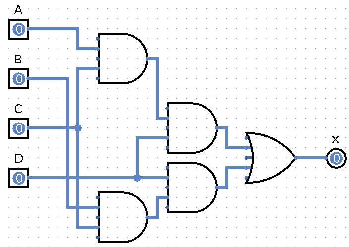

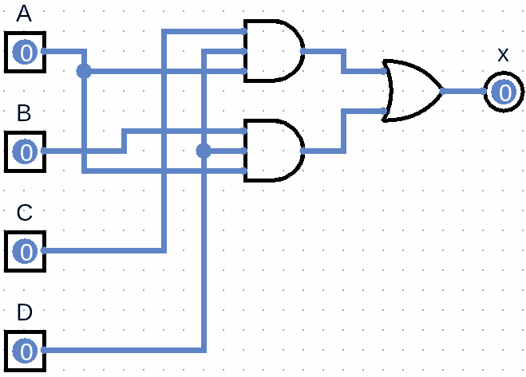

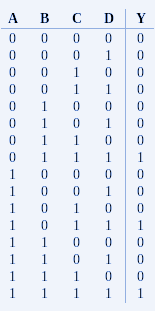

# APLICANDO ÁLGEBRA BOOLEANA

# Aplicando Álgebra Booleana

Con base al circuito, generar la ecuación, reducirla y obtener tabla de verdad

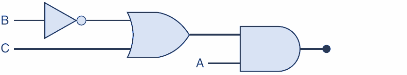

Vamos asignando los valores por cada compuerta y su salida

Nos da como resultado:

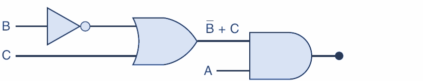

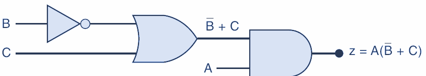

Nos da como resultado:

La tabla de verdad:

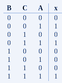

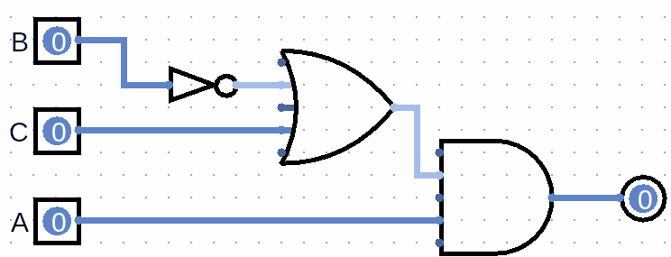

Con base al circuito, generar la ecuación, reducirla y obtener tabla de verdad

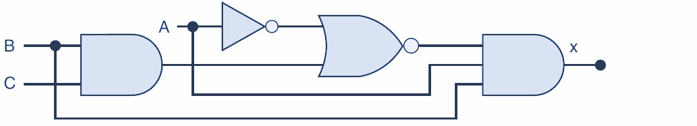

Vamos asignando los valores por cada compuerta y su salida

Nos da como resultado:

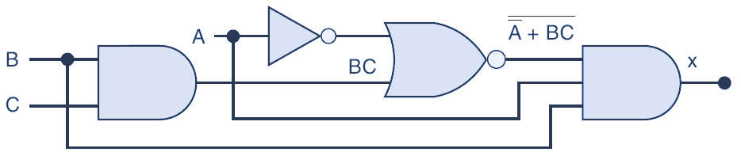

La función obtenida fue:

Para simplificar, aplicaremos Teorema de Morgan en las negaciones

Con esto aplicamos para que la suma se convierta en multiplicación:

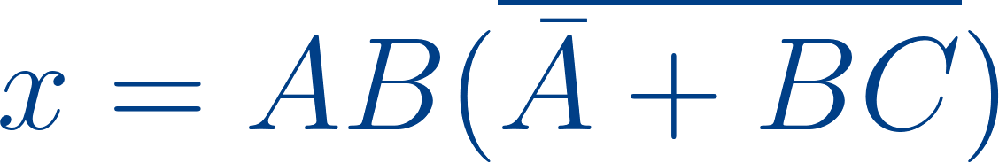

Ahora, aplicamos el teorema para

Con esto la ecuación nos queda:

Volvemos a aplicar teorema de Morgan:

Aplicamos el teorema

Con esto la ecuación se reduce

Multiplicamos los factores:

Aplicamos el teorema

Para llegar al resultado final:

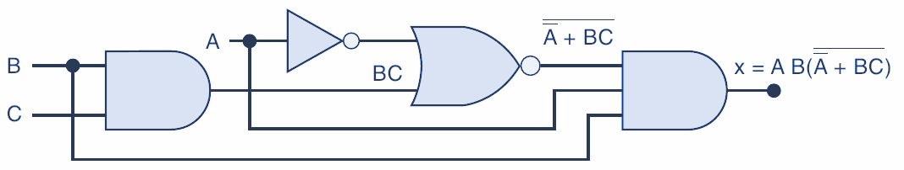

Creamos la tabla de verdad y comprobamos (sin reducción)

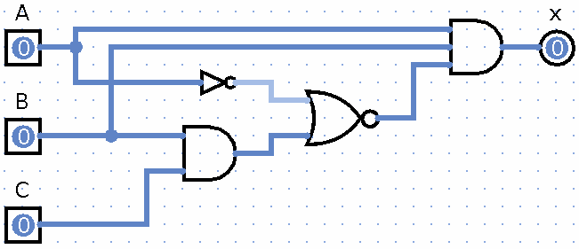

Creamos la tabla de verdad y comprobamos

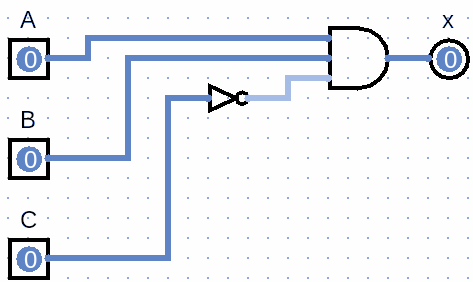

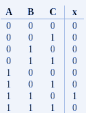

Con base al circuito, generar la ecuación, reducirla y obtener tabla de verdad

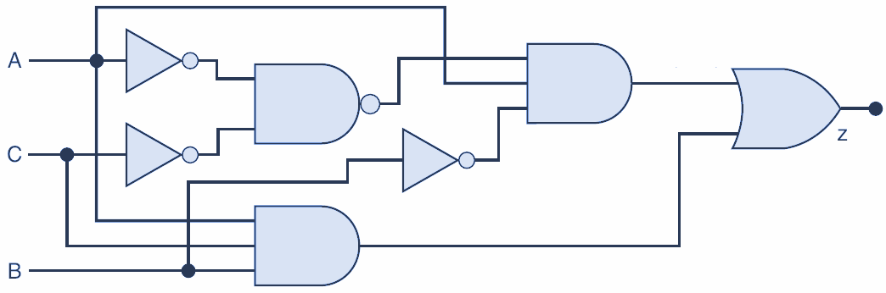

Vamos asignando los valores por cada compuerta y su salida

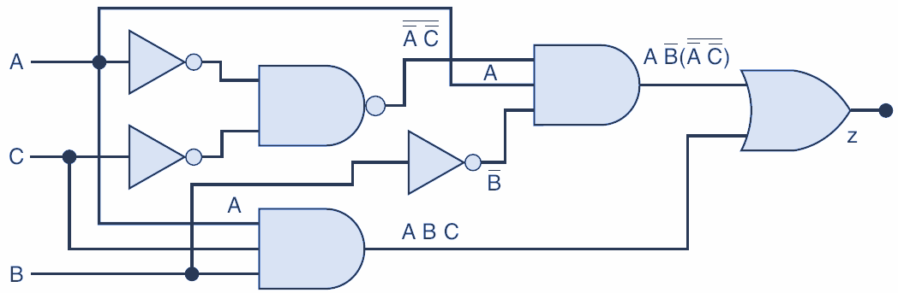

Nos dá como resultado:

La función resultante fue:

Aplicamos el teorema de Morgan:

Cancelamos los inversos en A y C

Multiplicamos los factores:

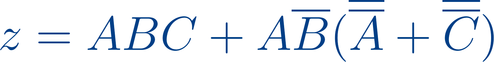

Reduzimos A.A = A

Fatorizamos AC

Reduzimos las B complementarias:

Nos queda:

Aún podemos factorizar para que nos quede:

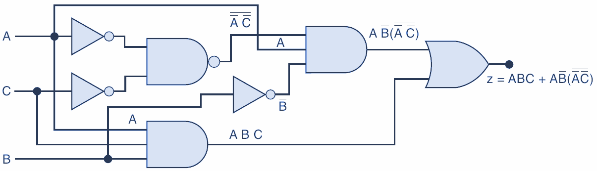

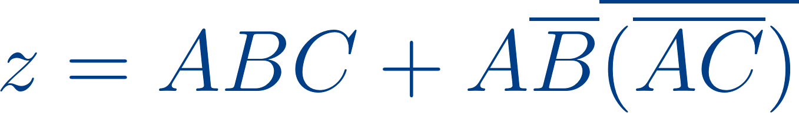

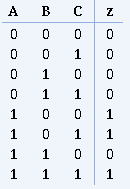

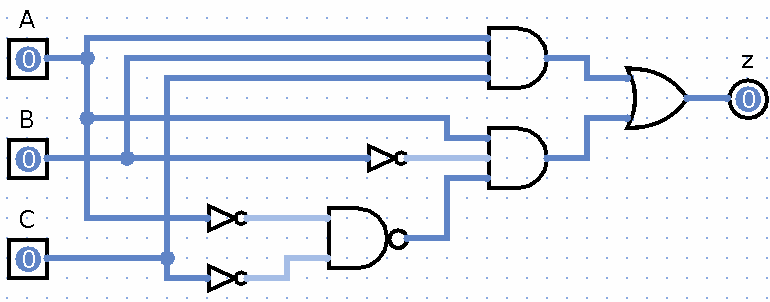

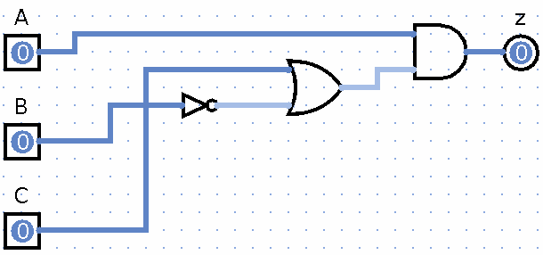

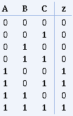

Con base a la tabla de verdad, obtener ecuación, reducir ecuación, y construir el circuito digital

Primero se debe obtener los valores de las salidas que sean 1:

Una vez tenemos las salidas en 1, se genera la ecuación sumando cada producto:

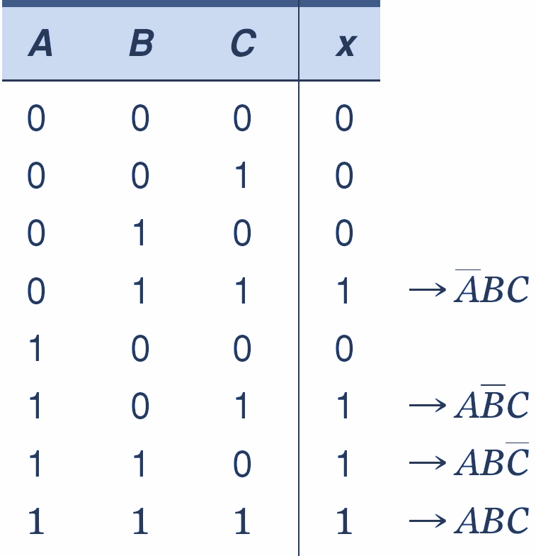

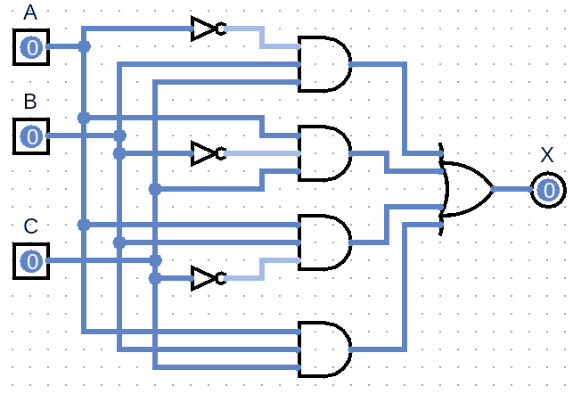

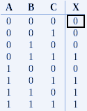

Ahora debemos reducir la ecuación, para esto vamos a aplicar el teorema  _x + x = x_ , con  _ABC_ ; duplicamos para reducir más fácil la ecuación:

Factorizamos los términos:

Hacemos las reducciones necesarias y llegamos a la resultante

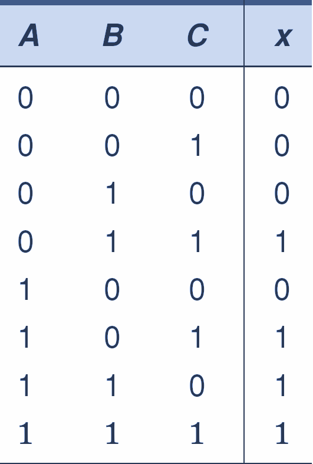

Armamos el circuito resultante

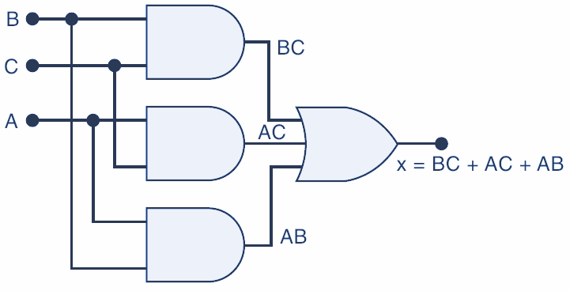

La tabla de verdad resultante:

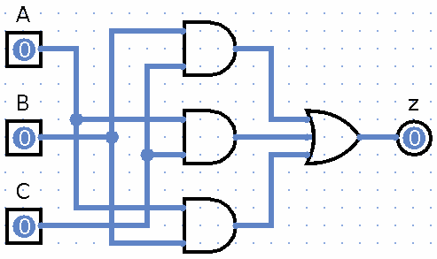

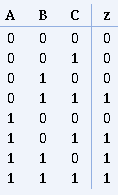

Con base a la tabla de verdad, obtener ecuación, reducir ecuación, y construir el circuito digital

Primero se debe obtener los valores de las salidas que sean 1:

La ecuación generada es:

( ~A B C D) + (A ~B ~C ~D ) + (A ~B ~C D ) +

(A ~B C ~ D) + (A ~B C D) + (A B ~C ~D) + (A B ~C D )

( A B C ~D) + (A B C D)

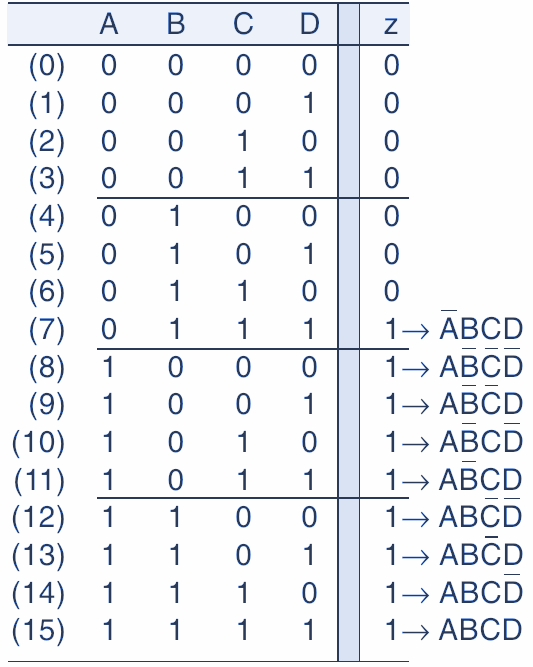

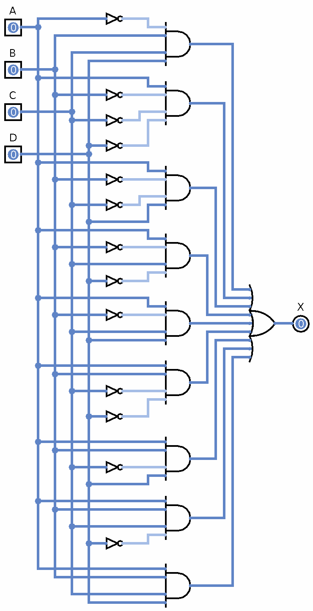

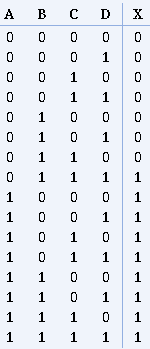

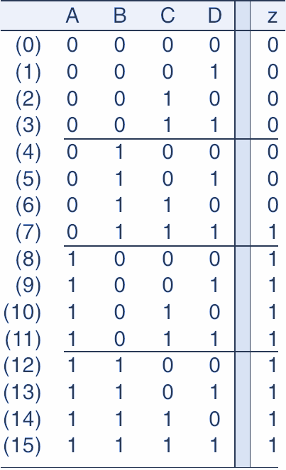

La función obtenida es:

Vamos a factorizar los complementos en D:

La ecuación reducida nos queda:

Volvemos factorizar los complementos de C:

La ecuación reducida nos queda:

Factorizamos A:

Aplicamos el complemento en B:

Aún podemos reducir más, aplicando el Teorama  _x + xy = x + y_ . En este caso  _x = A_  y  _y = BCD,_  nos queda:

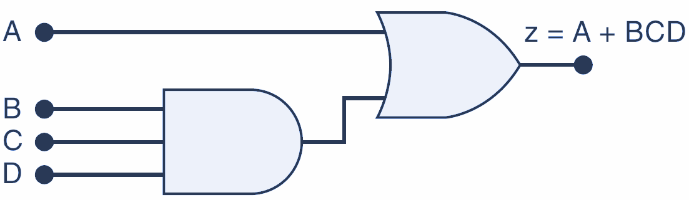

La tabla de verdad resultante:

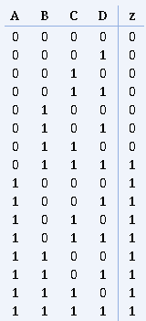

La tabla de verdad resultante:

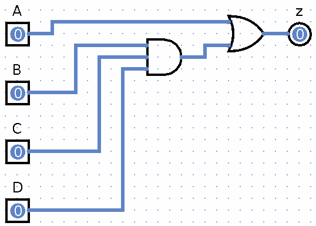
