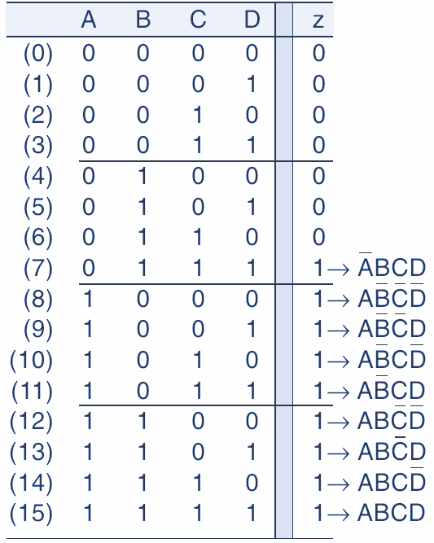
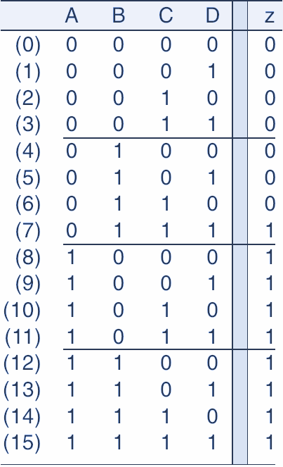
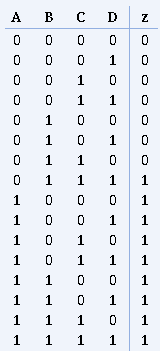

# Aplicando Álgebra Booleana

## Reducción de ecuacion y generación de circuito y tabla de verdad

## Ejercicio 1
Simplifique la expresión, comprobar tabla de verdad y crear su circuito digital

|             Ecuación             |
| :------------------------------: |
|  |

### Desarrollo

Simplificando la expresión, la ecuación es:

Factorizamos las variables comunes  $A\overline{B}$. Nos queda para reducir la $D$ con su complemento $D’$, y aplicamos la fórmula, nos da como resultado:

| Pasos | Operación                                 |
| :---: | ----------------------------------------- |
|   1   |           |
|   2   | Se reduce $D + \overline{D} = 1$          |
|   3   |           |
|   4   | Resolvemos la multiplicación y nos queda: |
|   5   |           |

### Resultado

Crear el circuito de la ecuación reducida:

|             Ecuación             |         Tabla de verdad          |
| :------------------------------: | :------------------------------: |
|  |  |

### Circuito

## Ejercicio 2

Simplifique la expresión, comprobar tabla de verdad y crear su circuito digital

|             Ecuación             |
| :------------------------------: |
|  |

### Desarrollo

| Pasos | Operación                                                                        |
| :---: | -------------------------------------------------------------------------------- |
|   1   |                                                  |
|   2   | Realizamos la multiplicación:                                                    |
|   3   |                                                 |
|   4   | Ahora podemos aplicar los teoremas siguientes:  |
|   5   | Sustituimos en la ecuación:                     |
|   6   |                                                 |
|       | Reducimos y nos queda:                                                           |
|       |                                                 |
|       | Factorizamos a B                                                                 |
|       |                                                 |
|       | Nos da como resultado:                                                           |
|       |                                                 |

|             Ecuación              |          Tabla de verdad          |
| :-------------------------------: | :-------------------------------: |
|  |  |

### Circuito

## Ejercicio 3

Simplifique la expresión, comprobar tabla de verdad y crear su circuito digital:

|             Ecuación              |
| :-------------------------------: |
|  |

### Desarrollo

| Pasos | Operación                                                                     |
| :---: | ----------------------------------------------------------------------------- |
|   1   | Simplificando la expresión, la ecuación es:                                   |
|   2   |                                              |
|   3   | Si factorizamos las variables comunes $CD$, tenemos que                       |
|   4   |                                              |
|   5   | Utilizando el  _teorema_  podemos sustituir  |
|   6   | Quedándonos:                                                                  |
|   7   |                                              |
|   8   | Volvemos a multiplicar todo, para el resultado final                          |
|   9   |                                              |

|             Ecuación              |          Tabla de verdad          |
| :-------------------------------: | :-------------------------------: |
|  |  |

### Circuito

## A partir de circuito generar ecuación y reducción

## Ejercicio 4

Con base al circuito, generar la ecuación, reducirla y obtener tabla de verdad

|         Circuito inicial          |
| :-------------------------------: |
|  |

### Desarrollo

Vamos asignando los valores por cada compuerta y su salida

| Pasos | Operación                                  |
| :---: | ------------------------------------------ |
|   1   | Inicio                                     |
|   2   |           |
|   3   | Nos da como resultado:                     |
|   4   |           |
|   5   | Nos da como resultado la ecuación booleana |
|   6   |           |

|             Ecuación              |          Tabla de verdad          |
| :-------------------------------: | :-------------------------------: |
|  |  |

### Circuito 

## Ejercicio 5

Con base al circuito, generar la ecuación, reducirla y obtener tabla de verdad

|         Circuito inicial          |
| :-------------------------------: |
|  |

### Desarrollo

| Pasos | Operación                                                                                             |
| :---: | ----------------------------------------------------------------------------------------------------- |
|   1   | Vamos asignando los valores por cada compuerta y su salida                                            |
|   2   |                                                                      |
|   3   | Nos da como resultado:                                                                                |
|   4   |                                                                      |
|   5   | La función obtenida fue:                                                                              |
|   6   |                                                                      |
|   7   | Para simplificar, aplicaremos **Teorema de Morgan** en las negaciones                                 |
|   8   | Con esto aplicamos para que la suma se convierta en multiplicación:  |
|   9   | Nos queda de la siguiente manera al aplicar el teorema de Morgan                                      |
|  10   |                                                                      |
|  11   | Ahora, aplicamos el teorema para                                     |
|  12   | Con esto la ecuación nos queda:                                                                       |
|  13   |                                                                      |
|  14   | Volvemos a aplicar teorema de Morgan:                                                                 |
|  15   |                                                                      |
|  16   | Aplicamos el teorema                                                                                  |
|  17   |                                                                      |
|  18   | Con esto la ecuación se reduce                                                                        |
|  19   |                                                                      |
|  20   | Se reduce, quedando:                                                                                  |
|  21   |                                                                      |
|  22   | Aplicamos el teorema                                                 |
|  23   | Multiplicamos los factores                                                                            |
|  24   | Para llegar al resultado final:                                                                       |
|  25   |                                                                      |

|         Ecuación Reducida         |          Tabla de verdad          |
| :-------------------------------: | :-------------------------------: |
|  |  |

### Circuito

## Ejercicio 6

Con base al circuito, generar la ecuación, reducirla y obtener tabla de verdad

|         Circuito inicial          |
| :-------------------------------: |
|  |

### Desarrollo

Vamos asignando los valores por cada compuerta y su salida

| Pasos | Operación                                                                       |
| :---: | ------------------------------------------------------------------------------- |
|   1   | Inicio                                                                          |
|   1   |                                                |
|       | Nos dá como resultado:                                                          |
|       |                                                |
|       | La función resultante fue:                                                      |
|       |                                                |
|       | Aplicamos el **teorema de Morgan**: $\overline{XY} = \overline{X}+\overline{Y}$ |
|       |                                                |
|       | Se reduce $\overline{\overline{A}}=A$. Cancelamos los inversos en $A$ y $C$     |
|       |                                                |
|       | Multiplicamos los factores:                                                     |
|       |                                                |
|       | Reduzimos $A \times A = A$. Nos queda:                                          |
|       |                                                |
|       | Fatorizamos $AC$.                                                               |
|       |                                                |
|       | Reduzimos las B complementarias:                                                |
|       |                                                |
|       | Nos queda:                                                                      |
|       |                                                |
|       | Aún podemos factorizar para que nos quede:                                      |
|       |                                                |

|         Ecuación Reducida         |          Tabla de verdad          |
| :-------------------------------: | :-------------------------------: |
|  |  |

### Circuito

## Ejercicio 7

Con base a la tabla de verdad, obtener ecuación, reducir ecuación, y construir el circuito digital

|           Tabla inicial           |
| :-------------------------------: |
|  |

### Desarrollo

| Pasos | Operación                                                                                                                                          |
| :---: | -------------------------------------------------------------------------------------------------------------------------------------------------- |
|   1   | Primero se debe obtener los valores de las salidas que sean 1                                                                                      |
|   2   |                                                                                                                   |
|       | Una vez tenemos las salidas en 1, se genera la ecuación sumando cada producto:                                                                     |
|       |                                                                                                                   |
|       | Ahora debemos reducir la ecuación, para esto vamos a aplicar el teorema  $x + x = x$ , con  $ABC$ ; duplicamos para reducir más fácil la ecuación: |
|       |                                                                                                                   |
|       | Factorizamos los términos:                                                                                                                         |
|       |                                                                                                                   |
|       | Hacemos las reducciones necesarias y llegamos a la resultante                                                                                      |
|       |                                                                                                                   |

|         Ecuación Reducida         |          Tabla de verdad          |
| :-------------------------------: | :-------------------------------: |
|  |  |

### Circuito

### Ejercicio 8

Con base a la tabla de verdad, obtener ecuación, reducir ecuación, y construir el circuito digital

|           Tabla inicial           |
| :-------------------------------: |
|  |

Con base a la tabla de verdad, obtener ecuación, reducir ecuación, y construir el circuito digital

Primero se debe obtener los valores de las salidas que sean 1:

La ecuación generada es:

( ~A B C D) + (A ~B ~C ~D ) + (A ~B ~C D ) +

(A ~B C ~ D) + (A ~B C D) + (A B ~C ~D) + (A B ~C D )

( A B C ~D) + (A B C D)

La función obtenida es:

Vamos a factorizar los complementos en D:

La ecuación reducida nos queda:

Volvemos factorizar los complementos de C:

La ecuación reducida nos queda:

Factorizamos A:

Aplicamos el complemento en B:

Aún podemos reducir más, aplicando el Teorama  $x + \overline{x}y = x + y$ . En este caso  $x = A$  y  $y = BCD,$  nos queda:

La tabla de verdad resultante:

