# Mapa de Karnaugh

Un  _mapa de Karnaugh_ es similar a una tabla de verdad, ya que muestra todos valores posibles de las variables de entrada y la salida resultante para cada valor. En lugar de organizar en filas y columnas como una tabla de verdad,  _el mapa de Karnaugh es una matriz de celdas_  en la que cada celda representa un valor binario de las variables de entrada.

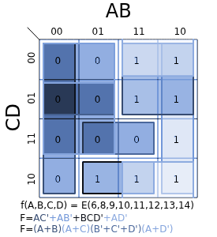

Las celdas se organizan de manera que la simplificación de una determinada expresión consiste en agrupar adecuadamente las celdas. Los mapas de Karnaugh se pueden utilizar para expresiones de dos, tres, cuatro y cinco variables.

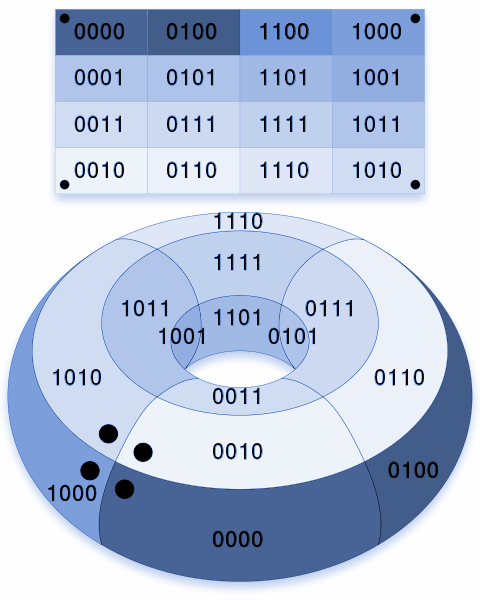

Existe otro método, denominado método de Quine\-McClusky, que puede emplearse para un número mayor de variables. El número de celdas de un mapa de Karnaugh es igual al número total de posibles combinaciones de las variables de entrada, al igual que el número de filas de una tabla de verdad. Para tres variables, el número de celdas necesarias es de 23 = 8. Para cuatro variables, el número de celdas es de 24 = 16.

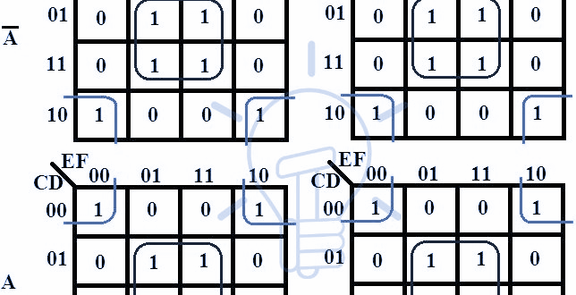

El  _mapa de Karnaugh (mapa K) es una herramienta gráfica_  que se utiliza para simplificar una ecuación lógica o convertir una tabla de verdad en su correspondiente circuito lógico mediante un proceso simple y ordenado. Aunque un mapa K puede usarse para problemas en los que se involucre cualquier número de variables de entrada,  _su utilidad práctica está limitada a cinco o seis variables_ .

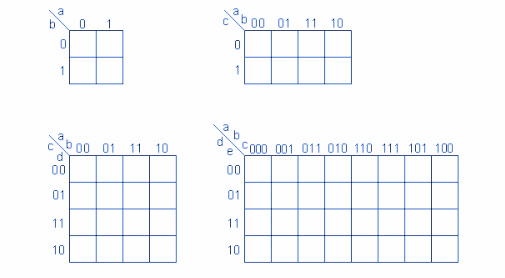

Al igual que una tabla de verdad, el  _mapa K _ es un medio para mostrar la relación entre las entradas lógicas y la salida deseada.

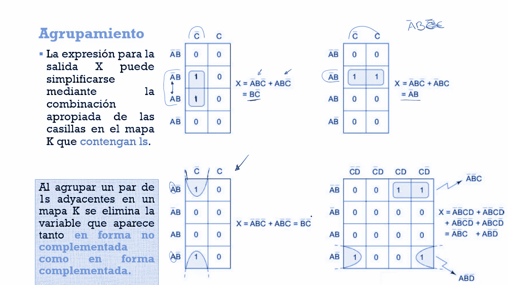

# Mapa de Karnaugh de tres variables

El mapa de Karnaugh de tres variables es una matriz de ocho celdas. En este caso, A, B y C se emplean para denominar a las variables, aunque podían haberse usado cualesquiera otras letras. Los valores binarios de A y B se encuentran en el lado izquierdo (observe la secuencia) y los valores de C se colocan en la parte superior.

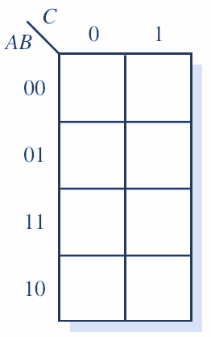

El valor de una determinada celda es el valor binario de A y B, en la parte izquierda de la misma fila combinado con el valor de C en la parte superior de la misma columna. Por ejemplo, la celda de la esquina superior izquierda tiene un valor binario de 000 y la celda inferior derecha tiene un valor binario de 101.

Se muestran los términos producto estándar representados por cada celda del mapa de Karnaugh.

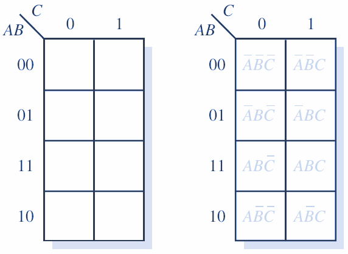

# Mapa de Karnaugh de cuatro variables

El mapa de Karnaugh de cuatro variables es una matriz de dieciséis celdas. Los valores binarios de A y B se encuentran en el lado izquierdo y los valores de C y D se colocan en la parte superior.

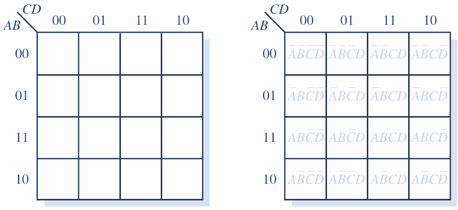

El valor de una determinada celda es el valor binario de A y B, en la parte izquierda de la misma fila, combinado con los valores binarios de C y D en la parte superior de la misma columna. Por ejemplo, la celda de la esquina superior derecha tiene un valor binario de 0010 y la celda inferior derecha tiene un valor binario de 1010.

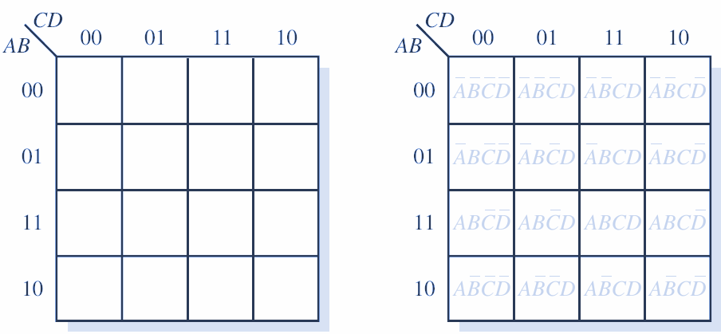

Se indican los términos producto estándar representados por cada celda del mapa de Karnaugh de cuatro variables.

# Adyacencia de celdas

Las celdas de un mapa de Karnaugh se disponen de manera que solo cambia una única variable entre celdas adyacentes. La adyacencia se define por un cambio de una única variable. Las celdas que difieren en una única variable son adyacentes. Por ejemplo, en el mapa de tres variables, la celda 010 es adyacente a las celdas 000, 011 y 110. La celda 010 no es adyacente a la celda 001, ni a la celda 111, ni a la celda 100 ni a la celda 101.

Físicamente, cada celda es adyacente a las celdas que están situadas inmediatas a ella por cualquiera de sus cuatro lados. Un celda no es adyacente a aquellas celdas que tocan diagonalmente alguna de sus esquinas. Además, las celdas de la fila superior son adyacentes a las de la fila inferior y las celdas de la columna izquierda son adyacentes a las situadas en la columna de la derecha.

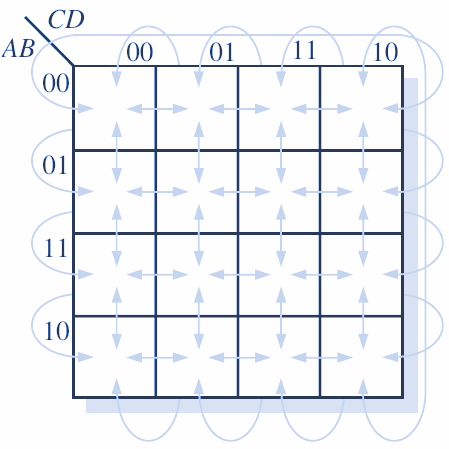

Esto se denomina adyacencia cíclica, ya que podemos pensar que el mapa de Karnaugh se dobla de forma que se toquen los extremos superior e inferior como si fuera un cilindro o los extremos de la derecha e izquierda para formar la misma figura. Se ilustra la adyacencia de celdas en un mapa de cuatro variables, aunque se aplican las mismas reglas de adyacencia a los mapas de Karnaugh con cualquier número de celdas.

# Mapa de Karnaugh

La tabla de verdad proporciona el valor de la salida  _X_  para cada combinación de valores de entrada. El mapa K proporciona la misma información en un formato distinto. Cada caso en la tabla de verdad corresponde a una casilla en el mapa K. Por ejemplo, en la figura la condición A = 0, B = 0 corresponde la casilla A’ B’ en el mapa K.

Como la tabla de verdad muestra X = 1 para este caso, se coloca un 1 en la casilla A’ B’ del mapa K. De manera similar, la condición A = 1, B = 1 en la tabla de verdad corresponde a la casilla AB del mapa K. Como X = 1 para este caso, se coloca un 1 en la casilla AB. Todas las demás casillas se llenan con 0s. Esta misma idea se utiliza en los mapas con tres y cuatro variables.

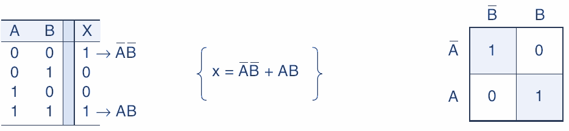

Las casillas del mapa K se etiquetan de manera que las casillas adyacentes en forma horizontal difieran solo por una variable. Por ejemplo, la casilla de la esquina superior izquierda en el mapa de cuatro variables es  _A’ B’ C’ D’_ , mientras que la casilla que se encuentra justo a su derecha es  _A’ B’ C’ D’_  (solo la variable D es distinta).

De manera similar, las casillas adyacentes verticales solo difieren por una variable. Por ejemplo, la casilla de la esquina superior izquierda es  _A’ B’ C’ D’_ , mientras que la casilla que está justo debajo es  _A’ B’ C’ D’_  (solo la variable B es distinta).

Observe que cada casilla en la fila superior se considera como adyacente a una casilla correspondiente en la fila inferior. Por ejemplo, la casilla  _A’ B’CD_  en la fila superior es adyacente a la casilla  _AB’CD_  en la fila inferior, ya que solo difieren por la variable  _A_ . Podemos considerar que la parte superior del mapa se dobla para tocar su parte inferior.

De manera similar, las casillas de la columna más a la izquierda son adyacentes a las correspondientes en la columna más a la derecha.

Para que las casillas adyacentes en forma vertical y horizontal difieran sólo por una variable, el etiquetado de arriba hacia abajo debe realizarse en el orden mostrado: A’ B’, A’B, AB, AB’. Lo mismo aplica para el etiquetado de izquierda a derecha: C’D’, C’D, CD, CD’.

Una vez que se ha llenado un  _mapa K_  con 0s y 1s, puede obtenerse la expresión de suma de productos para la salida  _X_  mediante la aplicación de la operación OR a todas las casillas que contengan un 1.

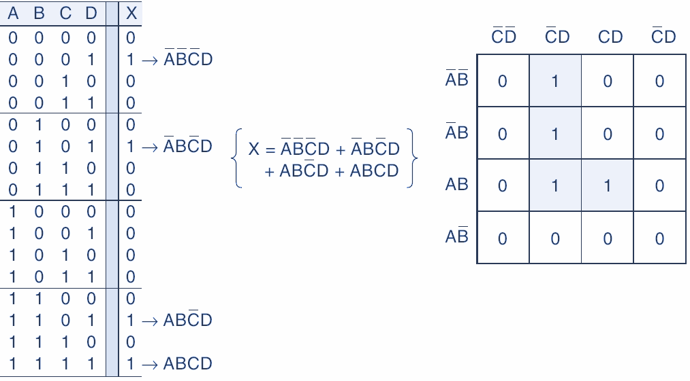

En el mapa de tres variables, las casillas A’B’C, A’B’C, ABC y ABC’ contienen un 1, de manera que X = A’B’C’+  A’B’C + A’BC’  ABC.

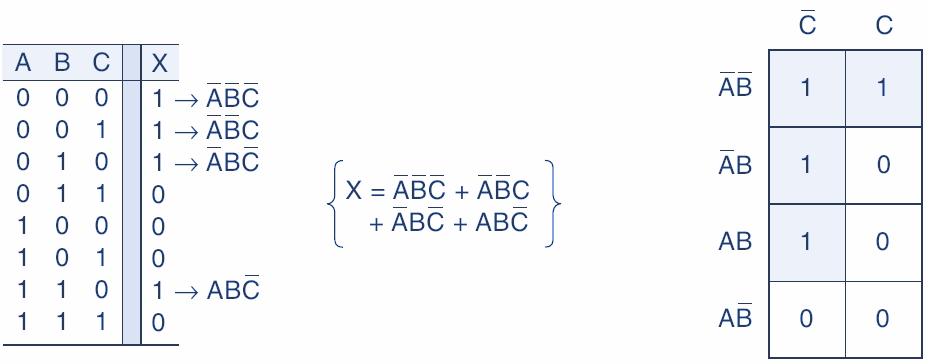

# Agrupamiento

La expresión para la salida X puede simplificarse mediante la combinación apropiada de las casillas en el mapa K que contengan 1s. Al proceso para combinar estos 1s se le conoce como  _agrupamiento_ .

_Los grupos solo pueden ser en base 2, es decir, solo pueden ser 1, 2, 4, 8, 16, 32 …_

No se pueden agregar en otra cantidad.

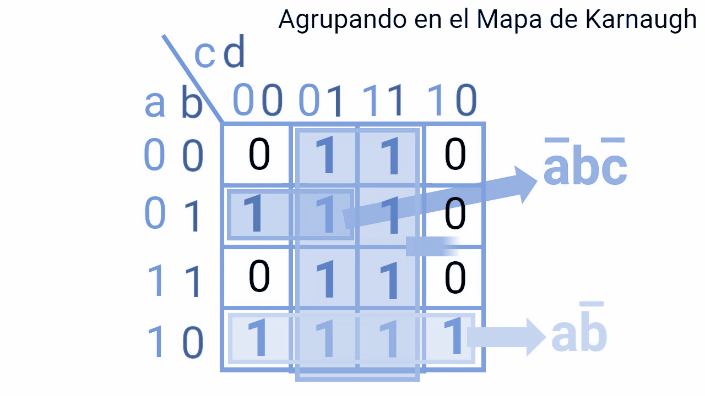

# Agrupamiento de pares (grupos de dos)

El mapa K para cierta tabla de verdad de tres variables. Este mapa contiene un par de 1s que son adyacentes en forma vertical; el primero representa a A’BC’ y el segundo a ABC’.

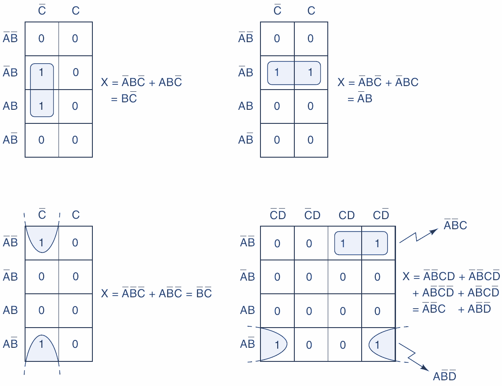

Observe que en estos dos términos, sólo la variable A aparece tanto en forma normal como complementada (invertida), mientras que B y C permanecen sin cambios. Estos dos términos pueden agruparse (combinarse) para obtener un resultante que elimine la variable A, ya que aparece tanto en forma complementada como no complementada.

_Al agrupar un par de 1s adyacentes en un mapa K se elimina la variable que aparece tanto en forma no complementada como en forma complementada._

# Agrupamiento de cuádruples (grupos de cuatro)

Un mapa K puede contener un grupo de cuatro 1s que sean adyacentes. A este grupo se le conoce como  _cuádruple_ . Se muestra varios ejemplos de este tipo.

En la figura, los cuatro 1s son adyacentes en forma vertical y en la otra son adyacentes en forma horizontal.

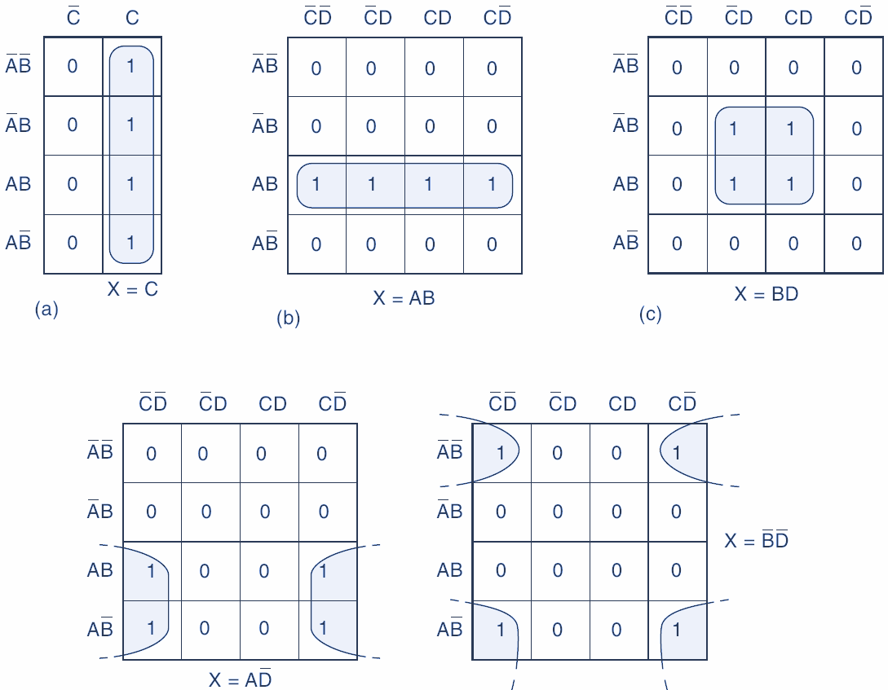

La figura c contiene cuatro 1s en una casilla y se consideran adyacentes entre sí. Los cuatro 1s de la figura d también son adyacentes, al igual que los de la figura e, ya que, como dijimos antes, las filas superior e inferior se consideran como adyacentes entre sí, al igual que las columnas más a la izquierda y más a la derecha.

_Al agrupar un cuádruple de 1s adyacentes se eliminan las dos variables que aparecen tanto en forma complementada como en forma no complementada._

# Agrupamiento de octetos (grupos de ocho)

A un grupo de ocho 1s adyacentes entre sí se le conoce como  _octeto_ . Se muestra varios ejemplos de octetos. Cuando se agrupa un octeto en un mapa de cuatro variables, se eliminan tres de ellas, ya que solo una permanece sin cambios.

Por ejemplo, si examinamos las ocho casillas agrupadas en la figura, podremos ver que solo la variable B se encuentra en la misma forma para las ocho casillas: las demás variables aparecen en su forma complementada y no complementada. En consecuencia, para este mapa X = B.

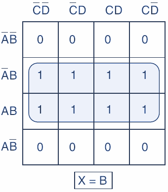

_Al agrupar un octeto de 1s adyacentes se eliminan las tres variables que aparecen tanto en su forma complementada como en su forma no complementada._

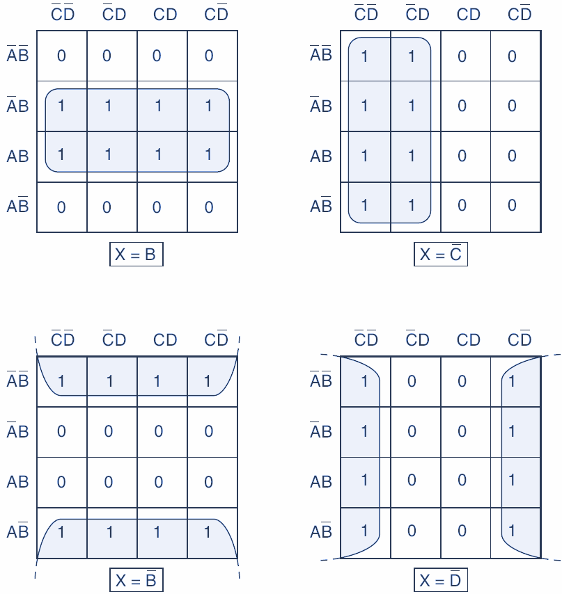

# Proceso completo de simplificación

_Cuando una variable aparece tanto en su forma complementada como no complementada dentro de un grupo, esa variable se elimina de la expresión. Las variables que son iguales para todas las casillas del grupo deben aparecer en la expresión final._

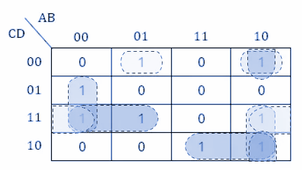

