# Aplicación: Mapa de Karnaugh

Transformar la siguiente suma de productos estándar en un mapa de Karnaugh:

Vamos a agrupar:

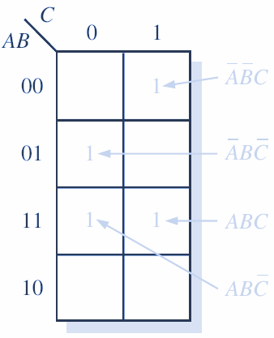

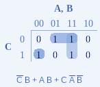

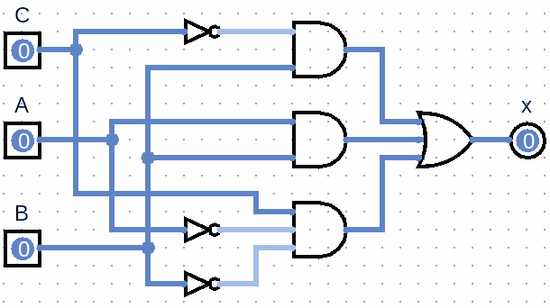

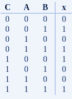

Transformar la siguiente suma de productos estándar en un mapa de Karnaugh:

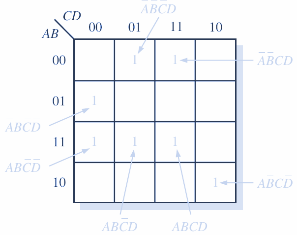

Vamos a agrupar:

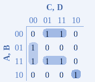

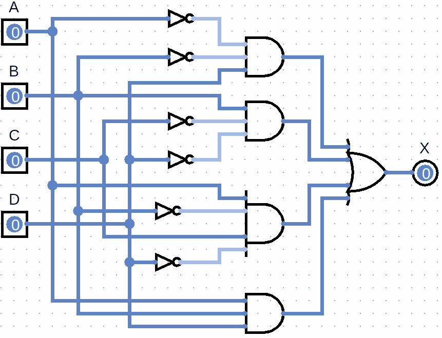

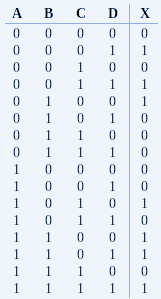

De la tabla de verdad genera tu mapa de Karnaugh, y el circuito digital:

Sacar los 1s

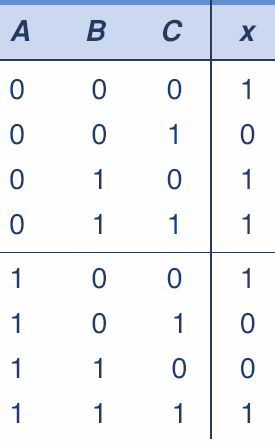

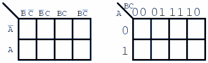

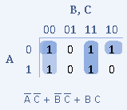

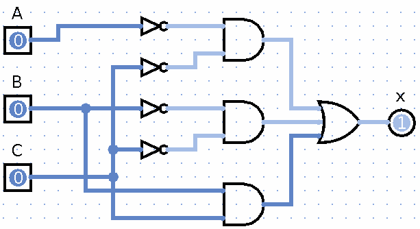

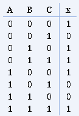

## Control de lámpara

Se desea gobernar una lámpara desde dos interruptores A y B, de forma que cada vez que varíe el estado de uno de ellos, la lámpara cambie de estado. Es decir, que si en un estado de los interruptores la lámpara está encendida, al cambiar A ó B, la lámpara se apague y si estaba apagada se encienda.

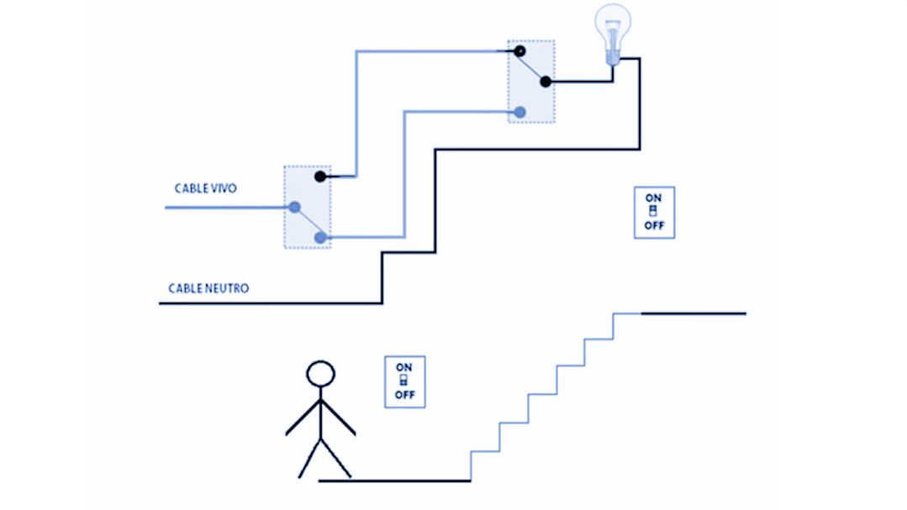

En un principio, si están abiertos los dos interruptores A y B, la lámpara está apagada.

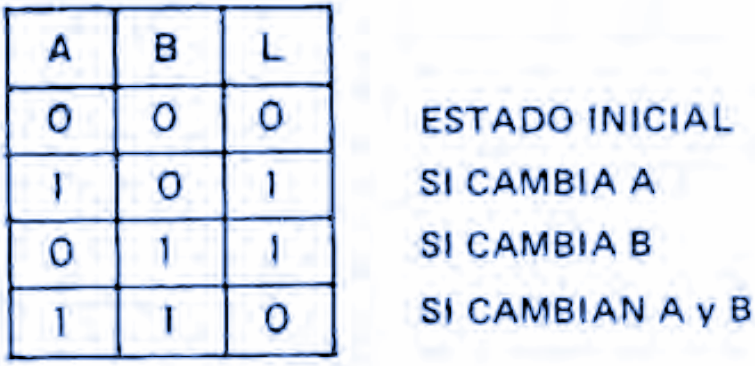

1a fase: Se establece la tabla de verdad, teniendo en cuenta que hay dos variables binarias de entrada, A y B, una salida, que es la lámpara L, y un estado definido por el enunciado, en el que si A = 0 y B = 0, L = 0. A partir de aquí, el cambio de una variable provoca la variación del estado de la lámpara.

Según la tabla de verdad, la lámpara se ilumina solo en dos casos:

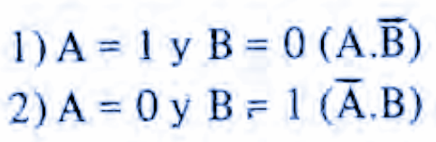

Debemos obtener la ecuación a partir de la tabla

No tiene reducción la ecuación, por lo tanto, así queda.

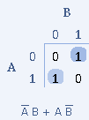

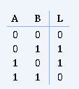

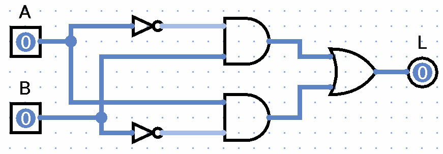

## Control de 2 motores

Se desea controlar dos motores M1 y M2 por medio de los contactos de tres interruptores  _A, B y C_ , de forma que se cumplan las siguientes condiciones:

Si  _A_  está pulsado y los otros dos no, se activa M1

Si  _C_  está pulsado y los otros dos nó, se activa M2

Si los  _tres interruptores_  están cerrados se activan M1 y M2

En las demás condiciones no mencionadas, los dos motores están parados.

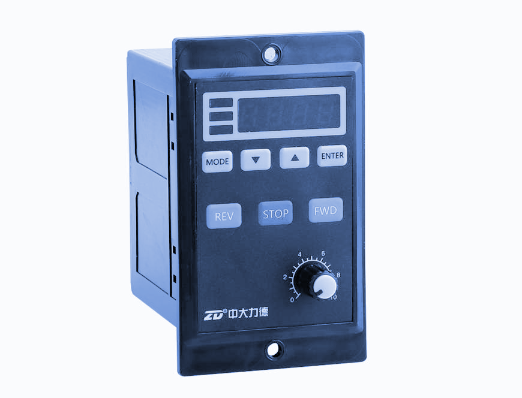

Obteniendo la tabla de verdad para M1 y M2

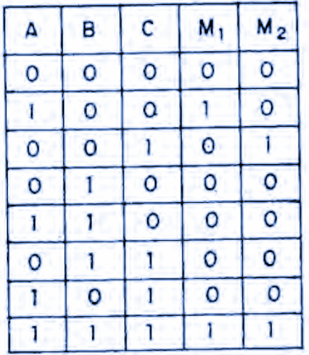

Obtenido la ecuación para M1

Obtenido la ecuación para M2

Generamos la reducción y el circuito

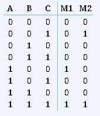

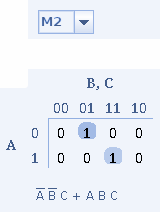

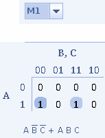

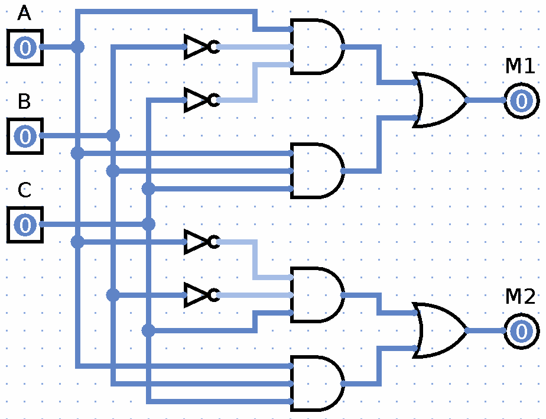
