# Aplicación: Mapa de Karnaugh

## Ejemplo básico 1

Transformar la siguiente suma de productos estándar en un mapa de Karnaugh:

|             Ecuación              |
| :-------------------------------: |
|  |
| 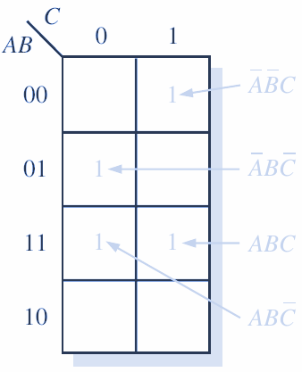 |

### Agrupamineto

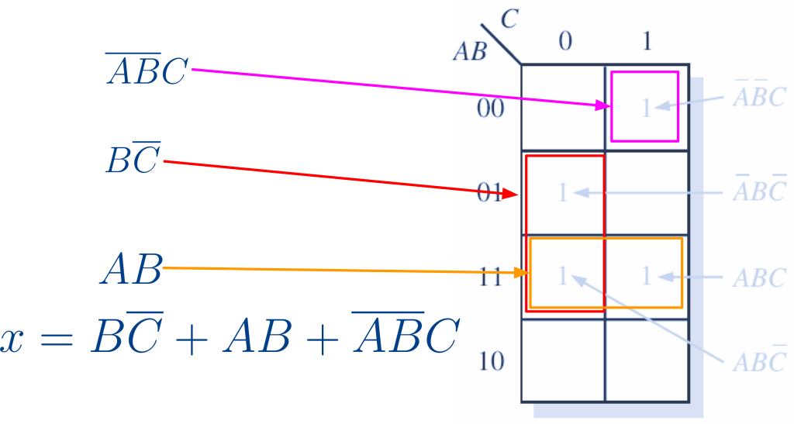

### Circuito

| Tabla de verdad                   | Mapa de Karnaugh                  |
| --------------------------------- | --------------------------------- |
| 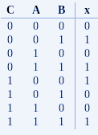 | 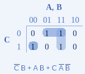 |

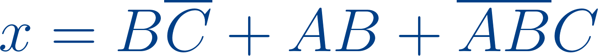

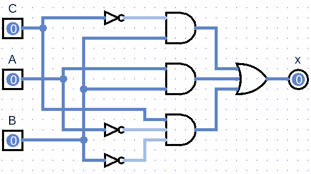

## Ejercicio básico 2

Transformar la siguiente suma de productos estándar en un mapa de Karnaugh:

|                              Ecuación                               |
| :-----------------------------------------------------------------: |
|   |
|                  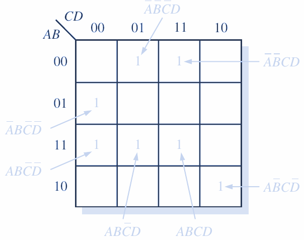                  |

### Agrupamiento

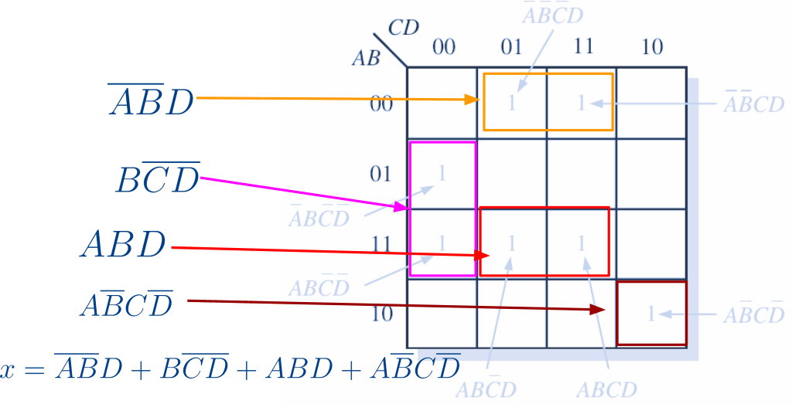

### Circuito

|          Tabla de verdad          |         Mapa de Karnaugh          |
| :-------------------------------: | :-------------------------------: |
| 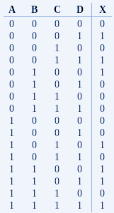 | 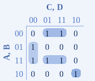 |

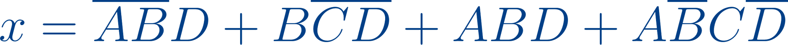

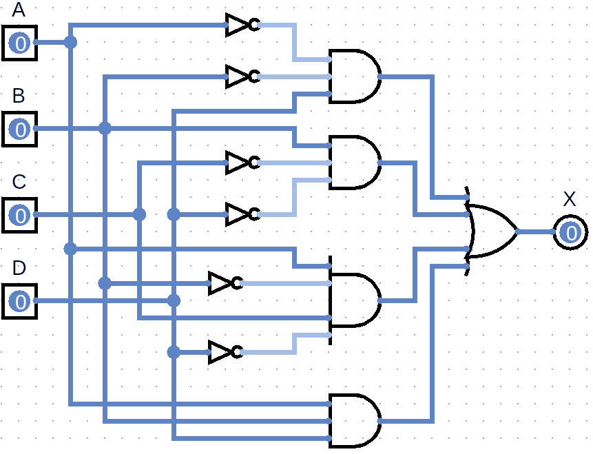

## Ejercicio básico 3

De la tabla de verdad genera tu mapa de Karnaugh, y el circuito digital:

|               Tabla               |             Sacar los 1s             |
| :-------------------------------: | :----------------------------------: |
| 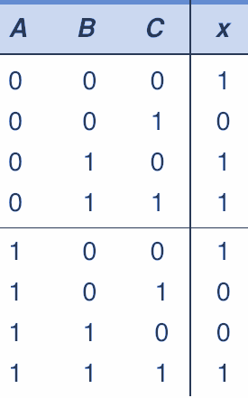 | 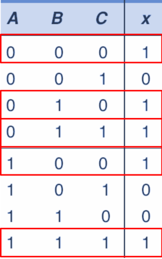 |

### Circuito

|          Tabla de verdad          |         Mapa de Karnaugh          |
| :-------------------------------: | :-------------------------------: |
| 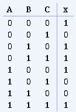 | 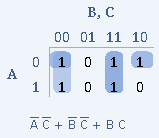 |

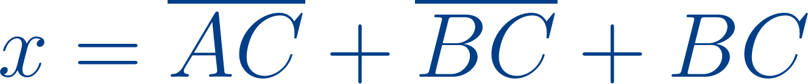

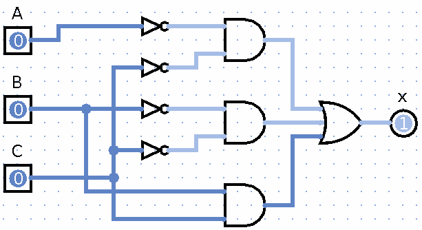

## Control de lámpara

Se desea gobernar una lámpara desde dos interruptores $A$ y $B$, de forma que cada vez que varíe el estado de uno de ellos, la lámpara cambie de estado. Es decir, que si en un estado de los interruptores la lámpara está encendida, al cambiar $A$ ó $B$, la lámpara se apague y si estaba apagada se encienda.

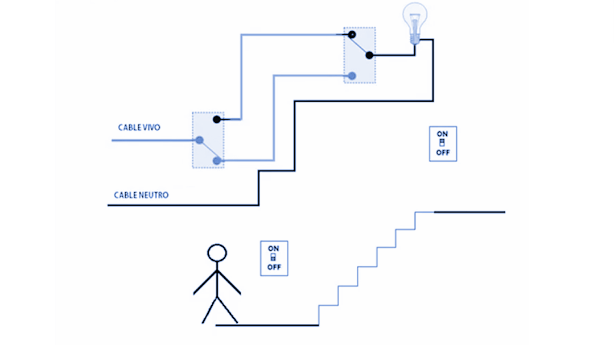

En un principio, si están abiertos los dos interruptores $A$ y $B$, la lámpara está apagada.

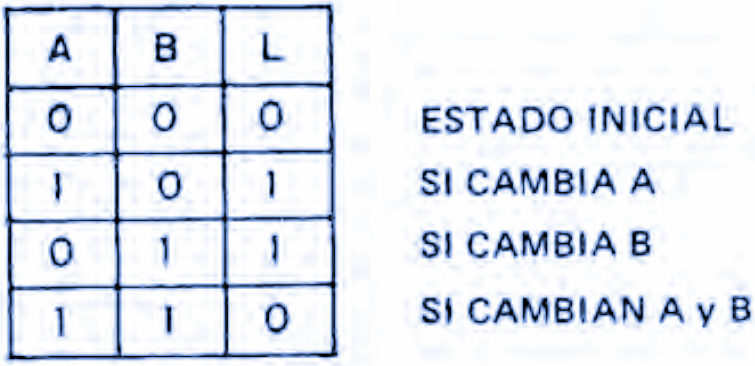

### 1a fase

Se establece la tabla de verdad, teniendo en cuenta que hay dos variables binarias de entrada, $A$ y $B$, una salida, que es la lámpara L, y un estado definido por el enunciado, en el que si $A = 0$ y $B = 0$, $L = 0$. A partir de aquí, el cambio de una variable provoca la variación del estado de la lámpara.

Según la tabla de verdad, la lámpara se ilumina solo en dos casos:

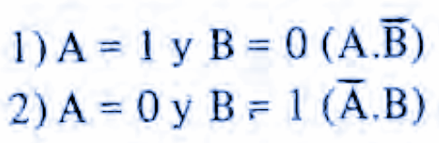

Debemos obtener la ecuación a partir de la tabla

No tiene reducción la ecuación, por lo tanto, así queda.

### Circuito

|          Tabla de verdad          |         Mapa de Karnaugh          |
| :-------------------------------: | :-------------------------------: |
| 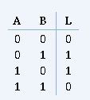 | 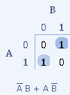 |

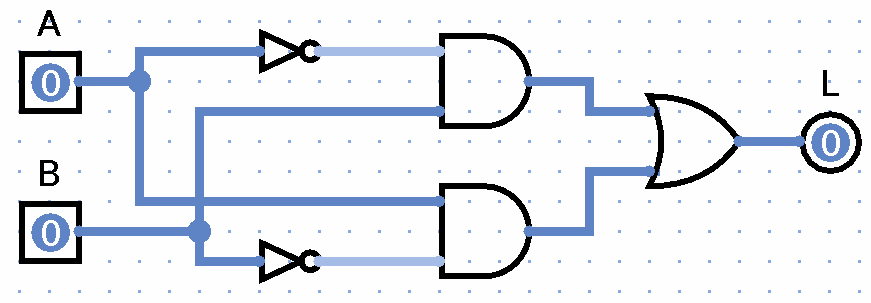

## Control de 2 motores

Se desea controlar dos motores $M1$ y $M2$ por medio de los contactos de tres interruptores  $A$, $B$ y $C$ , de forma que se cumplan las siguientes condiciones:

- Si  $A$  está pulsado y los otros dos no, se activa $M1$
- Si  $C$  está pulsado y los otros dos nó, se activa $M2$
- Si los  _tres interruptores_  están cerrados se activan $M1$ y $M2$
- En las demás condiciones no mencionadas, los dos motores están parados.

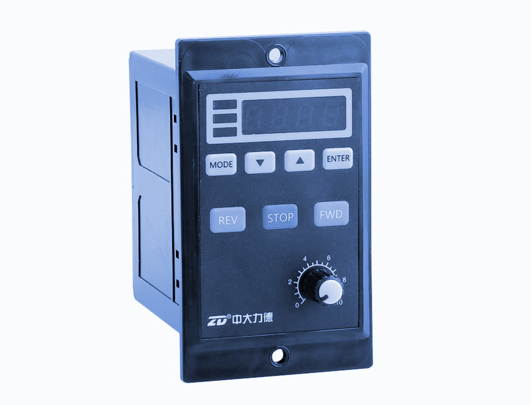

Obteniendo la tabla de verdad para $M1$ y $M2$

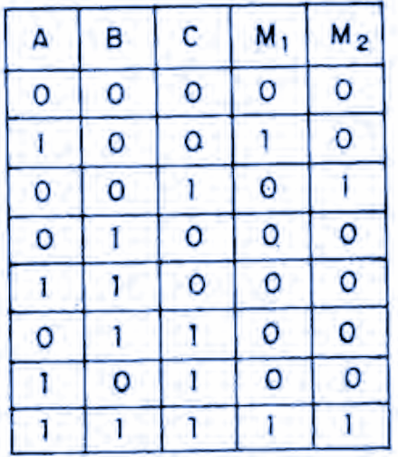

Obtenido la ecuación para $M1$

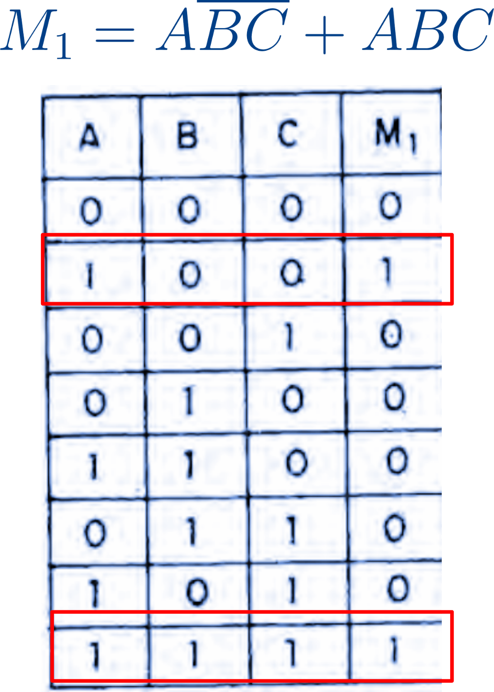

Obtenido la ecuación para $M2$

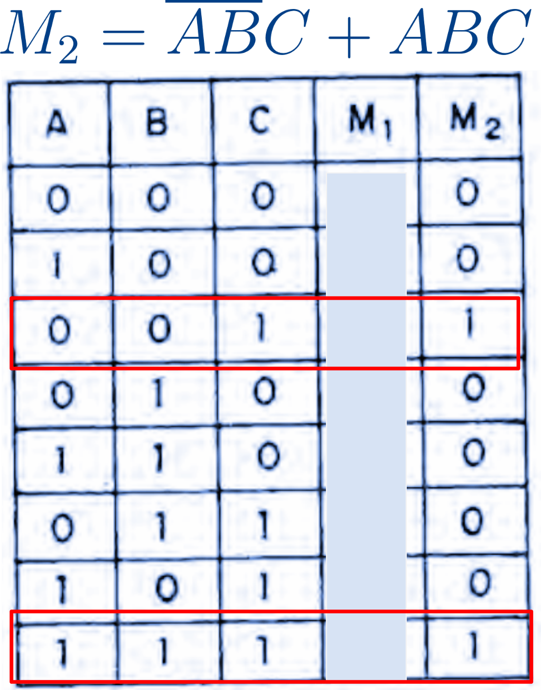

### Circuito

Generamos la reducción y el circuito

|          Tabla de verdad          |         Mapa de Karnaugh          |
| :-------------------------------: | :-------------------------------: |
| 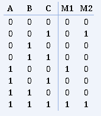 | 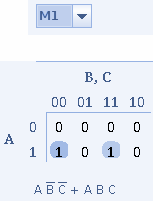 |
|  | 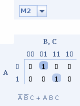 |

---

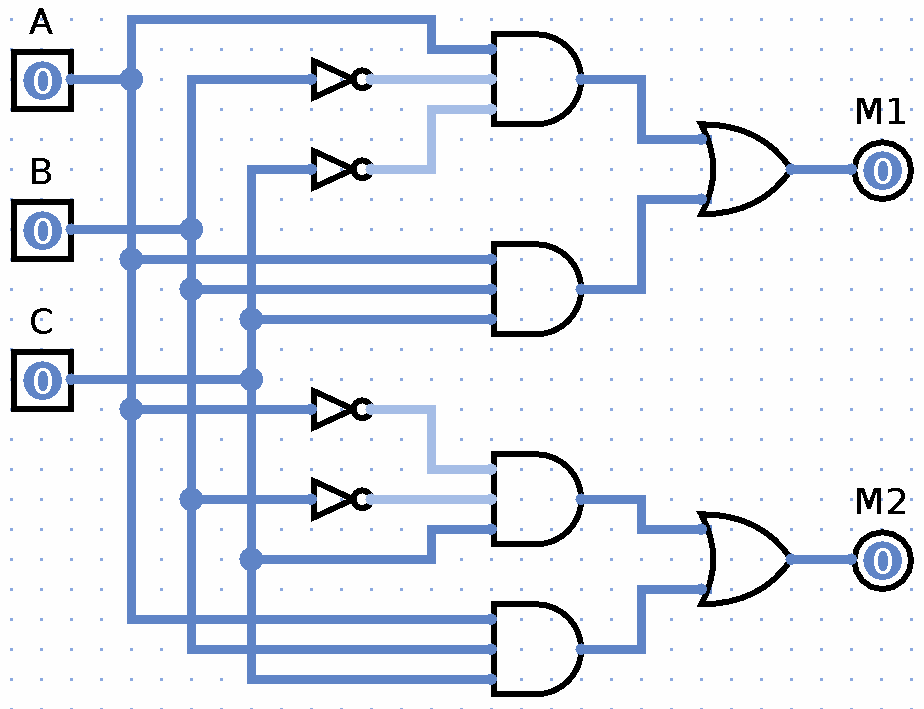

## Contador Hexadecimal

### Display de 7 segmentos

Un display de 7 segmentos es un componente electrónico que se utiliza para representar números del 0 al 9 (y algunas letras de la A a la F en formato hexadecimal) mediante el encendido o apagado de siete diodos LED individuales dispuestos en forma de "8".

#### Tipos

Se tienen 2 tipos de display de segmentos:

- Ánodo Común
- Cátodo Común

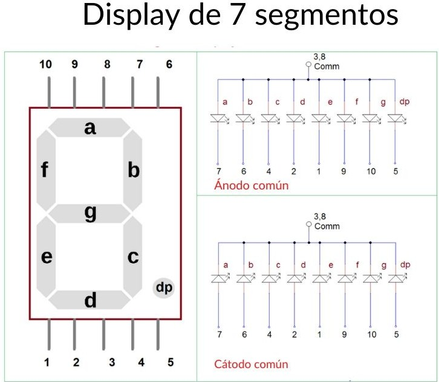

#### Pines

Existen diversos modelos de display de 7 segmentos, pero la comun es la siguiente:

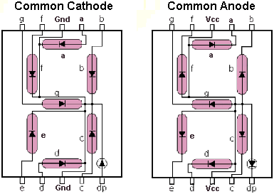

#### Desarrollo

Se realizara el diseño de un contador hexadecimal, que vaya del **0 a la F**. Para esto se tomara de base un display de catodo común, es decir, el negativo es el comun en el display, con la siguiente disposicion de pines:

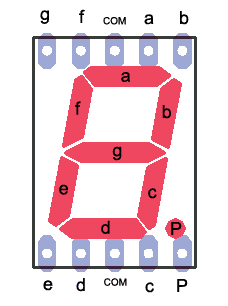

Se debe hacer el control de un display de 7 segmentos. Para mostrar los digitos desde el 0 hasta la F

| Digito |   A   |   B   |   C   |   D   |   a   |   b   |   c   |   d   |   e   |   f   |   g   |
| :----: | :---: | :---: | :---: | :---: | :---: | :---: | :---: | :---: | :---: | :---: | :---: |
| **0**  | **0** | **0** | **0** | **0** |   1   |   1   |   1   |   1   |   1   |   1   |   0   |
| **1**  | **0** | **0** | **0** | **1** |   0   |   1   |   1   |   0   |   0   |   0   |   0   |
| **2**  | **0** | **0** | **1** | **0** |   1   |   1   |   0   |   1   |   1   |   0   |   1   |
| **3**  | **0** | **0** | **1** | **1** |   1   |   1   |   1   |   1   |   0   |   0   |   1   |
| **4**  | **0** | **1** | **0** | **0** |   0   |   1   |   1   |   0   |   0   |   1   |   1   |
| **5**  | **0** | **1** | **0** | **1** |   1   |   0   |   1   |   1   |   0   |   1   |   1   |
| **6**  | **0** | **1** | **1** | **0** |   0   |   0   |   1   |   1   |   1   |   1   |   1   |
| **7**  | **0** | **1** | **1** | **1** |   1   |   1   |   1   |   0   |   0   |   0   |   0   |
| **8**  | **1** | **0** | **0** | **0** |   1   |   1   |   1   |   1   |   1   |   1   |   1   |
| **9**  | **1** | **0** | **0** | **1** |   1   |   1   |   1   |   0   |   0   |   1   |   1   |
| **A**  | **1** | **0** | **1** | **0** |   1   |   1   |   1   |   0   |   1   |   1   |   1   |
| **B**  | **1** | **0** | **1** | **1** |   0   |   0   |   1   |   1   |   1   |   1   |   1   |
| **C**  | **1** | **1** | **0** | **0** |   1   |   0   |   0   |   1   |   1   |   1   |   0   |
| **D**  | **1** | **1** | **0** | **1** |   0   |   1   |   1   |   1   |   1   |   0   |   1   |
| **E**  | **1** | **1** | **1** | **0** |   1   |   0   |   0   |   1   |   1   |   1   |   1   |
| **F**  | **1** | **1** | **1** | **1** |   1   |   0   |   0   |   0   |   1   |   1   |   1   |

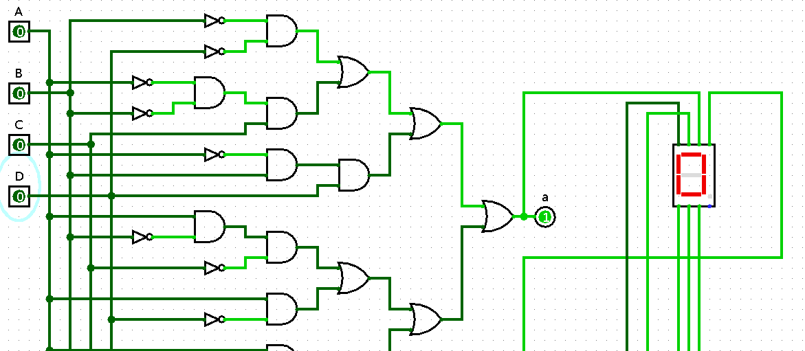

??? Note "Ecuacion RAW"
    - a = ~B ~D + ~A ~B C + ~A B D + A ~B ~C + A ~D + A B C
    - b = ~A ~B + ~A ~C ~D + ~B ~D + ~A C D + A ~C D
    - c = ~A ~C + ~A D + ~C D + ~A B + A ~B
    - d = ~A ~B ~D + ~B C D + B ~C D + B C ~D + A ~C ~D
    - e = ~B ~D + C ~D + A C + A B
    - f = ~C ~D + ~A B ~C + B ~D + A ~B + A C
    - g = ~B C + C ~D + ~A B ~C + A ~B + A D

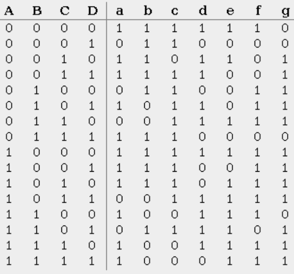

### Circuito

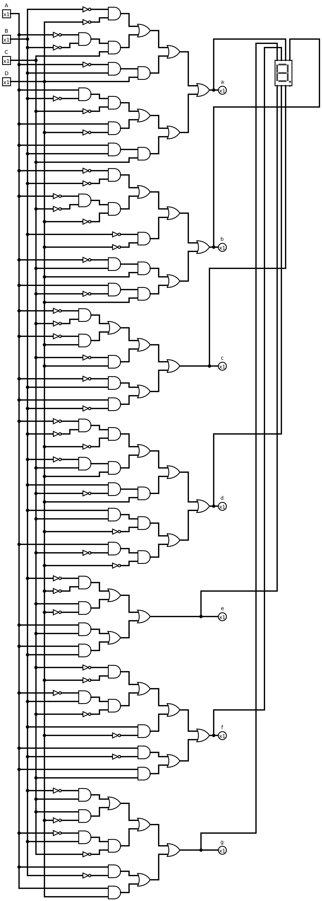

| Eucación                                                                                                                                   |         Mapa de Karnaugh          |
| :----------------------------------------------------------------------------------------------------------------------------------------- | :-------------------------------: |
| $a = \overline{B} \overline{D} + \overline{A} \overline{B} C + \overline{A} B D + A \overline{B} \overline{C} + A \overline{D} + A B C$    | 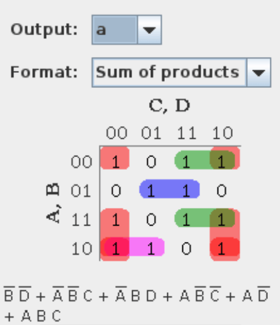 |
| $b = \overline{A} \overline{B} + \overline{A} \overline{C} \overline{D} + \overline{B} \overline{D} + \overline{A} C D + A \overline{C} D$ | 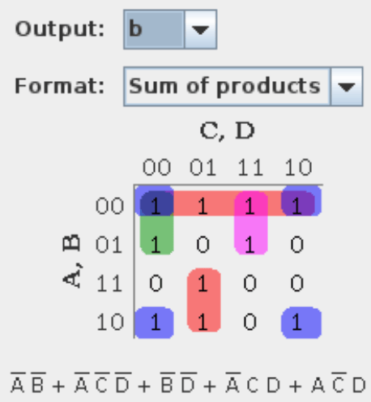 |
| $c = \overline{A} \overline{C} + \overline{A} D + \overline{C} D + \overline{A} B + A \overline{B}$                                        | 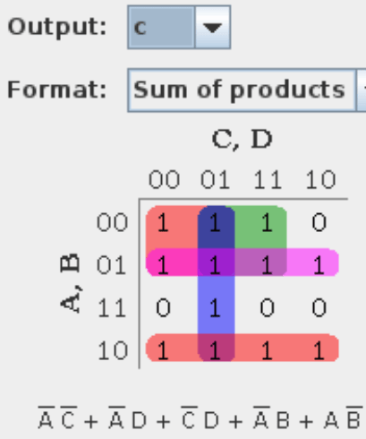 |
| $d = \overline{A} \overline{B} \overline{D} + \overline{B} C D + B \overline{C} D + B C \overline{D} + A \overline{C} \overline{D}$        | 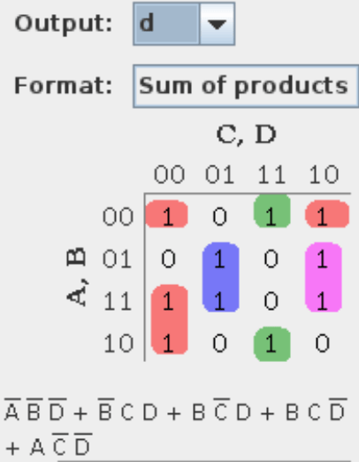 |
| $e = \overline{B} \overline{D} + C \overline{D} + A C + A B$                                                                               | 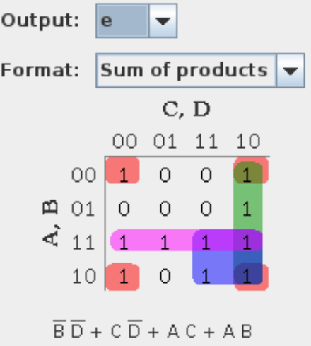 |
| $f = \overline{C} \overline{D} + \overline{A} B \overline{C} + B \overline{D} + A \overline{B} + A C$                                      | 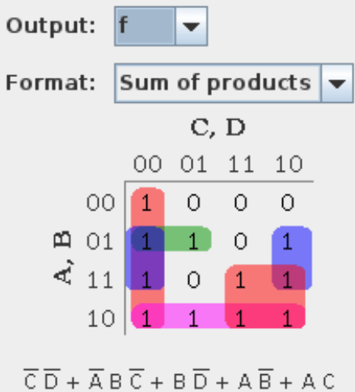 |
| $g = \overline{B} C + C \overline{D} + \overline{A} B \overline{C} + A \overline{B} + A D$                                                 | 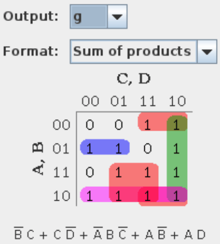 |

[Descargar simulación de Logisim](./assets/circuitos/display_7seg.circ)
