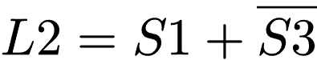
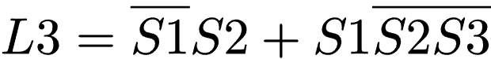

# Aplicaciones

## Estacionamineto

Contamos con estacionamiento de 3 espacios y una pluma de control para el acceso. Cada espacio cuenta con un sensor (*Sx*), por ende, tenemos 3 sensores para detectar si el espacio esta ocupado o no. De igual manera para que el estacionamiento detecte y levante la pluma tiene un sensor para detectar si hay auto enfrente que quiere entrar.

### Descripcion

Reglas para el estacionamiento son:

1. Si hay algun espacio disponible y se detecta auto se debe activar la pluma
2. Si Este lleno el estacionamiento no se podra levantar la pluma aun asi exista auto o no por el sensor.

<table width="100%">
    <tr >
        <td colspan="4" rowspan="1">
            
<strong>L&oacute;gica de sensores</strong>

        </td>
    </tr>
    <tr >
        <td  colspan="1" rowspan="1">
            
<strong>S1 (espacio 1)</strong>

        </td>
        <td  colspan="1" rowspan="1">
            
<strong>S2 (espacio 2)</strong>

        </td>
        <td  colspan="1" rowspan="1">
            
<strong>S3 (espacio 3)</strong>

        </td>
        <td  colspan="1" rowspan="1">
            
<strong>Auto</strong>

        </td>
    </tr>
    <tr >
        <td  colspan="3" rowspan="1">
            
0 = Espacio ocupado

        </td>
        <td  colspan="1" rowspan="1">
            
Auto para ingresar

        </td>
    </tr>
    <tr >
        <td  colspan="3" rowspan="1">
            
1 = Espacio libre

        </td>
        <td  colspan="1" rowspan="1">
            
No hya Auto para ingresar

        </td>
    </tr>
</table>

### Tabla de verdad

| AUTO  |  S1   |  S2   |  S3   | PLUMA | Detalles                                                       |
| :---: | :---: | :---: | :---: | :---: | -------------------------------------------------------------- |
|   0   |   0   |   0   |   0   | **0** | No hay auto, por ende no importa el estado de los autos dentro |
|   0   |   0   |   0   |   1   | **0** | No hay auto, por ende no importa el estado de los autos dentro |
|   0   |   0   |   1   |   0   | **0** | No hay auto, por ende no importa el estado de los autos dentro |
|   0   |   0   |   1   |   1   | **0** | No hay auto, por ende no importa el estado de los autos dentro |
|   0   |   1   |   0   |   0   | **0** | No hay auto, por ende no importa el estado de los autos dentro |
|   0   |   1   |   0   |   1   | **0** | No hay auto, por ende no importa el estado de los autos dentro |
|   0   |   1   |   1   |   0   | **0** | No hay auto, por ende no importa el estado de los autos dentro |
|   0   |   1   |   1   |   1   | **0** | No hay auto, por ende no importa el estado de los autos dentro |
|   1   |   0   |   0   |   0   | **1** | Hay auto esperando y si hay algun espacio                      |
|   1   |   0   |   0   |   1   | **1** | Hay auto esperando y si hay algun espacio                      |
|   1   |   0   |   1   |   0   | **1** | Hay auto esperando y si hay algun espacio                      |
|   1   |   0   |   1   |   1   | **1** | Hay auto esperando y si hay algun espacio                      |
|   1   |   1   |   0   |   0   | **1** | Hay auto esperando y si hay algun espacio                      |
|   1   |   1   |   0   |   1   | **1** | Hay auto esperando y si hay algun espacio                      |
|   1   |   1   |   1   |   0   | **1** | Hay auto esperando y si hay algun espacio                      |
|   1   |   1   |   1   |   1   | **0** | Estacionamiento lleno                                          |

### Circuito lógico combinacional

#### Logisim

| Tabla de verdad                              | Mapa K                                         |
| -------------------------------------------- | ---------------------------------------------- |
|  |  |

??? note "Ecuacion raw"
    AUTO ~S1 + AUTO ~S2 + AUTO ~S3

[Descargar la simulacion](./assets/circuitos/estacionamiento.circ)

## Carrito seguidor de luz

Se desarrollará un carrito que seguirá la luz, con 3 sensores de luz y 2 motores. Es decir, 3 bits de entrada, con 8 posibilidades de trabajo.

### Lógica de sensores y actuadores

<table >
        <tr >
            <td  colspan="1" rowspan="1">
                
<strong >Dispositivo</strong>

            </td>
            <td  colspan="1" rowspan="1">
                
<strong >Detección</strong>

            </td>
            <td  colspan="1" rowspan="1">
                
<strong >Respuesta</strong>

            </td>
        </tr>
        <tr >
            <td  colspan="1" rowspan="2">
                
Sensor

            </td>
            <td  colspan="1" rowspan="1">
                
Detecta luz

            </td>
            <td  colspan="1" rowspan="1">
                
<strong>1</strong>

            </td>
        </tr>
        <tr >
            <td  colspan="1" rowspan="1">
                
NO detecta luz

            </td>
            <td  colspan="1" rowspan="1">
                
<strong>0</strong>

            </td>
        </tr>
        <tr >
            <td  colspan="1" rowspan="2">
                
Motor

            </td>
            <td  colspan="1" rowspan="1">
                
Avanzar

            </td>
            <td  colspan="1" rowspan="1">
                
<strong>1</strong>

            </td>
        </tr>
        <tr >
            <td  colspan="1" rowspan="1">
                
Detenerse

            </td>
            <td  colspan="1" rowspan="1">
                
<strong>0</strong>

            </td>
        </tr>
    </table>

### Filosofía de operación

Tenemos 3 sensores de luz, los cuales captan la luz que se encuentra enfrente, contando con un sensor de lado izquierdo (S1), para detectar la luz en ese lado, la luz de frente (S2) y el sensor de la derecha (S3), para el control de 2 motores; un motor para giro a la derecha (motor izquierdo, M1) y para que gire a la izquierda (motor derecho, M2). Contando con una luz indicadora que nos indica si los sensores fallan, dado que esa combinación no es posible.

* Si ningún sensor detecta luz, el carrito se debe detener completamente y encender luz de error (E).
* Si solo el sensor derecho (S3) debe arrancar el motor izquierdo (M1).
* Si solo el sensor izquierdo (S1) debe arrancar el motor izquierdo (M2).
* Si el sensor izquierdo, derecho y central debe arrancar ambos motores.
* Si el sensor izquierdo y central detectan luz, se arranca el motor derecho, para que el carro se desplace a la izquierda.
* Si el sensor derecho y central detectan luz, se arranca el motor izquierdo, para que el carro se desplace a la derecha.
* Código de error: Esta luz se enciende si el S1 y S3 detectan luz, pero S2 no detecta luz. Esta situación es incongruente, dado que no podría existir luz solo de los lados y al centro no. Por ende, encendemos la luz piloto (E) y haremos que avance hacia enfrente (*si quieres cambiar esto, eres libre*).

### Tabla de verdad

|       Sensores       |                    |                    |     Actuadores      |                   |                  |
| :------------------: | :----------------: | :----------------: | :-----------------: | :---------------: | :--------------: |
| **Sensor izquierdo** | **Sensor central** | **Sensor derecho** | **Motor izquierdo** | **Motor derecho** | **Código error** |
|        **S1**        |       **S2**       |       **S3**       |       **M1**        |      **M2**       |      **E**       |
|        **0**         |       **0**        |       **0**        |          0          |         0         |        1         |
|        **0**         |       **0**        |       **1**        |          1          |         0         |        0         |
|        **0**         |       **1**        |       **0**        |          1          |         1         |        0         |
|        **0**         |       **1**        |       **1**        |          1          |         0         |        0         |
|        **1**         |       **0**        |       **0**        |          0          |         1         |        0         |
|        **1**         |       **0**        |       **1**        |          1          |         1         |      **1**       |
|        **1**         |       **1**        |       **0**        |          0          |         1         |        0         |
|        **1**         |       **1**        |       **1**        |          1          |         1         |        0         |

### Vista del carrito

### Diagrama de control (lógica combinacional)

pendiente...

### Diagrama esquemático

pendiente...

### Infografia de referencia

## Contador Hexadecimal

pendiente...

## Control de luces inteligentes

### Descripción

Se tienen 3 sensores de luz digitales. Cada sensor indica un estado, los cuales se describen a continuación:

* **Solo** si el sensor de noche (S1) se debe encender todas las luces.
* **Solo** si el sensor de luz media (S2) se debe encender 2 luces, que serán L1 y L3.
* **Solo** si el sensor de luz (S3) se debe apagar todas las luces.
* Combinado el sensor S2 y S3, indicarían una luz del aproximadamente 75%, es decir, solo se encenderá L3.
* Si tenemos una luz baja, es decir, oscuridad al 75% aproximadamente, se van a encender luces L1 y L2.
* Cuando se activen los sensores de manera no posible, es decir, no puede marcar que es noche y que hay 100% de luz, se enciende una lámpara que sería un código de error; se **encenderá solamente L1**. **Código de Error**.

<table >
    <tr >
        <td  colspan="6" rowspan="1">
            
<strong>Lógica de sensores</strong> 

        </td>
    </tr>
    <tr >
        <td  colspan="2" rowspan="1">
            
<strong >S1 (indica noche)</strong>

        </td>
        <td  colspan="2" rowspan="1">
            
<strong >S2 (indica luz al 50%)</strong>

        </td>
        <td  colspan="2" rowspan="1">
            
<strong >S3 (indica que 100% luz)</strong>

        </td>
    </tr>
    <tr >
        <td  colspan="1" rowspan="1">
            
0 (No es de noche)

        </td>
        <td  colspan="1" rowspan="1">
            
1 (Es noche)

        </td>
        <td  colspan="1" rowspan="1">
            
0 (No est&aacute; luz al 50%)

        </td>
        <td  colspan="1" rowspan="1">
            
1 (La luz est&aacute; al 50%)

        </td>
        <td  colspan="1" rowspan="1">
            
0 (Indica que no est&aacute; al 100% la luz)

        </td>
        <td  colspan="1" rowspan="1">
            
1 (Hay luz al 100%)

        </td>
    </tr>
</table>

### Tabla de verdad

| S1 (noche) | S2 (50% luz) | S3 (100% luz) |  L1   |  L2   |  L3   |        Descripción         |
| :--------: | :----------: | :-----------: | :---: | :---: | :---: | :------------------------: |
|   **0**    |    **0**     |     **0**     |   1   |   0   |   0   |         No posible         |
|   **0**    |    **0**     |     **1**     |   0   |   0   |   0   |          100% luz          |
|   **0**    |    **1**     |     **0**     |   1   |   0   |   1   |         Luz al 50%         |
|   **0**    |    **1**     |     **1**     |   0   |   0   |   1   | Luz entre 50% y 100% (75%) |
|   **1**    |    **0**     |     **0**     |   1   |   1   |   1   |           Noche            |
|   **1**    |    **0**     |     **1**     |   1   |   0   |   0   |         No posible         |
|   **1**    |    **1**     |     **0**     |   1   |   1   |   0   | Luz al 25% u Oscuridad 75% |
|   **1**    |    **1**     |     **1**     |   1   |   0   |   0   |         No posible         |

### Ecuaciones booleanas

$$L1 = \overline{S3} + S1$$
$$L2 = S1 \overline{S3}$$
$$L3 = \overline{S1} S2 + S1 \overline{S2 S3}$$

### Mapas de Karnaugh

|                      Mapa de Karnugh                      |                       Ecuación                       |
| :-------------------------------------------------------: | :--------------------------------------------------: |
|                          **L1**                           |                        **L1**                        |
|  |  |
|                          **L2**                           |                        **L2**                        |
|  |  |
|                          **L3**                           |                        **L3**                        |
|  |  |

### Circuito lógico combinacional

#### Logisim

[Descargar simulacion](./assets/circuitos/contro_luces_inteligentes.circ)

### Diagrama esquemático

pendiente...

---

## Aplasta latas (Electroneumatica)

Se tiene un circuito electroneumatico el cual se debe automatizar aplicando logica combinacional. Se debe controlar un cilindor de doble efecto controlado con una electrovalvula biestable. Se cuenta con 2 botones los cuales se deben accionar al mismo tiempo por seguridad del operador y el cilindro tiene 2 sensores Reed para conocer la posicion del embolo.

### Desarrollo

- Si ambos sensores Reed se activan debe haber un indicador de error.
- Si no se presionan los botones se debe activar **Y2** y apagar **Y1**, para asegurar que el vastago no salga.
- Si **S1**, **S2** y **1B1** estan activados sale el vastago, es decir, se activa **Y1** y se desenergeza **Y2**.
- Si se estan presionando **S1** y **S2** y **1B2** detecta el vastago regresa.
- Si existe alguna condicion que no se considera o se describe se debe regresar el vastago, es decir, se debe mantener activo **Y2**.

### Tabla de verdad

|  S1   |  S2   |  1B1  |  1B2  |  Y1   |  Y2   | FALLA |
| :---: | :---: | :---: | :---: | :---: | :---: | :---: |
|   0   |   0   |   0   |   0   | **0** | **1** | **0** |
|   0   |   0   |   0   |   1   | **0** | **1** | **1** |
|   0   |   0   |   1   |   0   | **0** | **1** | **0** |
|   0   |   0   |   1   |   1   | **0** | **1** | **1** |
|   0   |   1   |   0   |   0   | **0** | **1** | **0** |
|   0   |   1   |   0   |   1   | **x** | **1** | **0** |
|   0   |   1   |   1   |   0   | **0** | **1** | **0** |
|   0   |   1   |   1   |   1   | **0** | **1** | **1** |
|   1   |   0   |   0   |   0   | **0** | **1** | **0** |
|   1   |   0   |   0   |   1   | **0** | **1** | **0** |
|   1   |   0   |   1   |   0   | **0** | **1** | **0** |
|   1   |   0   |   1   |   1   | **0** | **1** | **1** |
|   1   |   1   |   0   |   0   | **0** | **1** | **1** |
|   1   |   1   |   0   |   1   | **0** | **1** | **0** |
|   1   |   1   |   1   |   0   | **1** | **0** | **0** |
|   1   |   1   |   1   |   1   | **0** | **0** | **1** |

> *Nota: Revisarla porque puede ser que se me haya pasado algo*

### Circuito lógico combinacional

#### Logisim

|                Tabla de verdad                |
| :-------------------------------------------: |
|  |

 | Variable  | Mapa K                                              |
 | :-------: | --------------------------------------------------- |
 |  **Y1**   |     |
 |  **Y2**   |     |
 | **ERROR** |  |

- [Descargar simulacion logisim](./assets/circuitos/electroneumatica_1.circ)
- [Descargar simulacion fluidsim](./assets/circuitos/electroneumatico_1_fluidsim.ct)

??? note "Expresion RAW"
    Y1 = S1 S2 B1 ~B2
    Y2 = ~S1 + ~S2 + ~B1
    ERROR = ~S1 ~S2 B2 + B1 B2 + S1 S2 ~B1 ~B2

## Cepilladora

### Desarrollo

### Circuito Ladder

### Simulacion (SimulIDE)

- [Descargar simulacion](./assets/circuitos/cepilladora.sim1)

- [Ver video](./assets/videos/cepilladora.mp4)
