# Aplicaciones

## Estacionamineto

Contamos con estacionamiento de 3 espacios y una pluma de control para el acceso. Cada espacio cuenta con un sensor (*Sx*), por ende, tenemos 3 sensores para detectar si el espacio esta ocupado o no. De igual manera para que el estacionamiento detecte y levante la pluma tiene un sensor para detectar si hay auto enfrente que quiere entrar.

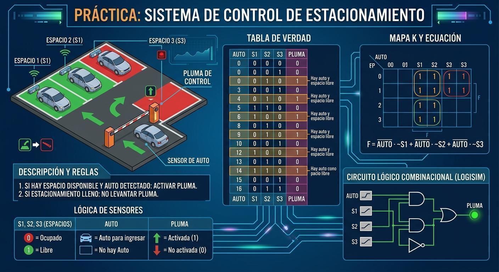

> *Infografía representativa*

### Descripcion

Reglas para el estacionamiento son:

1. Si hay algun espacio disponible y se detecta auto se debe activar la pluma
2. Si Este lleno el estacionamiento no se podra levantar la pluma aun asi exista auto o no por el sensor.

<table width="100%">
    <tr >
        <td colspan="4" rowspan="1">
            
<strong>L&oacute;gica de sensores</strong>

        </td>
    </tr>
    <tr >
        <td  colspan="1" rowspan="1">
            
<strong>S1 (espacio 1)</strong>

        </td>
        <td  colspan="1" rowspan="1">
            
<strong>S2 (espacio 2)</strong>

        </td>
        <td  colspan="1" rowspan="1">
            
<strong>S3 (espacio 3)</strong>

        </td>
        <td  colspan="1" rowspan="1">
            
<strong>Auto</strong>

        </td>
    </tr>
    <tr >
        <td  colspan="3" rowspan="1">
            
0 = Espacio ocupado

        </td>
        <td  colspan="1" rowspan="1">
            
Auto para ingresar

        </td>
    </tr>
    <tr >
        <td  colspan="3" rowspan="1">
            
1 = Espacio libre

        </td>
        <td  colspan="1" rowspan="1">
            
No hya Auto para ingresar

        </td>
    </tr>
</table>

### Tabla de verdad

| AUTO  |  S1   |  S2   |  S3   | PLUMA | Detalles                                                       |
| :---: | :---: | :---: | :---: | :---: | -------------------------------------------------------------- |
|   0   |   0   |   0   |   0   | **0** | No hay auto, por ende no importa el estado de los autos dentro |
|   0   |   0   |   0   |   1   | **0** | No hay auto, por ende no importa el estado de los autos dentro |
|   0   |   0   |   1   |   0   | **0** | No hay auto, por ende no importa el estado de los autos dentro |
|   0   |   0   |   1   |   1   | **0** | No hay auto, por ende no importa el estado de los autos dentro |
|   0   |   1   |   0   |   0   | **0** | No hay auto, por ende no importa el estado de los autos dentro |
|   0   |   1   |   0   |   1   | **0** | No hay auto, por ende no importa el estado de los autos dentro |
|   0   |   1   |   1   |   0   | **0** | No hay auto, por ende no importa el estado de los autos dentro |
|   0   |   1   |   1   |   1   | **0** | No hay auto, por ende no importa el estado de los autos dentro |
|   1   |   0   |   0   |   0   | **1** | Hay auto esperando y si hay algun espacio                      |
|   1   |   0   |   0   |   1   | **1** | Hay auto esperando y si hay algun espacio                      |
|   1   |   0   |   1   |   0   | **1** | Hay auto esperando y si hay algun espacio                      |
|   1   |   0   |   1   |   1   | **1** | Hay auto esperando y si hay algun espacio                      |
|   1   |   1   |   0   |   0   | **1** | Hay auto esperando y si hay algun espacio                      |
|   1   |   1   |   0   |   1   | **1** | Hay auto esperando y si hay algun espacio                      |
|   1   |   1   |   1   |   0   | **1** | Hay auto esperando y si hay algun espacio                      |
|   1   |   1   |   1   |   1   | **0** | Estacionamiento lleno                                          |

### Circuito lógico combinacional

#### Logisim

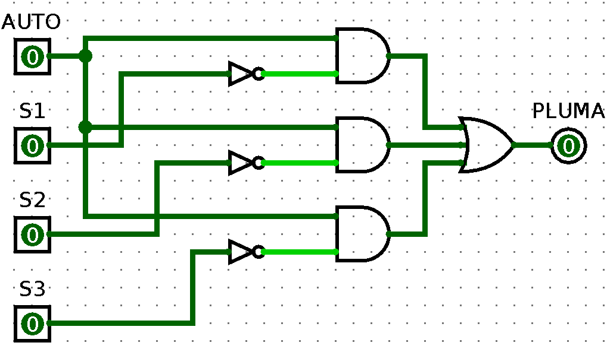

### Tabla de verdad y Mapa de Karnaugh

| Tabla de verdad                              | Mapa K                                         |
| -------------------------------------------- | ---------------------------------------------- |
| 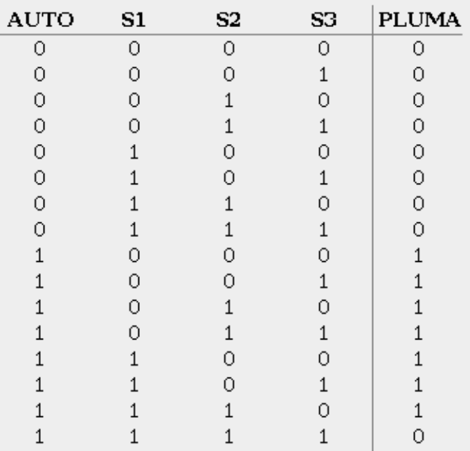 | 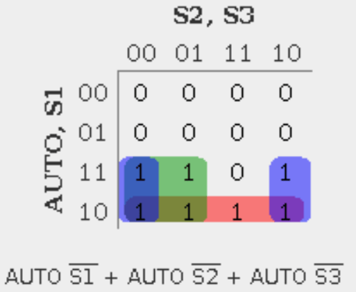 |

??? note "Ecuacion raw"
    - PLUMA = AUTO ~S1 + AUTO ~S2 + AUTO ~S3

[Descargar la simulación de Logisim](./assets/circuitos/estacionamiento.circ)

## Carrito seguidor de luz

Se diseñará e implementará un vehículo robótico móvil capaz de orientarse y desplazarse en dirección a una fuente luminosa mediante un sistema de control digital combinatorial.

El sistema utiliza 3 sensores de luz (LDRs) alineados en la parte frontal como entradas digitales (3 bits de entrada, generando $2^3 = 8$ combinaciones posibles) y 2 motores independientes como actuadores para maniobrar la dirección del vehículo, además de un indicador visual de fallo.

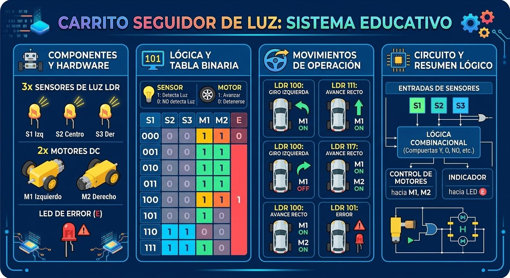

### Lógica de sensores y actuadores

<table >
        <tr >
            <td  colspan="1" rowspan="1">
                
<strong >Dispositivo</strong>

            </td>
            <td  colspan="1" rowspan="1">
                
<strong >Detección</strong>

            </td>
            <td  colspan="1" rowspan="1">
                
<strong >Respuesta</strong>

            </td>
        </tr>
        <tr >
            <td  colspan="1" rowspan="2">
                
Sensor

            </td>
            <td  colspan="1" rowspan="1">
                
Detecta luz

            </td>
            <td  colspan="1" rowspan="1">
                
<strong>1</strong>

            </td>
        </tr>
        <tr >
            <td  colspan="1" rowspan="1">
                
NO detecta luz

            </td>
            <td  colspan="1" rowspan="1">
                
<strong>0</strong>

            </td>
        </tr>
        <tr >
            <td  colspan="1" rowspan="2">
                
Motor

            </td>
            <td  colspan="1" rowspan="1">
                
Avanzar

            </td>
            <td  colspan="1" rowspan="1">
                
<strong>1</strong>

            </td>
        </tr>
        <tr >
            <td  colspan="1" rowspan="1">
                
Detenerse

            </td>
            <td  colspan="1" rowspan="1">
                
<strong>0</strong>

            </td>
        </tr>
    </table>

### Descripción

Tenemos 3 sensores de luz, los cuales captan la luz que se encuentra enfrente, contando con un sensor de lado izquierdo (S1), para detectar la luz en ese lado, la luz de frente (S2) y el sensor de la derecha (S3), para el control de 2 motores; un motor para giro a la derecha (motor izquierdo, M1) y para que gire a la izquierda (motor derecho, M2). Contando con una luz indicadora que nos indica si los sensores fallan, dado que esa combinación no es posible.

* Si ningún sensor detecta luz, el carrito se debe detener completamente y encender luz de error (E).
* Si solo el sensor derecho (S3) debe arrancar el motor izquierdo (M1).
* Si solo el sensor izquierdo (S1) debe arrancar el motor izquierdo (M2).
* Si el sensor izquierdo, derecho y central debe arrancar ambos motores.
* Si el sensor izquierdo y central detectan luz, se arranca el motor derecho, para que el carro se desplace a la izquierda.
* Si el sensor derecho y central detectan luz, se arranca el motor izquierdo, para que el carro se desplace a la derecha.
* Código de error: Esta luz se enciende si el S1 y S3 detectan luz, pero S2 no detecta luz. Esta situación es incongruente, dado que no podría existir luz solo de los lados y al centro no. Por ende, encendemos la luz piloto (E) y haremos que avance hacia enfrente (*si quieres cambiar esto, eres libre*).

### Tabla de verdad

|       Sensores       |                    |                    |     Actuadores      |                   |                  |
| :------------------: | :----------------: | :----------------: | :-----------------: | :---------------: | :--------------: |
| **Sensor izquierdo** | **Sensor central** | **Sensor derecho** | **Motor izquierdo** | **Motor derecho** | **Código error** |
|        **S1**        |       **S2**       |       **S3**       |       **M1**        |      **M2**       |      **E**       |
|        **0**         |       **0**        |       **0**        |          0          |         0         |      **1**       |
|        **0**         |       **0**        |       **1**        |          1          |         0         |        0         |
|        **0**         |       **1**        |       **0**        |          1          |         1         |        0         |
|        **0**         |       **1**        |       **1**        |          1          |         0         |        0         |
|        **1**         |       **0**        |       **0**        |          0          |         1         |        0         |
|        **1**         |       **0**        |       **1**        |          1          |         1         |      **1**       |
|        **1**         |       **1**        |       **0**        |          0          |         1         |        0         |
|        **1**         |       **1**        |       **1**        |          1          |         1         |        0         |

### Vista del carrito

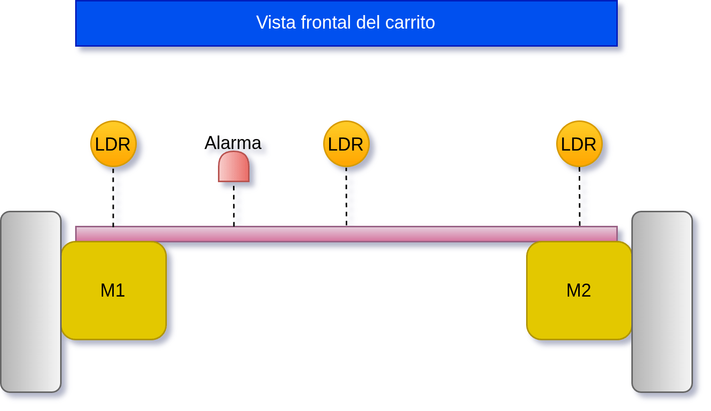

### Diagrama de control (lógica combinacional)

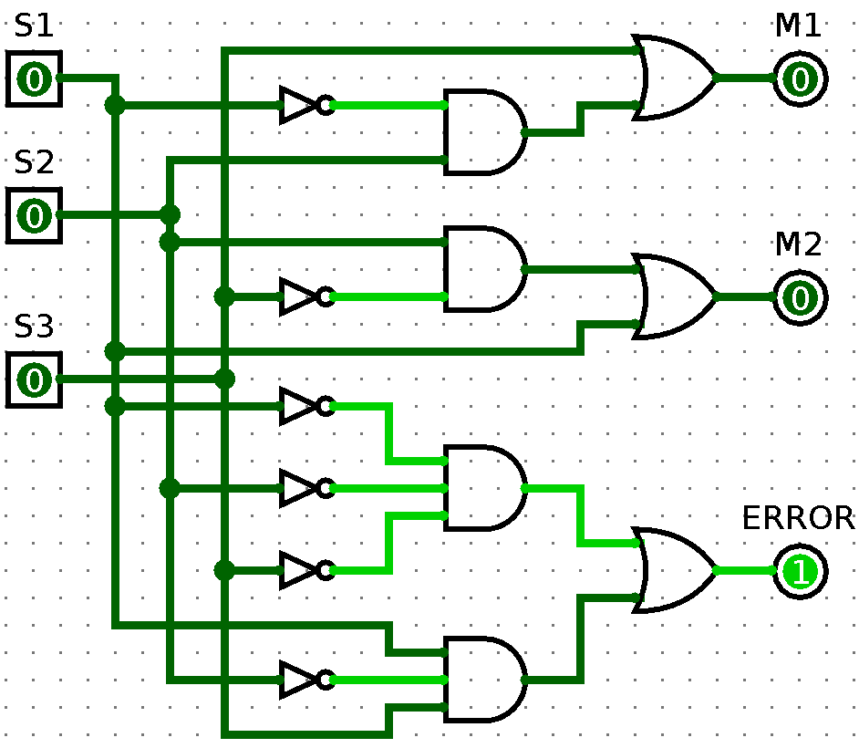

[Descargar la simulación](assets/circuitos/carrito_seguidor_luz.circ)

### Tabla de verdad y Mapa de Karnaugh

| Tabla de verdad                                   |
| ------------------------------------------------- |
| 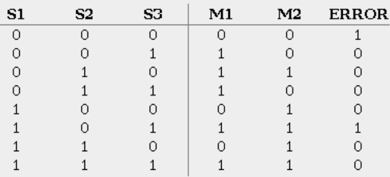 |

|             Ecuación             |                       Mapa K                        |
| :------------------------------: | :-------------------------------------------------: |
|        $M1= S3 + ~S1 S2$         |  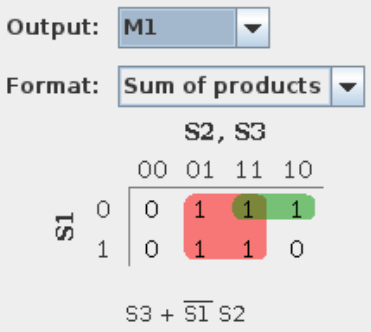   |
|        $M2= S2 ~S3 + S1$         |  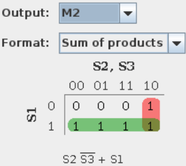   |
| $ERROR= ~S1 ~S2 ~S3 + S1 ~S2 S3$ | 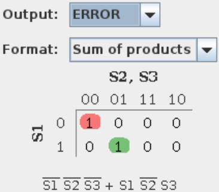 |

??? Note "Ecuaciones Raw"
    - M1= S3 + ~S1 S2

    - M2= S2 ~S3 + S1

    - ERROR= ~S1 ~S2 ~S3 + S1 ~S2 S3

### Diagrama esquemático

    pendiente...

## Contador Hexadecimal

pendiente...

## Control de luces inteligentes

### Descripción

Se diseñará un sistema de iluminación inteligente automatizado mediante lógica combinacional, utilizando 3 sensores de luz digitales como entradas ($S1$, $S2$, $S3$) y 3 lámparas como salidas ($L1$, $L2$, $L3$).

* **Solo** si el sensor de noche (S1) se debe encender todas las luces.
* **Solo** si el sensor de luz media (S2) se debe encender 2 luces, que serán L1 y L3.
* **Solo** si el sensor de luz (S3) se debe apagar todas las luces.
* Combinado el sensor S2 y S3, indicarían una luz del aproximadamente 75%, es decir, solo se encenderá L3.
* Si tenemos una luz baja, es decir, oscuridad al 75% aproximadamente, se van a encender luces L1 y L2.
* Cuando se activen los sensores de manera no posible, es decir, no puede marcar que es noche y que hay 100% de luz, se enciende una lámpara que sería un código de error; se **encenderá solamente L1**. **Código de Error**.

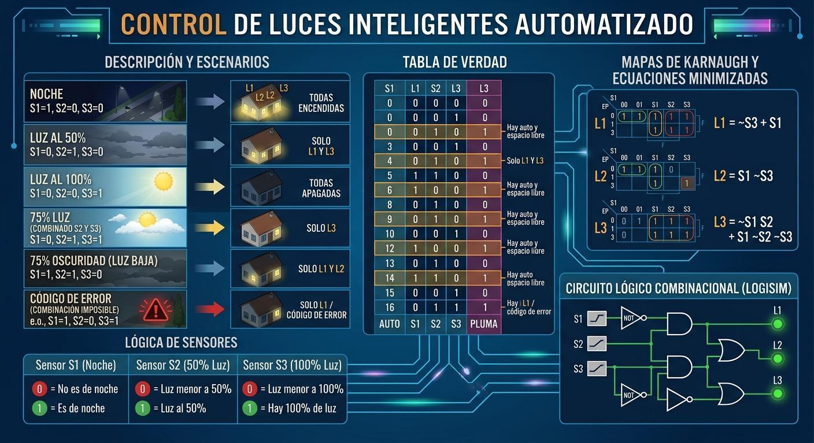

### Lógica de sensores

| Sensor | Condición Detectada | Estado Digital = 0 | Estado Digital = 1 |
| ------ | ------------------- | ------------------ | ------------------ |
| **S1** | Noche               | No es de noche     | Es de noche        |
| **S2** | Luz al 50%          | Luz menor a 50%    | Luz al 50%         |
| **S3** | Luz al 100%         | Luz menor a 100%   | Hay 100% de luz    |

### Tabla de verdad

| S1 (noche) | S2 (50% luz) | S3 (100% luz) |  L1   |  L2   |  L3   |        Descripción         |
| :--------: | :----------: | :-----------: | :---: | :---: | :---: | :------------------------: |
|   **0**    |    **0**     |     **0**     |   1   |   0   |   0   |         No posible         |
|   **0**    |    **0**     |     **1**     |   0   |   0   |   0   |          100% luz          |
|   **0**    |    **1**     |     **0**     |   1   |   0   |   1   |         Luz al 50%         |
|   **0**    |    **1**     |     **1**     |   0   |   0   |   1   | Luz entre 50% y 100% (75%) |
|   **1**    |    **0**     |     **0**     |   1   |   1   |   1   |           Noche            |
|   **1**    |    **0**     |     **1**     |   1   |   0   |   0   |         No posible         |
|   **1**    |    **1**     |     **0**     |   1   |   1   |   0   | Luz al 25% u Oscuridad 75% |
|   **1**    |    **1**     |     **1**     |   1   |   0   |   0   |         No posible         |

### Mapas de Karnaugh

|                   Ecuación                    |                      Mapa de Karnugh                      |
| :-------------------------------------------: | :-------------------------------------------------------: |
|           $L1 = \overline{S3} + S1$           | 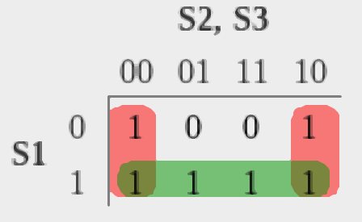 |
|            $L2 = S1 \overline{S3}$            | 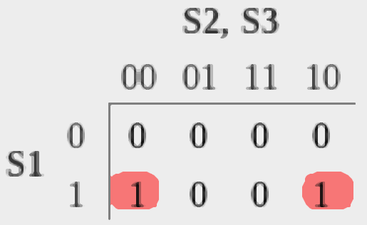 |
| $L3 = \overline{S1} S2 + S1 \overline{S2 S3}$ | 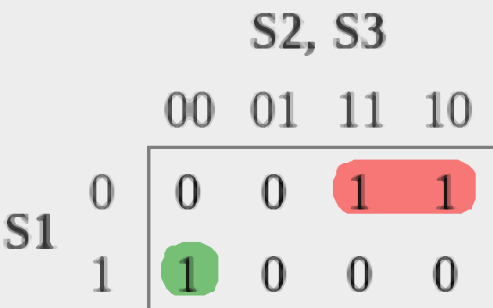 |

### Circuito lógico combinacional

#### Logisim

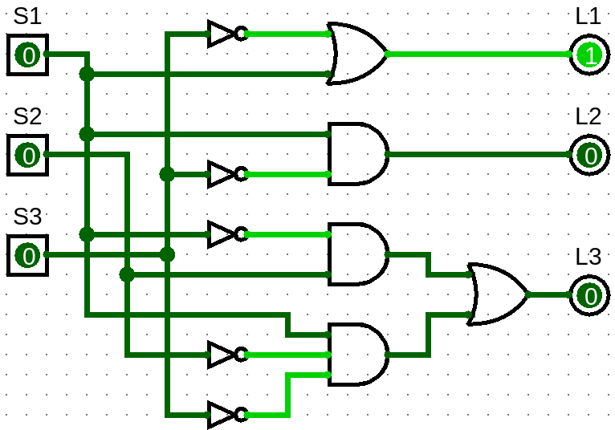

|             Tabla de verdad              |
| :--------------------------------------: |
| 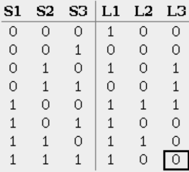 |

[Descargar simulacion](./assets/circuitos/contro_luces_inteligentes.circ)

??? Note "Ecuaciones RAW"
    L1 = ~S3 + S1
    L2 = S1 ~S3
    L3 = ~S1 S2 + S1 ~S2 ~S3

### Diagrama esquemático

pendiente...

---

## Aplasta latas (Electroneumatica)

Se requiere automatizar un sistema de prensado de latas mediante control electroneumático utilizando lógica combinacional.

El sistema consta de un cilindro de doble efecto controlado por una electroválvula biestable 5/2 (solenoides Y1 para avance y Y2 para retroceso). Por seguridad del operador, la máquina requiere un accionamiento bimanual mediante dos pulsadores (S1 y S2). La posición del émbolo se monitorea mediante dos sensores magnéticos tipo Reed (1B1 en inicio de carrera y 1B2 en fin de carrera).

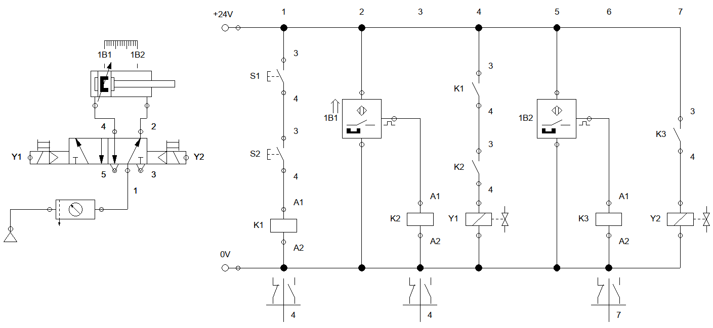

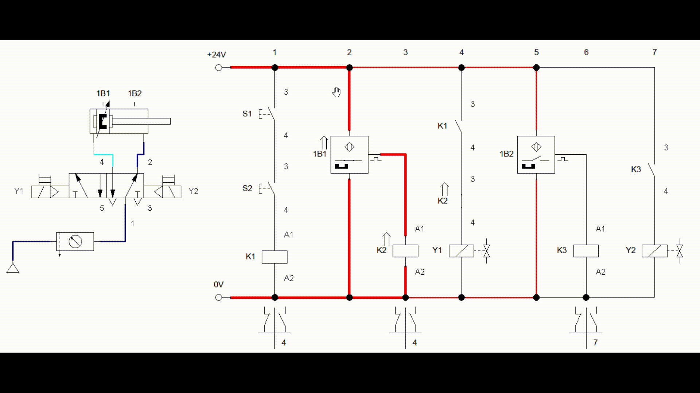

[Descarga video](assets/videos/electroneumatica.mp4)

[Descargar simulacion FluidSIIM Electroneumatica](assets/circuitos/electroneumatico_1_fluidsim.ct)

### Desarrollo

- Si ambos sensores Reed se activan debe haber un indicador de error.
- Si no se presionan los botones se debe activar **Y2** y apagar **Y1**, para asegurar que el vastago no salga.
- Si **S1**, **S2** y **1B1** estan activados sale el vastago, es decir, se activa **Y1** y se desenergeza **Y2**.
- Si se estan presionando **S1** y **S2** y **1B2** detecta el vastago regresa.
- Si existe alguna condicion que no se considera o se describe se debe regresar el vastago, es decir, se debe mantener activo **Y2**.

### Tabla de verdad

|  S1   |  S2   |  B1   |  B2   |  Y1   |  Y2   | FALLA |
| :---: | :---: | :---: | :---: | :---: | :---: | :---: |
|   0   |   0   |   0   |   0   | **0** | **1** | **0** |
|   0   |   0   |   0   |   1   | **0** | **1** | **0** |
|   0   |   0   |   1   |   0   | **0** | **1** | **0** |
|   0   |   0   |   1   |   1   | **0** | **0** | **1** |
|   0   |   1   |   0   |   0   | **0** | **1** | **0** |
|   0   |   1   |   0   |   1   | **0** | **1** | **0** |
|   0   |   1   |   1   |   0   | **0** | **1** | **0** |
|   0   |   1   |   1   |   1   | **0** | **1** | **1** |
|   1   |   0   |   0   |   0   | **0** | **1** | **0** |
|   1   |   0   |   0   |   1   | **0** | **1** | **0** |
|   1   |   0   |   1   |   0   | **0** | **1** | **0** |
|   1   |   0   |   1   |   1   | **0** | **1** | **1** |
|   1   |   1   |   0   |   0   | **0** | **1** | **0** |
|   1   |   1   |   0   |   1   | **0** | **1** | **0** |
|   1   |   1   |   1   |   0   | **1** | **0** | **0** |
|   1   |   1   |   1   |   1   | **0** | **0** | **1** |

### Circuito lógico combinacional

#### Logisim

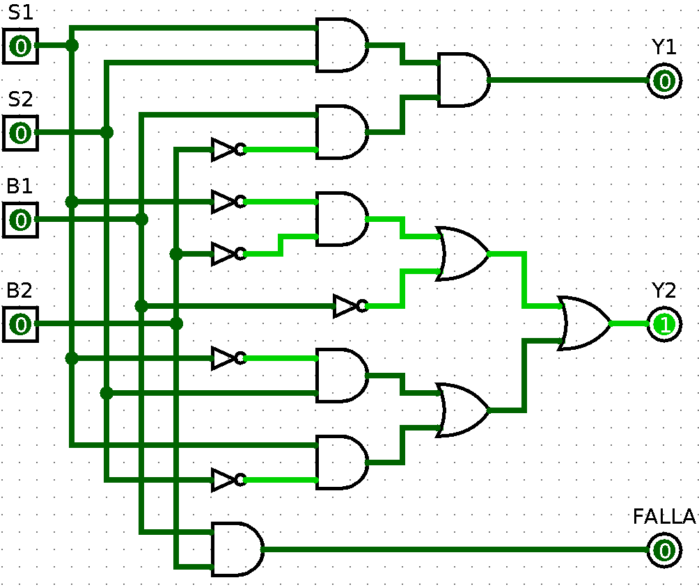

|                Tabla de verdad                |
| :-------------------------------------------: |
| 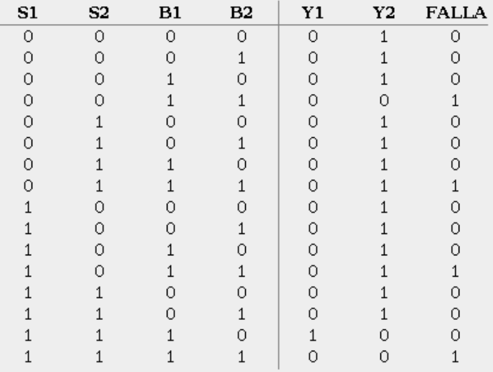 |

 |                Variable                | Mapa K                                              |
 | :------------------------------------: | --------------------------------------------------- |
 |          $Y1 = S1 S2 B1 ~B2$           | 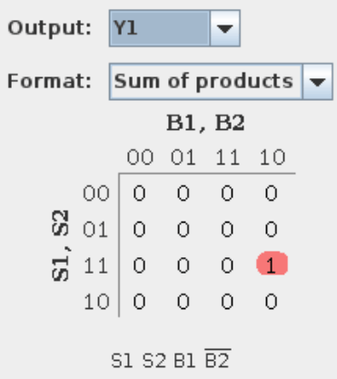    |
 | $Y2 = ~S1 ~B2 + ~B1 + ~S1 S2 + S1 ~S2$ | 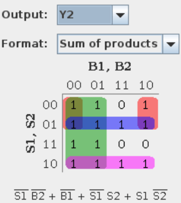    |
 |            $ERROR = B1 B2$             | 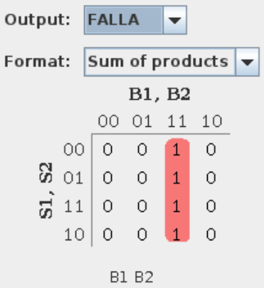 |

??? note "Expresion RAW"
    - Y1 = S1 S2 B1 ~B2
    - Y2 = ~S1 ~B2 + ~B1 + ~S1 S2 + S1 ~S2
    - ERROR = B1 B2

- [Descargar simulacion logisim](./assets/circuitos/electroneumatica_1.circ)
- [Descargar simulacion fluidsim](./assets/circuitos/electroneumatico_1_fluidsim.ct)

## Cepilladora

### Desarrollo

### Tabla de verdad

| Entrada # | `BP`  | `LSD` | `LSI` | `BD`  | `BI`  | Salida `MD` | Salida `MI` | Nota / Estado                                                  |
| :-------: | :---: | :---: | :---: | :---: | :---: | :---------: | :---------: | :------------------------------------------------------------- |
|     0     |   0   |   0   |   0   |   0   |   0   |    **0**    |    **0**    | Reposo total                                                   |
|     1     |   0   |   0   |   0   |   0   |   1   |    **0**    |    **1**    | Presionas `BI` $\rightarrow$ Enciende Izquierda                |
|     2     |   0   |   0   |   0   |   1   |   0   |    **1**    |    **0**    | Presionas `BD` $\rightarrow$ Enciende Derecha                  |
|     3     |   0   |   0   |   0   |   1   |   1   |    **0**    |    **0**    | Conflicto (Ambos presionales a la vez)                         |
|     4     |   0   |   0   |   1   |   0   |   0   |    **1**    |    **0**    | Toca Sensor Izquierdo $LSI \rightarrow$ Activa Derecha         |
|     5     |   0   |   0   |   1   |   0   |   1   |    **1**    |    **0**    | Sensor $LSI$ + $BI$                                            |
|     6     |   0   |   0   |   1   |   1   |   0   |    **1**    |    **0**    | Sensor $LSI$ + $BD$                                            |
|     7     |   0   |   0   |   1   |   1   |   1   |    **0**    |    **0**    | Conflicto                                                      |
|     8     |   0   |   1   |   0   |   0   |   0   |    **0**    |    **1**    | Toca Sensor Derecho $LSD \rightarrow$ Activa Izquierda         |
|     9     |   0   |   1   |   0   |   0   |   1   |    **0**    |    **1**    | Sensor $LSD$ + $BI$                                            |
|    10     |   0   |   1   |   0   |   1   |   0   |    **0**    |    **1**    | Sensor $LSD$ + $BD$                                            |
|    11     |   0   |   1   |   0   |   1   |   1   |    **0**    |    **0**    | Conflicto                                                      |
|  12 a 15  |   0   |   1   |   1   |   X   |   X   |    **0**    |    **0**    | Ambos sensores tocados al mismo tiempo (bloqueo)               |
|  16 a 31  |   1   |   X   |   X   |   X   |   X   |    **0**    |    **0**    | **Todas las filas con $BP=1$ dan salida $0, 0$** (Paro activo) |

| BP | LSD | LSI | BD | BI | MD_in | MI_in | MD_out | MI_out |
|---|---|---|---|---|---|---|---|---|
| 0 | 0 | 0 | 0 | 0 | 0 | 0 | 0 | 0 |
| 0 | 0 | 0 | 0 | 0 | 0 | 1 | 0 | 1 |
| 0 | 0 | 0 | 0 | 0 | 1 | 0 | 1 | 0 |
| 0 | 0 | 0 | 0 | 0 | 1 | 1 | 0 | 0 |
| 0 | 0 | 0 | 0 | 1 | 0 | 0 | 0 | 1 |
| 0 | 0 | 0 | 0 | 1 | 0 | 1 | 0 | 1 |
| 0 | 0 | 0 | 0 | 1 | 1 | 0 | 0 | 0 |
| 0 | 0 | 0 | 0 | 1 | 1 | 1 | 0 | 0 |
| 0 | 0 | 0 | 1 | 0 | 0 | 0 | 1 | 0 |
| 0 | 0 | 0 | 1 | 0 | 0 | 1 | 0 | 0 |
| 0 | 0 | 0 | 1 | 0 | 1 | 0 | 1 | 0 |
| 0 | 0 | 0 | 1 | 0 | 1 | 1 | 0 | 0 |
| 0 | 0 | 0 | 1 | 1 | 0 | 0 | 0 | 0 |
| 0 | 0 | 0 | 1 | 1 | 0 | 1 | 0 | 0 |
| 0 | 0 | 0 | 1 | 1 | 1 | 0 | 0 | 0 |
| 0 | 0 | 0 | 1 | 1 | 1 | 1 | 0 | 0 |
| 0 | 0 | 1 | 0 | 0 | 0 | 0 | 1 | 0 |
| 0 | 0 | 1 | 0 | 0 | 0 | 1 | 1 | 0 |
| 0 | 0 | 1 | 0 | 0 | 1 | 0 | 0 | 0 |
| 0 | 0 | 1 | 0 | 0 | 1 | 1 | 0 | 0 |
| 0 | 0 | 1 | 0 | 1 | 0 | 0 | 1 | 0 |
| 0 | 0 | 1 | 0 | 1 | 0 | 1 | 1 | 0 |
| 0 | 0 | 1 | 0 | 1 | 1 | 0 | 0 | 0 |
| 0 | 0 | 1 | 0 | 1 | 1 | 1 | 0 | 0 |
| 0 | 0 | 1 | 1 | 0 | 0 | 0 | 1 | 0 |
| 0 | 0 | 1 | 1 | 0 | 0 | 1 | 1 | 0 |
| 0 | 0 | 1 | 1 | 0 | 1 | 0 | 0 | 0 |
| 0 | 0 | 1 | 1 | 0 | 1 | 1 | 0 | 0 |
| 0 | 0 | 1 | 1 | 1 | 0 | 0 | 0 | 0 |
| 0 | 0 | 1 | 1 | 1 | 0 | 1 | 0 | 0 |
| 0 | 0 | 1 | 1 | 1 | 1 | 0 | 0 | 0 |
| 0 | 0 | 1 | 1 | 1 | 1 | 1 | 0 | 0 |
| 0 | 1 | 0 | 0 | 0 | 0 | 0 | 0 | 1 |
| 0 | 1 | 0 | 0 | 0 | 0 | 1 | 0 | 0 |
| 0 | 1 | 0 | 0 | 0 | 1 | 0 | 0 | 1 |
| 0 | 1 | 0 | 0 | 0 | 1 | 1 | 0 | 0 |
| 0 | 1 | 0 | 0 | 1 | 0 | 0 | 0 | 1 |
| 0 | 1 | 0 | 0 | 1 | 0 | 1 | 0 | 0 |
| 0 | 1 | 0 | 0 | 1 | 1 | 0 | 0 | 1 |
| 0 | 1 | 0 | 0 | 1 | 1 | 1 | 0 | 0 |
| 0 | 1 | 0 | 1 | 0 | 0 | 0 | 0 | 1 |
| 0 | 1 | 0 | 1 | 0 | 0 | 1 | 0 | 0 |
| 0 | 1 | 0 | 1 | 0 | 1 | 0 | 0 | 1 |
| 0 | 1 | 0 | 1 | 0 | 1 | 1 | 0 | 0 |
| 0 | 1 | 0 | 1 | 1 | 0 | 0 | 0 | 0 |
| 0 | 1 | 0 | 1 | 1 | 0 | 1 | 0 | 0 |
| 0 | 1 | 0 | 1 | 1 | 1 | 0 | 0 | 0 |
| 0 | 1 | 0 | 1 | 1 | 1 | 1 | 0 | 0 |
| 0 | 1 | 1 | 0 | 0 | 0 | 0 | 0 | 0 |
| 0 | 1 | 1 | 0 | 0 | 0 | 1 | 0 | 0 |
| 0 | 1 | 1 | 0 | 0 | 1 | 0 | 0 | 0 |
| 0 | 1 | 1 | 0 | 0 | 1 | 1 | 0 | 0 |
| 0 | 1 | 1 | 0 | 1 | 0 | 0 | 0 | 0 |
| 0 | 1 | 1 | 0 | 1 | 0 | 1 | 0 | 0 |
| 0 | 1 | 1 | 0 | 1 | 1 | 0 | 0 | 0 |
| 0 | 1 | 1 | 0 | 1 | 1 | 1 | 0 | 0 |
| 0 | 1 | 1 | 1 | 0 | 0 | 0 | 0 | 0 |
| 0 | 1 | 1 | 1 | 0 | 0 | 1 | 0 | 0 |
| 0 | 1 | 1 | 1 | 0 | 1 | 0 | 0 | 0 |
| 0 | 1 | 1 | 1 | 0 | 1 | 1 | 0 | 0 |
| 0 | 1 | 1 | 1 | 1 | 0 | 0 | 0 | 0 |
| 0 | 1 | 1 | 1 | 1 | 0 | 1 | 0 | 0 |
| 0 | 1 | 1 | 1 | 1 | 1 | 0 | 0 | 0 |
| 0 | 1 | 1 | 1 | 1 | 1 | 1 | 0 | 0 |
| 1 | 0 | 0 | 0 | 0 | 0 | 0 | 0 | 0 |
| 1 | 0 | 0 | 0 | 0 | 0 | 1 | 0 | 0 |
| 1 | 0 | 0 | 0 | 0 | 1 | 0 | 0 | 0 |
| 1 | 0 | 0 | 0 | 0 | 1 | 1 | 0 | 0 |
| 1 | 0 | 0 | 0 | 1 | 0 | 0 | 0 | 0 |
| 1 | 0 | 0 | 0 | 1 | 0 | 1 | 0 | 0 |
| 1 | 0 | 0 | 0 | 1 | 1 | 0 | 0 | 0 |
| 1 | 0 | 0 | 0 | 1 | 1 | 1 | 0 | 0 |
| 1 | 0 | 0 | 1 | 0 | 0 | 0 | 0 | 0 |
| 1 | 0 | 0 | 1 | 0 | 0 | 1 | 0 | 0 |
| 1 | 0 | 0 | 1 | 0 | 1 | 0 | 0 | 0 |
| 1 | 0 | 0 | 1 | 0 | 1 | 1 | 0 | 0 |
| 1 | 0 | 0 | 1 | 1 | 0 | 0 | 0 | 0 |
| 1 | 0 | 0 | 1 | 1 | 0 | 1 | 0 | 0 |
| 1 | 0 | 0 | 1 | 1 | 1 | 0 | 0 | 0 |
| 1 | 0 | 0 | 1 | 1 | 1 | 1 | 0 | 0 |
| 1 | 0 | 1 | 0 | 0 | 0 | 0 | 0 | 0 |
| 1 | 0 | 1 | 0 | 0 | 0 | 1 | 0 | 0 |
| 1 | 0 | 1 | 0 | 0 | 1 | 0 | 0 | 0 |
| 1 | 0 | 1 | 0 | 0 | 1 | 1 | 0 | 0 |
| 1 | 0 | 1 | 0 | 1 | 0 | 0 | 0 | 0 |
| 1 | 0 | 1 | 0 | 1 | 0 | 1 | 0 | 0 |
| 1 | 0 | 1 | 0 | 1 | 1 | 0 | 0 | 0 |
| 1 | 0 | 1 | 0 | 1 | 1 | 1 | 0 | 0 |
| 1 | 0 | 1 | 1 | 0 | 0 | 0 | 0 | 0 |
| 1 | 0 | 1 | 1 | 0 | 0 | 1 | 0 | 0 |
| 1 | 0 | 1 | 1 | 0 | 1 | 0 | 0 | 0 |
| 1 | 0 | 1 | 1 | 0 | 1 | 1 | 0 | 0 |
| 1 | 0 | 1 | 1 | 1 | 0 | 0 | 0 | 0 |
| 1 | 0 | 1 | 1 | 1 | 0 | 1 | 0 | 0 |
| 1 | 0 | 1 | 1 | 1 | 1 | 0 | 0 | 0 |
| 1 | 0 | 1 | 1 | 1 | 1 | 1 | 0 | 0 |
| 1 | 1 | 0 | 0 | 0 | 0 | 0 | 0 | 0 |
| 1 | 1 | 0 | 0 | 0 | 0 | 1 | 0 | 0 |
| 1 | 1 | 0 | 0 | 0 | 1 | 0 | 0 | 0 |
| 1 | 1 | 0 | 0 | 0 | 1 | 1 | 0 | 0 |
| 1 | 1 | 0 | 0 | 1 | 0 | 0 | 0 | 0 |
| 1 | 1 | 0 | 0 | 1 | 0 | 1 | 0 | 0 |
| 1 | 1 | 0 | 0 | 1 | 1 | 0 | 0 | 0 |
| 1 | 1 | 0 | 0 | 1 | 1 | 1 | 0 | 0 |
| 1 | 1 | 0 | 1 | 0 | 0 | 0 | 0 | 0 |
| 1 | 1 | 0 | 1 | 0 | 0 | 1 | 0 | 0 |
| 1 | 1 | 0 | 1 | 0 | 1 | 0 | 0 | 0 |
| 1 | 1 | 0 | 1 | 0 | 1 | 1 | 0 | 0 |
| 1 | 1 | 0 | 1 | 1 | 0 | 0 | 0 | 0 |
| 1 | 1 | 0 | 1 | 1 | 0 | 1 | 0 | 0 |
| 1 | 1 | 0 | 1 | 1 | 1 | 0 | 0 | 0 |
| 1 | 1 | 0 | 1 | 1 | 1 | 1 | 0 | 0 |
| 1 | 1 | 1 | 0 | 0 | 0 | 0 | 0 | 0 |
| 1 | 1 | 1 | 0 | 0 | 0 | 1 | 0 | 0 |
| 1 | 1 | 1 | 0 | 0 | 1 | 0 | 0 | 0 |
| 1 | 1 | 1 | 0 | 0 | 1 | 1 | 0 | 0 |
| 1 | 1 | 1 | 0 | 1 | 0 | 0 | 0 | 0 |
| 1 | 1 | 1 | 0 | 1 | 0 | 1 | 0 | 0 |
| 1 | 1 | 1 | 0 | 1 | 1 | 0 | 0 | 0 |
| 1 | 1 | 1 | 0 | 1 | 1 | 1 | 0 | 0 |
| 1 | 1 | 1 | 1 | 0 | 0 | 0 | 0 | 0 |
| 1 | 1 | 1 | 1 | 0 | 0 | 1 | 0 | 0 |
| 1 | 1 | 1 | 1 | 0 | 1 | 0 | 0 | 0 |
| 1 | 1 | 1 | 1 | 0 | 1 | 1 | 0 | 0 |
| 1 | 1 | 1 | 1 | 1 | 0 | 0 | 0 | 0 |
| 1 | 1 | 1 | 1 | 1 | 0 | 1 | 0 | 0 |
| 1 | 1 | 1 | 1 | 1 | 1 | 0 | 0 | 0 |
| 1 | 1 | 1 | 1 | 1 | 1 | 1 | 0 | 0 |

### Circuito Ladder

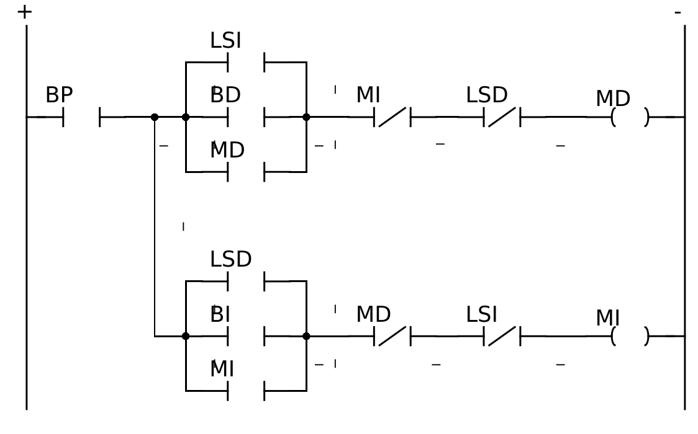

### Simulacion (SimulIDE)

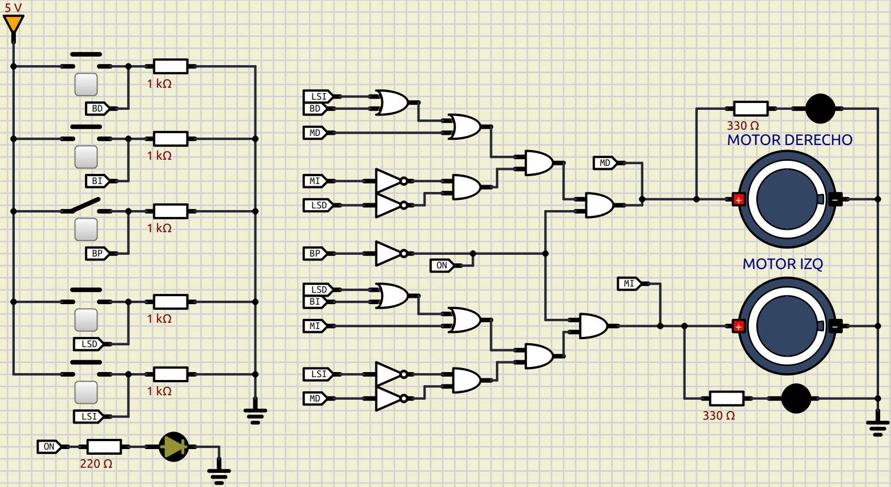

- [Descargar simulacion](./assets/circuitos/cepilladora.sim1)

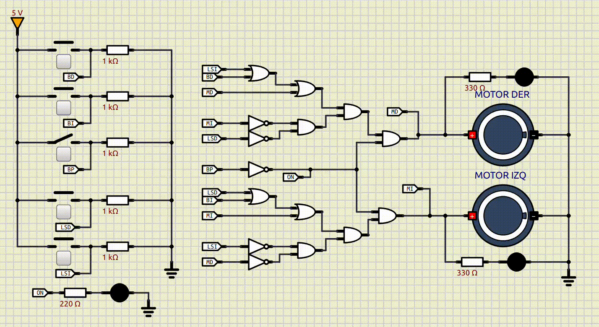

- [Ver video](./assets/videos/cepilladora.mp4)
