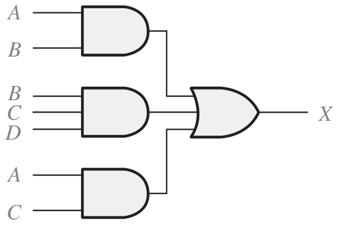
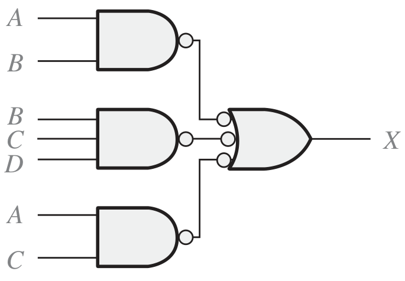
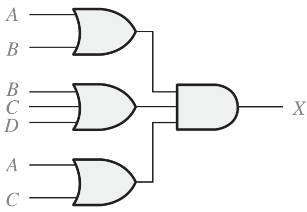
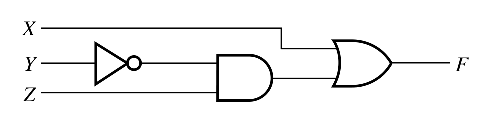
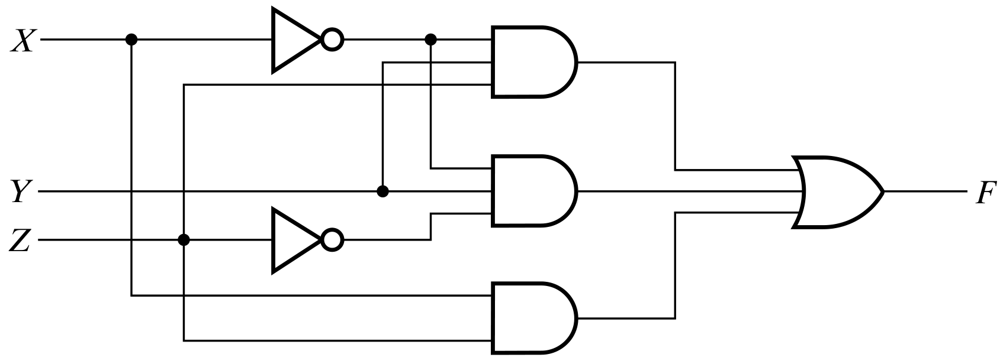

# Ecuaciones Booleanas y Circuitos lógicos

## De ecuacion a circito

Realizar el **circuito lógico** de las siguientes ecuaciones, junto con su **tabla de verdad**:

1. $$Y = A \cdot \bar{B} \cdot C + \bar{A} \cdot B \cdot \bar{C}$$
2. $$Y = (A + \bar{B}) \cdot (\bar{C} + D)$$
3. $$Y = \overline{A \cdot B \cdot C} + D$$
4. $$Y = A \cdot B \cdot \bar{C} \cdot D + \bar{A} \cdot C$$
5. $$Y = (A \cdot B + C) \cdot (\bar{D} + E)$$
6. $$Y = A \cdot \bar{B} \cdot C + \bar{A} \cdot B \cdot D + A \cdot B \cdot \bar{C} \cdot \bar{D} + \overline{C + D}$$
7. $$Y = \overline{(A \cdot B + C)} + (D \cdot \bar{E}) + \bar{A} \cdot C \cdot E$$
8. $$Y = (A + B) \cdot C + \bar{A} \cdot \bar{B} \cdot D + A \cdot \bar{C} \cdot D + \overline{B \cdot D} + C \cdot \bar{D}$$

## De circuito a ecuación

Con base al circuito mostrado, crear la ecuacion que lo representa, con su tabla de verdad correspondiente.

1.

---

2.

---

3.

---
 
4.

---

5.

