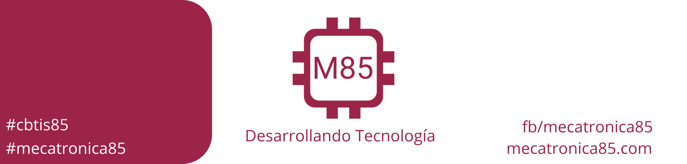
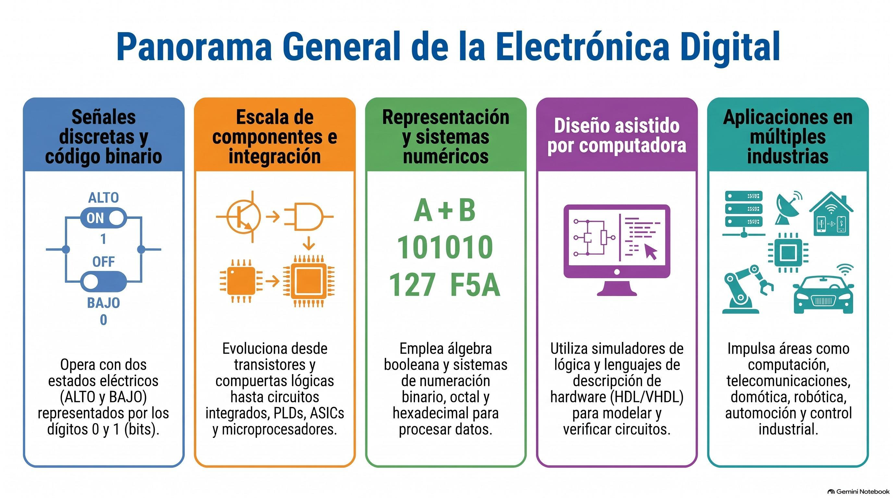

<!-- GENENRATED AUTOMATIC - NO CHANGE -->

# Electrónica Digital
- [Introduccion a la electronica digital](01_introduccion.md)
- [Sistemas Numéricos](02_bases_numericas.md)
- [Operaciones Binarias](03_suma_binaria.md)
- [Diseño Digital](04_diseño_digital.md)
- [Compuertas logicas](05_compuertas_logicas.md)
- [Compuertas combinadas NOR y NAND](06_compuertas_combinadas.md)
- [Lógica combinacional](07_logica_combinacional.md)
- [Aplicando Álgebra Booleana](08_aplicacion_algebra_booleana.md)
- [Mapa de Karnaugh](09_mapa_karnaugh.md)
- [Aplicación: Mapa de Karnaugh](10_aplicacion_mapa_karnaugh.md)
- [Aplicaciones](11_aplicaciones.md)
- [Bibliografía](bibliografia.md)

<!-- GENENRATED AUTOMATIC - NO CHANGE -->