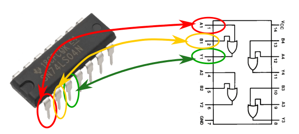
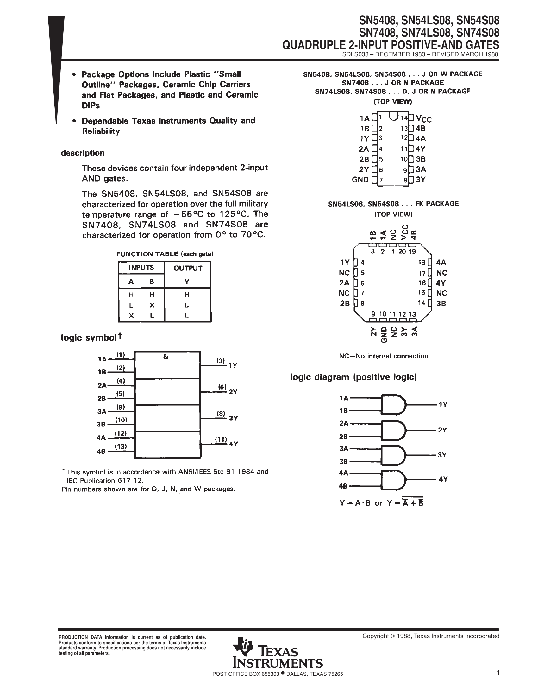
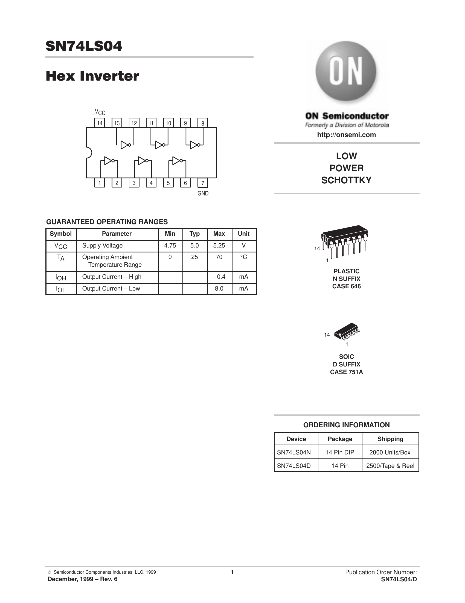
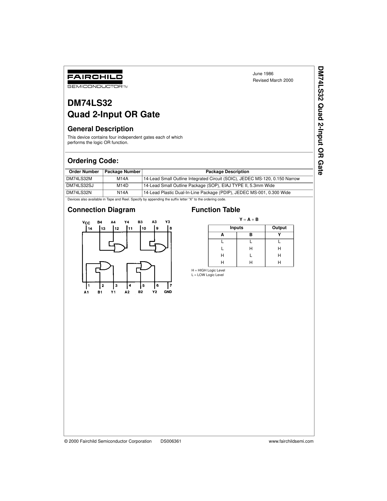
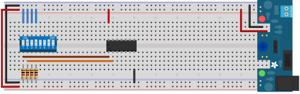
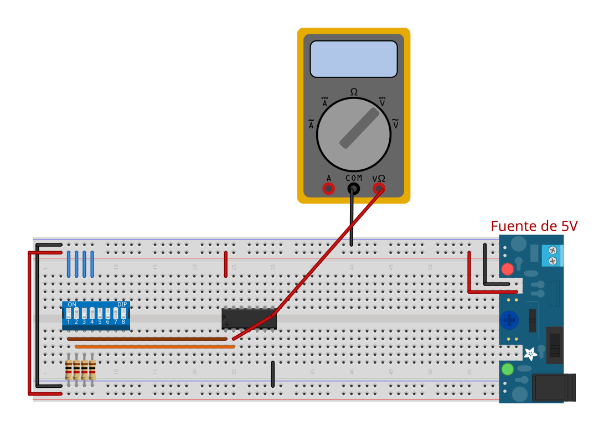
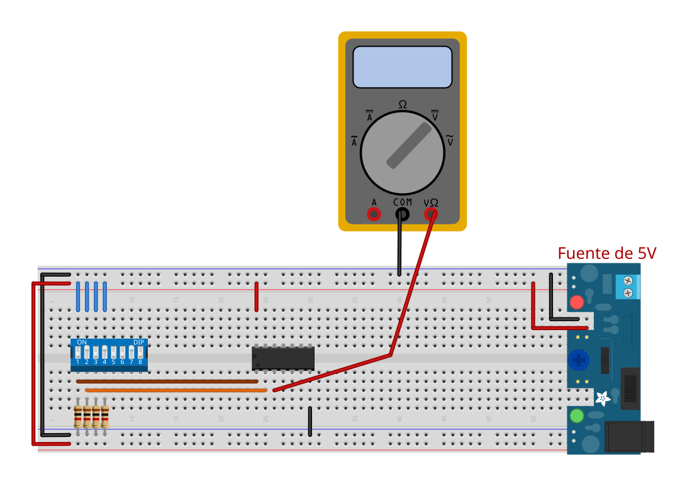
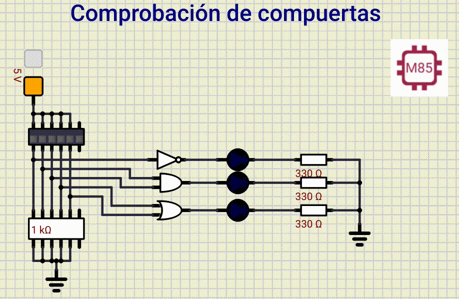

# Práctica 2 - Comprobación de compuertas y niveles lógicos

## Objetivo

En esta Práctica a prenderás a identificar las compuerta lógicas, en sus entradas, salidas, pines de alimentación, niveles de voltaje, y saber si tienes un `1` o un `0` lógico.

## Materiales

| Cantidad | Nombre                  | Descripción                                                                       |
| -------- | ----------------------- | --------------------------------------------------------------------------------- |
| 1        | Multímetro              | Voltímetro                                                                        |
| 1        | IC 7404                 | Compuerta                                                                         |
| 1        | IC 7408                 | Compuerta                                                                         |
| 1        | IC7432                  | Compuerta                                                                         |
| 1        | Fuente de 5V            | Fuente regulada de 5V (Cargador de 5V, Pila 9V con su regulador, fuente variable) |
| X        | LEDs                    | LEDs de los colores que desees (no ultrabrillantes)                               |
| 1        | R330                    | Resistencias 330                                                                  |
| 2        | R1k                     | Resistencias 1k                                                                   |
| 1        | Dipswitch o push button |                                                                                   |
| 1        | Datasheet               | Hoja de datos del 7404                                                            |
| 1        | Datasheet               | Hoja de datos del 7408                                                            |
| 1        | Datasheet               | Hoja de datos del 7432                                                            |

## Desarrollo

### Paso 1: Identificación de salidas digitales

Para realizar la identificación de entradas y salidas se debe tomar el datasheet de cada compuerta. En su hoja de especificaciones vamos observar la distribución de pines.
**Esto realizarlo para todas las compuertas que tiene dentro el circuito integrado.**

#### Datasheets

- [7408](../datasheet/7408.pdf)
- [7404](../datasheet/7404.pdf)
- [7432](../datasheet/7432.pdf)

| 7404                           | 7408                           | 7432                           |
| ------------------------------ | ------------------------------ | ------------------------------ |
|  |  |  |

!!! danger
    Las compuertas soportan máximo 5.5V (Revisar datasheet), **si se pasa de ese voltaje quemaras la compuerta**.

!!! note
    Si cuentas con una pila de 9V, utilizar un regulador de voltaje 7805 o algun regulador para 5V.

### Paso 2: Probar niveles de voltaje de entrada

Montar el circuito integrado en el protoboard y darle alimentación (*voltaje*). Realizando la siguiente conexión:

Primero revisaras los valores de entrada, que serian la entrada **A** y **B**. Es decir, el voltaje en cada pin de entrada de cada compuerta.

### Paso 3: Verificar niveles de voltaje de Salida

Ahora vamos a realizar las combinaciones en la entrada y ver los voltajes que tenemos a la salida de cada compuerta.

Una vez realizada las conexiones realizar las combinaciones en la entrada (en el dipswitch) para cada compuerta que tenga el IC.

#### AND 7408

Voltaje en $V_{cc}$ y $GND$ de la compuerta

| Pin           | Voltaje |
| ------------- | ------- |
| $V_{cc}$ (14) |         |
| $GND$ (7)     |         |

**Compuerta 1**

|   A   |   B   | Voltaje de salida |
| :---: | :---: | :---------------: |
|   0   |   0   |                   |
|   0   |   1   |                   |
|   1   |   0   |                   |
|   1   |   1   |                   |

**Compuerta 2**

|   A   |   B   | Voltaje de salida |
| :---: | :---: | :---------------: |
|   0   |   0   |                   |
|   0   |   1   |                   |
|   1   |   0   |                   |
|   1   |   1   |                   |

**Compuerta 3**

|   A   |   B   | Voltaje de salida |
| :---: | :---: | :---------------: |
|   0   |   0   |                   |
|   0   |   1   |                   |
|   1   |   0   |                   |
|   1   |   1   |                   |

**Compuerta 4**

|   A   |   B   | Voltaje de salida |
| :---: | :---: | :---------------: |
|   0   |   0   |                   |
|   0   |   1   |                   |
|   1   |   0   |                   |
|   1   |   1   |                   |

---

#### OR 7432

Voltaje en $V_{cc}$ y $GND$ de la compuerta

| Pin           | Voltaje |
| ------------- | ------- |
| $V_{cc}$ (14) |         |
| $GND$ (7)     |         |

**Compuerta 1**

|   A   |   B   | Voltaje de salida |
| :---: | :---: | :---------------: |
|   0   |   0   |                   |
|   0   |   1   |                   |
|   1   |   0   |                   |
|   1   |   1   |                   |

**Compuerta 2**

|   A   |   B   | Voltaje de salida |
| :---: | :---: | :---------------: |
|   0   |   0   |                   |
|   0   |   1   |                   |
|   1   |   0   |                   |
|   1   |   1   |                   |

**Compuerta 3**

|   A   |   B   | Voltaje de salida |
| :---: | :---: | :---------------: |
|   0   |   0   |                   |
|   0   |   1   |                   |
|   1   |   0   |                   |
|   1   |   1   |                   |

**Compuerta 4**

|   A   |   B   | Voltaje de salida |
| :---: | :---: | :---------------: |
|   0   |   0   |                   |
|   0   |   1   |                   |
|   1   |   0   |                   |
|   1   |   1   |                   |

----

#### NOT 7404

Voltaje en $V_{cc}$ y $GND$ de la compuerta

|      Pin      | Voltaje |
| :-----------: | ------- |
| $V_{cc}$ (14) |         |
|   $GND$ (7)   |         |

**Compuerta 1**

|   A   | Voltaje de salida |
| :---: | :---------------: |
|   0   |                   |
|   1   |                   |

**Compuerta 2**

|   A   | Voltaje de salida |
| :---: | :---------------: |
|   0   |                   |
|   1   |                   |

**Compuerta 3**

|   A   | Voltaje de salida |
| :---: | :---------------: |
|   0   |                   |
|   1   |                   |

**Compuerta 4**

|   A   | Voltaje de salida |
| :---: | :---------------: |
|   0   |                   |
|   1   |                   |

**Compuerta 5**

|   A   | Voltaje de salida |
| :---: | :---------------: |
|   0   |                   |
|   1   |                   |

**Compuerta 6**

|   A   | Voltaje de salida |
| :---: | :---------------: |
|   0   |                   |
|   1   |                   |

!!! warning "Atención"
    Si en caso alguna compuerta de todo el circuito integrado no te da el valor correcto, elimina ese IC, porque no sirve, esta dañado.

### Paso 4: Verificación de salida con LED

Ahora vas a colocar un led a la salida de cada compuerta que contenga el IC, realizando las combinaciones de la tabla de verdad y ver lo que sucede con el estado del LED

**AND 7408**

|   A   |   B   | ESTADO LED |
| :---: | :---: | :--------: |
|   0   |   0   |            |
|   0   |   1   |            |
|   1   |   0   |            |
|   1   |   1   |            |

**OR 7432**

|   A   |   B   | ESTADO LED |
| :---: | :---: | :--------: |
|   0   |   0   |            |
|   0   |   1   |            |
|   1   |   0   |            |
|   1   |   1   |            |

**NOT 7404**

|   A   | ESTADO LED |
| :---: | :--------: |
|   0   |            |
|   1   |            |

---

## Ejemplo

<!--  -->

---

> Circuitos digitales

> Mecatrónica
