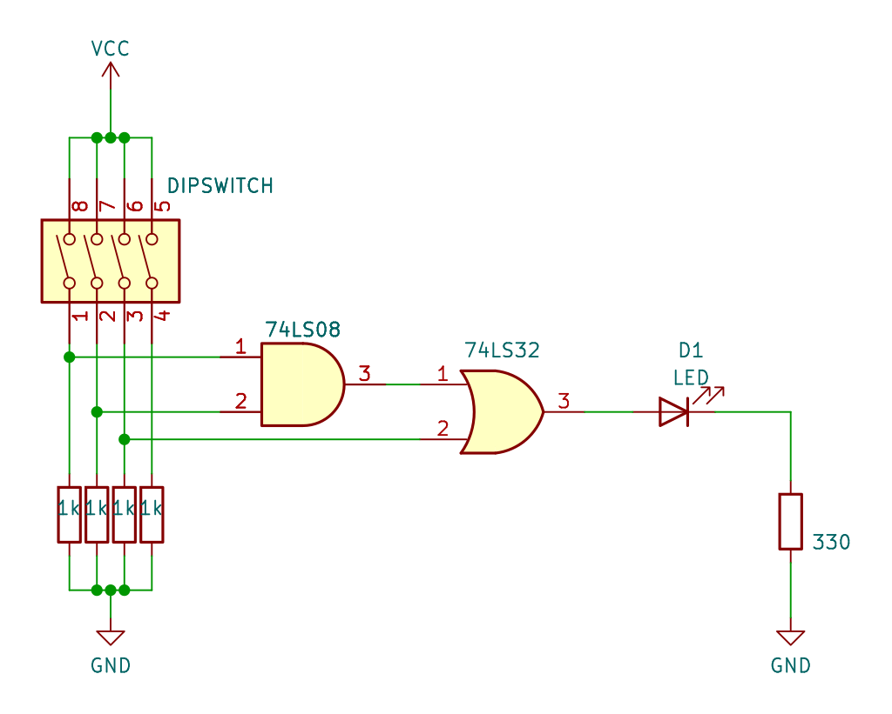
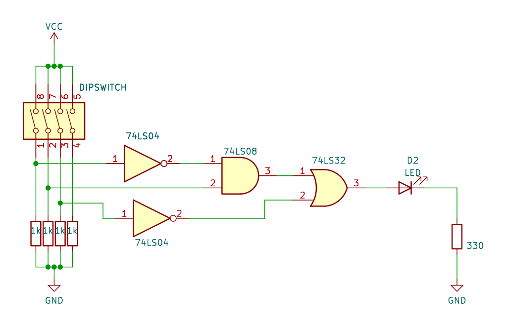

# Práctica 4 - Álgebra booleana básico

## Objetivo

Construir y analizar el comportamiento de circuitos digitales, creando tablas de verdad.

## Materiales

| Cantidad | Nombre                  | Descripción      |
| :------: | ----------------------- | ---------------- |
|    1     | Multímetro              | Voltímetro       |
|    1     | IC 7404                 | Compuerta        |
|    1     | IC 7408                 | Compuerta        |
|    1     | IC7432                  | Compuerta        |
|    x     | Leds                    | Leds de colores  |
|    x     | R330                    | Resistencias 330 |
|    x     | R1k                     | Resistencias 1k  |
|    1     | Dipswitch o push button |                  |

## Desarrollo

### Circuito digital 1 - Ecuación

Reducir la expresión booleana, generar la tabla de verdad y su diagrama. Comprobar la tabla de verdad con el circuito fisico.

$$A\overline{B} + AB$$

#### Tabla de verdad

|   A   |   B   |   X   |
| :---: | :---: | :---: |
| **0** | **0** |       |
| **0** | **1** |       |
| **1** | **0** |       |
| **1** | **1** |       |

### Circuito digital 2 - Ecuación

Reducir la expresión booleana, generar la tabla de verdad y su diagrama. Comprobar la tabla de verdad con el circuito fisico.

$$A\overline{B}C + ABC + AB\overline{C}$$

#### Tabla de verdad

|   A   |   B   |   C   |   X   |
| :---: | :---: | :---: | :---: |
| **0** | **0** | **0** |       |
| **0** | **0** | **1** |       |
| **0** | **1** | **0** |       |
| **0** | **1** | **1** |       |
| **1** | **0** | **0** |       |
| **1** | **0** | **1** |       |
| **1** | **1** | **0** |       |
| **1** | **1** | **1** |       |

### Circuito digital 3

Realizar el siguiente circuito, generar la tabla de verdad, su ecuación representativa. Comprobar la tabla de verdad con el circuito fisico.

#### Tabla de verdad

|   A   |   B   |   C   |   X   |
| :---: | :---: | :---: | :---: |
| **0** | **0** | **0** |       |
| **0** | **0** | **1** |       |
| **0** | **1** | **0** |       |
| **0** | **1** | **1** |       |
| **1** | **0** | **0** |       |
| **1** | **0** | **1** |       |
| **1** | **1** | **0** |       |
| **1** | **1** | **1** |       |

### Circuito digital 4

Realizar el siguiente circuito, generar la tabla de verdad, su ecuación representativa.
tabla de verdad con el circuito fisico.

#### Tabla de verdad

|   A   |   B   |   C   |   X   |
| :---: | :---: | :---: | :---: |
| **0** | **0** | **0** |       |
| **0** | **0** | **1** |       |
| **0** | **1** | **0** |       |
| **0** | **1** | **1** |       |
| **1** | **0** | **0** |       |
| **1** | **0** | **1** |       |
| **1** | **1** | **0** |       |
| **1** | **1** | **1** |       |

---

> Circuitos digitales

> Mecatrónica

---
