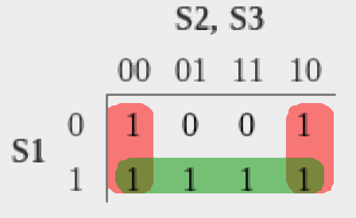
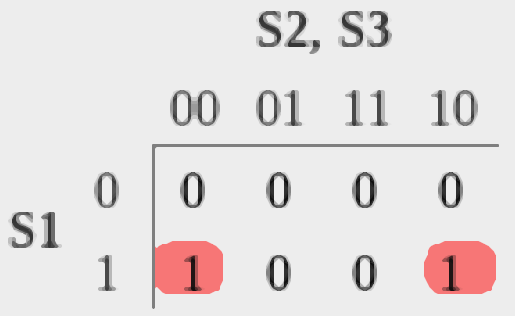
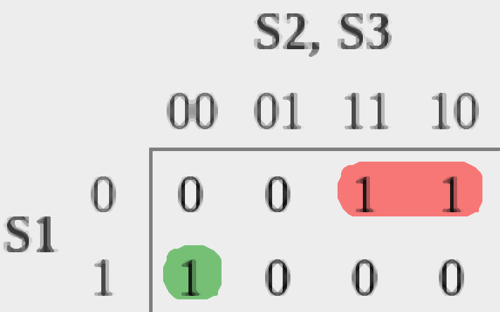
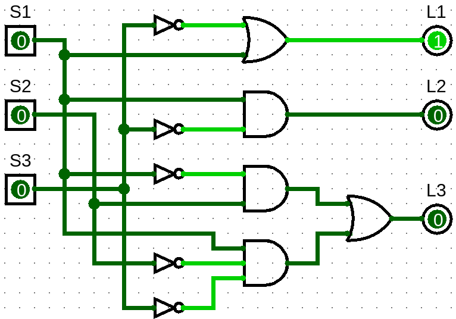

# Control de luces inteligentes

## Descripción

Se tienen 3 sensores de luz digitales. Cada sensor indica un estado, los cuales se describen a continuación:

* **Solo** si el sensor de noche (S1) se debe encender todas las luces.  
* **Solo** si el sensor de luz media (S2) se debe encender 2 luces, que serán L1 y L3.  
* **Solo** si el sensor de luz (S3) se debe apagar todas las luces.  
* Combinado el sensor S2 y S3, indicarían una luz del aproximadamente 75%, es decir, solo se encenderá L3.  
* Si tenemos una luz baja, es decir, oscuridad al 75% aproximadamente, se van a encender luces L1 y L2.  
* Cuando se activen los sensores de manera no posible, es decir, no puede marcar que es noche y que hay 100% de luz, se enciende una lámpara que sería un código de error; se **encenderá solamente L1**. **Código de Error**.

<table >
    <tr >
        <td  colspan="6" rowspan="1">
            
<strong>Lógica de sensores</strong> 

        </td>
    </tr>
    <tr >
        <td  colspan="2" rowspan="1">
            
<strong >S1 (indica noche)</strong>

        </td>
        <td  colspan="2" rowspan="1">
            
<strong >S2 (indica luz al 50%)</strong>

        </td>
        <td  colspan="2" rowspan="1">
            
<strong >S3 (indica que 100% luz)</strong>

        </td>
    </tr>
    <tr >
        <td  colspan="1" rowspan="1">
            
0 (No es de noche)

        </td>
        <td  colspan="1" rowspan="1">
            
1 (Es noche)

        </td>
        <td  colspan="1" rowspan="1">
            
0 (No est&aacute; luz al 50%)

        </td>
        <td  colspan="1" rowspan="1">
            
1 (La luz est&aacute; al 50%)

        </td>
        <td  colspan="1" rowspan="1">
            
0 (Indica que no est&aacute; al 100% la luz)

        </td>
        <td  colspan="1" rowspan="1">
            
1 (Hay luz al 100%)

        </td>
    </tr>
</table>

## Tabla de verdad

| S1 (noche) | S2 (50% luz) | S3 (100% luz) | L1 | L2 | L3 | Descripción |
| :---: | :---: | :---: | :---: | :---: | :---: | :---: |
| **0** | **0** | **0** | 1 | 0 | 0 | No posible |
| **0** | **0** | **1** | 0 | 0 | 0 | 100% luz  |
| **0** | **1** | **0** | 1 | 0 | 1 | Luz al 50% |
| **0** | **1** | **1** | 0 | 0 | 1 | Luz entre 50% y 100% (75%) |
| **1** | **0** | **0** | 1 | 1 | 1 | Noche |
| **1** | **0** | **1** | 1 | 0 | 0 | No posible |
| **1** | **1** | **0** | 1 | 1 | 0 | Luz al 25% u Oscuridad 75% |
| **1** | **1** | **1** | 1 | 0 | 0 | No posible |

## Ecuaciones booleanas

* $$L1 = \overline{S3} + S1$$
* $$L2 = S1 \overline{S3}$$
* $$L3 = \overline{S1} S2 + S1 \overline{S2 S3}$$

## Mapas de Karnaugh

|Mapa de Karnugh|Ecuación|
| :---: |:--:|
| **L1** |**L1**|
|  ||
| **L2** |**L2**|
|  ||
| **L3** |**L3**|
|  ||

## Circuito lógico combinacional

### Logisim

## Diagrama esquemático 

pendiente...

