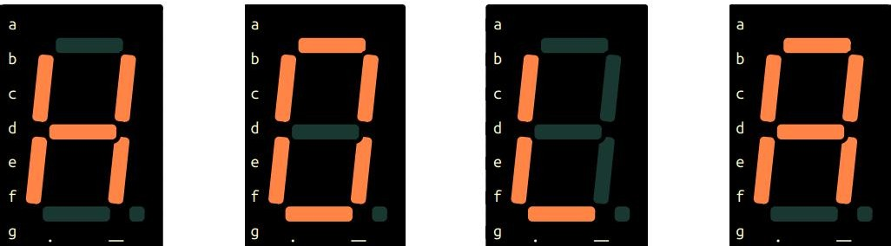

# Práctica 6 - Display de 7 segmentos

## Objetivo

Aplicar los conocimientos de algebra booleana a un display de 7 segmentos, mostrando una frase.

## Materiales

| Cantidad | Nombre                    | Descripción                            |
| -------- | ------------------------- | -------------------------------------- |
| 1        | IC 7404                   | Compuerta                              |
| 1        | IC 7408                   | Compuerta                              |
| 1        | IC7432                    | Compuerta                              |
| 1        | Display 7                 | Display de 7 segmentos de cátodo común |
| 7        | Resistencias 330          |                                        |
| 4        | Resistencias 1k           |                                        |
| 1        | Dipswitch o 4 push button |                                        |

### Desarrollo

##  Circuito digital

Crear la tabla de verdad, reducción y armar el circuito para lograr que en cada combinación se coloque una letra, que en secuencia muestre la palabra `HOLA`.

| Combinación | Letra |
| :---------: | :---: |
|     00      | **H** |
|     01      | **O** |
|     10      | **L** |
|     11      | **A** |

