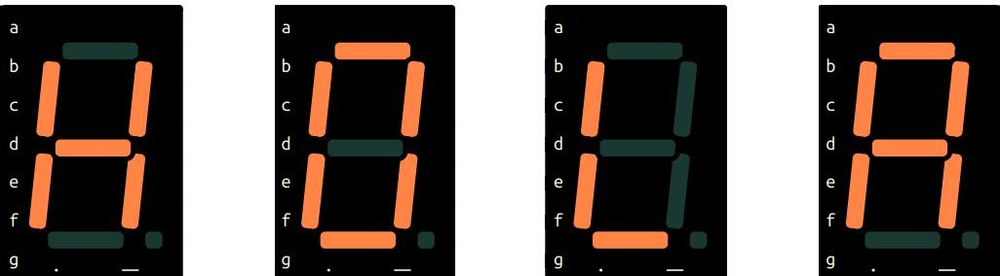

# Práctica 7 - Display de 7 segmentos

## Objetivo

Aplicar los conocimientos de algebra booleana a un display de 7 segmentos, mostrando una frase.

## Materiales

<table>
 <tr>
  <th>Cantidad</th>
  <th>Nombre</th>
  <th>Descripción</th>
 </tr>
 <tr>
  <td>1</td>
  <td>IC 7404</td>
  <td>Compuerta</td>
 </tr>
 <tr>
  <td>1</td>
  <td>IC 7408</td>
  <td>Compuerta</td>
 </tr>
 <tr>
  <td>1</td>
  <td>IC7432</td>
  <td>Compuerta</td>
 </tr>
 <tr>
  <td>1</td>
  <td>Display 7</td>
  <td>Display de 7 segmentos de cátodo común</td>
 </tr>
 <tr>
  <td>7</td>
  <td>Resistencias 330</td>
  <td></td>
 </tr>
 <tr>
  <td>4</td>
  <td>Resistencias 1k</td>
  <td></td>
 </tr>
 <tr>
  <td>1</td>
  <td>Dipswitch o 4 push</td>
  <td>button</td>
 </tr>
</table>

### Desarrollo

## Paso 1: Circuito digital

Crear la tabla de verdad, reducción y armar el circuito para lograr que en cada combinación se
coloque una letra, que en secuencia muestre la palabra "HOLA".

<table>
 <tr>
  <th>Combinación</th>
  <th>Letra</th>
 </tr>
 <tr>
  <td>00</td>
  <td>H</td>
 </tr>
 <tr>
  <td>01</td>
  <td>O</td>
 </tr>
 <tr>
  <td>10</td>
  <td>L</td>
 </tr>
 <tr>
  <td>11</td>
  <td>A</td>
 </tr>
</table>

