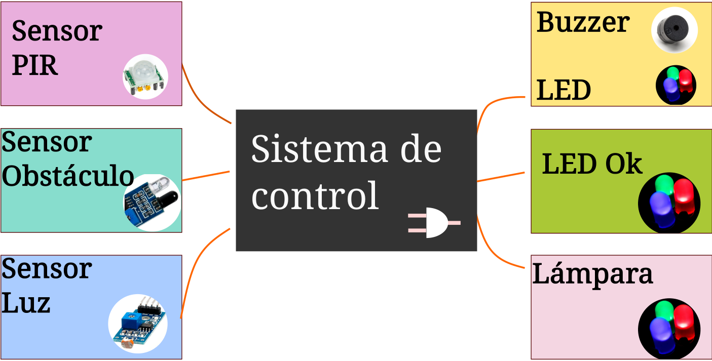

# Práctica 9 - Sistema de alarma

## Objetivo

Aplicar los conocimientos de sistemas digitales de control a un sistema de seguridad básico

## Material

<table>
 <tr>
  <th>Cantidad</th>
  <th>Nombre</th>
  <th>Descripción</th>
 </tr>
 <tr>
  <td>1</td>
  <td>Multímetro</td>
  <td>Voltímetro</td>
 </tr>
 <tr>
  <td>1</td>
  <td>IC 7404</td>
  <td>Compuerta</td>
 </tr>
 <tr>
  <td>1</td>
  <td>IC 7408</td>
  <td>Compuerta</td>
 </tr>
 <tr>
  <td>1</td>
  <td>IC7432</td>
  <td>Compuerta</td>
 </tr>
 <tr>
  <td>1</td>
  <td>Led</td>
  <td></td>
 </tr>
 <tr>
  <td>1</td>
  <td>Resistencias 330</td>
  <td></td>
 </tr>
 <tr>
  <td>2</td>
  <td>Resistencias 1k</td>
  <td></td>
 </tr>
 <tr>
  <td>1</td>
  <td>Sensor de presencia</td>
  <td>Sensor PIR</td>
 </tr>
 <tr>
  <td>1</td>
  <td>Buzzer activo</td>
  <td>Buzzer</td>
 </tr>
</table>

Cantidad Nombre

1

1

Dipswitch o push button

Dipswitch o push button

Descripción

## Desarrollo

## Filosofía de operación

Tenemos la siguiente arquitectura, y se debe desarrollar el circuito de control para lograrlo:

## Sistema de control

Las condiciones para que se activen los actuadores con base a los sensores son:

1. Si existe presencia, hay un obstáculo y no hay luz, se debe activar el buzzer, el cual indica que hay una presencia en el lugar. Y apagara el led de OK, encender la lámpara.

2. Si no hay luz, ni obstáculo y si hay presencia, se debe encender la lámpara, y estar el led OK encendido, el buzzer apagado

3. Si hay obstáculo, no hay luz y ni presencia, se activa el buzzer, se apaga el led OK, y la lámpara se enciende.

4. Hay luz, la lámpara se debe estar apagada. El resto de sensores no importan.

5. Si no hay presencia, ni obstáculo, el led de OK debe estar encendido

�. Si no hay presencia, ni obstáculo, el buzzer debe estar apagado.

<table>
 <tr>
  <th>Si hay obstáculo, se debe activar el buzzer Si no hay obstáculo, se debe encender el led de OK de circuito de control base a la información anterior, desarrollar el circuito, haciendo uso de la técnica de Algebra o Karnaugh. Obtén la tabla de verdad y realiza los pasos necesarios para generar tu circuito de e implementalo.</th>
 </tr>
 <tr>
  <th>Tabla</th>
 </tr>
</table>

## Diseño

<table>
 <tr>
  <th>0</th>
  <td>0</td>
  <td>1</td>
 </tr>
 <tr>
  <th>0</th>
  <td>1</td>
  <td>0</td>
 </tr>
 <tr>
  <th>0</th>
  <td>1</td>
  <td>1</td>
 </tr>
 <tr>
  <th>1</th>
  <td>0</td>
  <td>0</td>
 </tr>
 <tr>
  <th>1</th>
  <td>0</td>
  <td>1</td>
 </tr>
 <tr>
  <th>1</th>
  <td>1</td>
  <td>0</td>
 </tr>
</table>

1

Obstáculo Luz

0

0

1

1

Buzzer LED Lámpara

<table>
 <tr>
  <th>Circuitos digitales Mecatrónica</th>
 </tr>
 <tr>
  <td></td>
 </tr>
</table>

