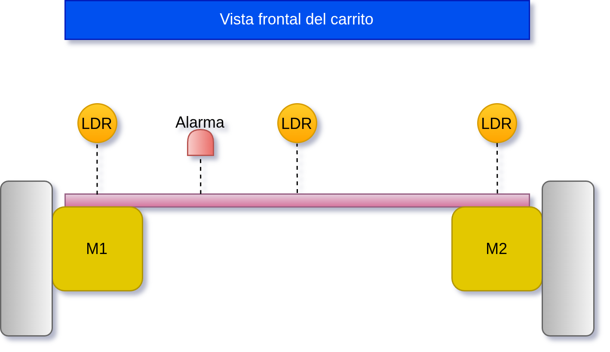
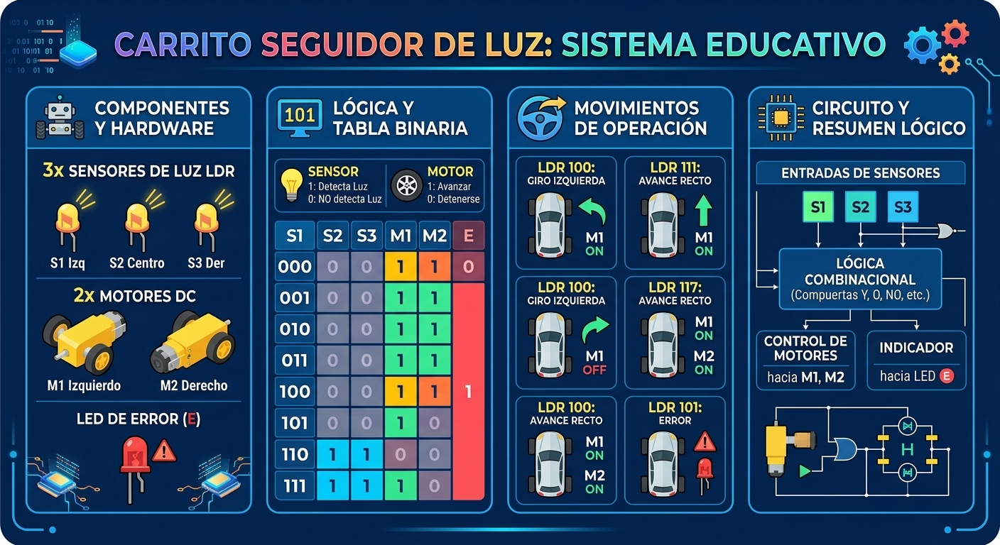

# Carrito seguidor de luz

Se desarrollará un carrito que seguirá la luz, con 3 sensores de luz y 2 motores. Es decir, 3 bits de entrada, con 8 posibilidades de trabajo.

## Lógica de sensores y actuadores 

<table >
        <tr >
            <td  colspan="1" rowspan="1">
                
<strong >Dispositivo</strong>

            </td>
            <td  colspan="1" rowspan="1">
                
<strong >Detección</strong>

            </td>
            <td  colspan="1" rowspan="1">
                
<strong >Respuesta</strong>

            </td>
        </tr>
        <tr >
            <td  colspan="1" rowspan="2">
                
Sensor

            </td>
            <td  colspan="1" rowspan="1">
                
Detecta luz

            </td>
            <td  colspan="1" rowspan="1">
                
<strong>1</strong>

            </td>
        </tr>
        <tr >
            <td  colspan="1" rowspan="1">
                
NO detecta luz

            </td>
            <td  colspan="1" rowspan="1">
                
<strong>0</strong>

            </td>
        </tr>
        <tr >
            <td  colspan="1" rowspan="2">
                
Motor

            </td>
            <td  colspan="1" rowspan="1">
                
Avanzar

            </td>
            <td  colspan="1" rowspan="1">
                
<strong>1</strong>

            </td>
        </tr>
        <tr >
            <td  colspan="1" rowspan="1">
                
Detenerse

            </td>
            <td  colspan="1" rowspan="1">
                
<strong>0</strong>

            </td>
        </tr>
    </table>

## Filosofía de operación

Tenemos 3 sensores de luz, los cuales captan la luz que se encuentra enfrente, contando con un sensor de lado izquierdo (S1), para detectar la luz en ese lado, la luz de frente (S2) y el sensor de la derecha (S3), para el control de 2 motores; un motor para giro a la derecha (motor izquierdo, M1) y para que gire a la izquierda (motor derecho, M2). Contando con una luz indicadora que nos indica si los sensores fallan, dado que esa combinación no es posible.

* Si ningún sensor detecta luz, el carrito se debe detener completamente y encender luz de error (E).  
* Si solo el sensor derecho (S3) debe arrancar el motor izquierdo (M1).  
* Si solo el sensor izquierdo (S1) debe arrancar el motor izquierdo (M2).  
* Si el sensor izquierdo, derecho y central debe arrancar ambos motores.  
* Si el sensor izquierdo y central detectan luz, se arranca el motor derecho, para que el carro se desplace a la izquierda.  
* Si el sensor derecho y central detectan luz, se arranca el motor izquierdo, para que el carro se desplace a la derecha.  
* Código de error: Esta luz se enciende si el S1 y S3 detectan luz, pero S2 no detecta luz. Esta situación es incongruente, dado que no podría existir luz solo de los lados y al centro no. Por ende, encendemos la luz piloto (E) y haremos que avance hacia enfrente (*si quieres cambiar esto, eres libre*).

## Tabla de verdad 

| Sensores |  |  | Actuadores |  |  |
| :---: | :---: | :---: | :---: | :---: | :---: |
| **Sensor izquierdo** | **Sensor central** | **Sensor derecho** | **Motor izquierdo** | **Motor derecho** | **Código error** |
| **S1** | **S2** | **S3** | **M1** | **M2** | **E** |
| **0** | **0** | **0** | 0 | 0 | 1 |
| **0** | **0** | **1** | 1 | 0 | 0 |
| **0** | **1** | **0** | 1 | 1 | 0 |
| **0** | **1** | **1** | 1 | 0 | 0 |
| **1** | **0** | **0** | 0 | 1 | 0 |
| **1** | **0** | **1** | 1 | 1 | **1** |
| **1** | **1** | **0** | 0 | 1 | 0 |
| **1** | **1** | **1** | 1 | 1 | 0 |

## Vista del carrito 

## Diagrama de control (lógica combinacional)

pendiente...

## Diagrama esquemático 

pendiente...

## Infografia de referencia

